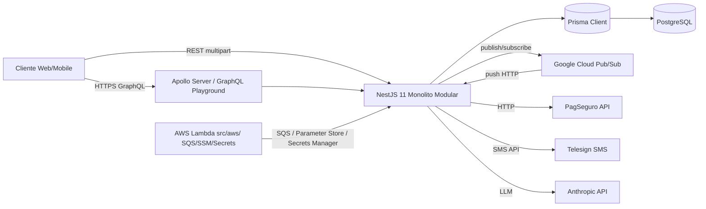
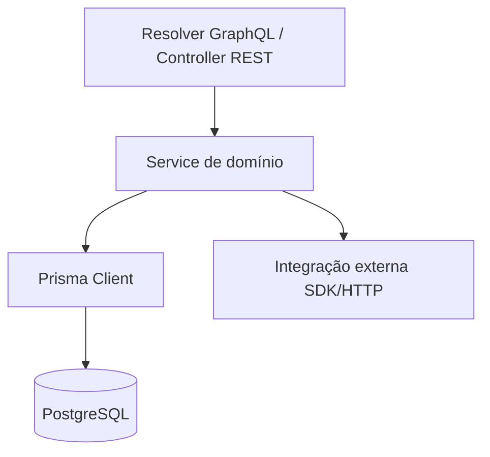

# Arquitetura

## Visão geral

O backend do `Date-Me-Encontre-Aqui` é um monolito modular construído em NestJS 11
com Apollo Server em modo *code-first* (GraphQL), usando Prisma 6 como ORM sobre
PostgreSQL. O aplicativo expõe parte de seus módulos via GraphQL (ver
[`src/app.module.ts`](../src/app.module.ts)) e complementa com controladores REST
(por exemplo, webhooks de Pub/Sub em `ReportingController` e upload multipart em
`UploadMediasController`). Integrações externas efetivamente importadas no código
incluem Google Cloud Pub/Sub (`@google-cloud/pubsub`), Telesign para SMS,
PagSeguro para pagamentos, e Anthropic SDK em `AssistantAiModule`. A pasta
`src/aws/` contém *handlers* AWS Lambda (Node) com clientes AWS SDK v3
(SQS, SSM, Secrets Manager) operados fora do runtime Nest. Agendamento interno
usa `@nestjs/schedule`. Autenticação é baseada em Passport + JWT.

## Diagrama de contêineres (C4 nível 2)

> Nota: o projeto declara em `package.json` outras dependências (Twilio,
> `@langchain/*`, `ioredis`, `@aws-sdk/client-s3`, `@aws-sdk/client-sns`) que
> não aparecem importadas no código runtime em `src/modules/**`. Tais
> integrações estão listadas como
> > **A confirmar**
>
> até serem observadas como `import` ativo.

## Camadas internas

- **Resolver / Controller** (`*.resolver.ts`, `*.controller.ts`): camada de
  entrada. Resolvers GraphQL declaram `@Query`, `@Mutation` e `@Subscription`;
  controllers REST expõem endpoints HTTP (por exemplo, uploads e *webhooks*).
  Guards como `JwtAuthGuard` e `RolesGuard` aplicam autenticação e autorização.
- **Service** (`*.service.ts`): contém a lógica de domínio, orquestra
  chamadas ao Prisma e a provedores externos, e aplica regras de validação
  adicionais além dos `class-validator` DTOs.
- **Prisma** (`src/modules/prisma`): `PrismaService` encapsula o
  `PrismaClient` compartilhado. É o único ponto de acesso a Postgres.
- **Integração externa**: clientes SDK dedicados (`PubSub`, `Telesign`,
  `Anthropic`) ou HTTP cru (`axios` no PagSeguro) são injetados nos serviços,
  geralmente via *provider* de módulo (ex.: `PUBSUB_CLIENT` em
  [`src/modules/gcp/gcp.module.ts`](../src/modules/gcp/gcp.module.ts)).

## Módulos expostos no schema GraphQL

Em `GraphQLModule.forRoot(...)` dentro de
[`src/app.module.ts`](../src/app.module.ts), o array `include` controla quais
módulos geram tipos no `schema.gql`.

Incluídos (publicados no schema):

- `AuthModule`
- `PagSeguroModule`
- `PlansModule`
- `SubscriptionsModule`
- `SubscriptionStatusModule`
- `PaymentsModule`
- `PostsModule`
- `UploadMediasModule`
- `ComplaintsModule`

Fora do `include` (não publicam tipos GraphQL, permanecem internos ou REST):

- `UsersModule`
- `PrismaModule`
- `SmsModule`
- `AddressesModule`
- `RolesModule`
- `AssistantAiModule`
- `CommentsModule`
- `GcpModule`
- `ReportingModule`

> Observação: mesmo fora do `include`, esses módulos são registrados no `imports`
> do `AppModule` e continuam ativos (injeção de dependência, controllers REST,
> *schedulers*). Apenas não contribuem com tipos ao schema GraphQL.

## Autenticação

O fluxo usa `@nestjs/passport` + `@nestjs/jwt`:

- `PassportModule.register({ defaultStrategy: 'jwt' })` e `JwtModule.register(...)`
  são configurados em
  [`src/modules/auth/auth.module.ts`](../src/modules/auth/auth.module.ts).
- `JwtAuthGuard` (em `src/modules/auth/guards/jwt-auth.guard.ts`) valida tokens
  Bearer em resolvers e controllers.
- `RolesGuard` (em `src/modules/auth/guards/roles.guard.ts`) aplica autorização
  por papel, consumindo metadados de `@Roles(...)`.
- Decorador `@Public()` marca rotas que devem ignorar o guard (usado, por
  exemplo, em `ReportingController` para *webhook* Pub/Sub).

> Ponteiro: consulte `src/modules/auth/README.md`.
>
> **A confirmar** — arquivo `src/modules/auth/README.md` ainda não existe no
> repositório; o ponteiro será válido quando a documentação desse módulo for
> criada nas próximas tasks do plano.

## Bootstrap

O arquivo [`src/main.ts`](../src/main.ts) inicializa a aplicação:

- Cria `NestExpressApplication` a partir de `AppModule`.
- Porta: `process.env.PORT || 3000`, `listen(port, '0.0.0.0')`.
- Servidor de arquivos estáticos em `/uploads/` apontando para `../uploads`.
- `ValidationPipe` global com `whitelist: true`, `transform: true`,
  `enableImplicitConversion: true`, `forbidNonWhitelisted: false`.
- GraphQL (configurado em `AppModule`): `playground: true`,
  `introspection: true`, `autoSchemaFile: src/schema.gql`.

> **A confirmar** — não há chamada explícita a `app.enableCors(...)` em
> `main.ts`; se CORS for necessário em produção, está sendo aplicado em outra
> camada (proxy/reverso) e deve ser verificado.

## Execução

Scripts disponíveis em `package.json`:

- `npm run start:dev` — inicia em modo *watch* com `nest start --watch`.
- `npm run build` — compila para `dist/` via `nest build`.
- `npm run start:prod` — executa `node dist/main` (binário compilado).
- `npm run start:debug` — modo *watch* com `--debug` habilitado.
- `npm test`, `npm run test:cov`, `npm run test:e2e` — suíte de testes Jest.

Para detalhes de variáveis de ambiente, contêineres, e infraestrutura
suportada (Postgres, Redis, buckets, credenciais GCP/AWS), consulte
[`./infrastructure.md`](./infrastructure.md).
