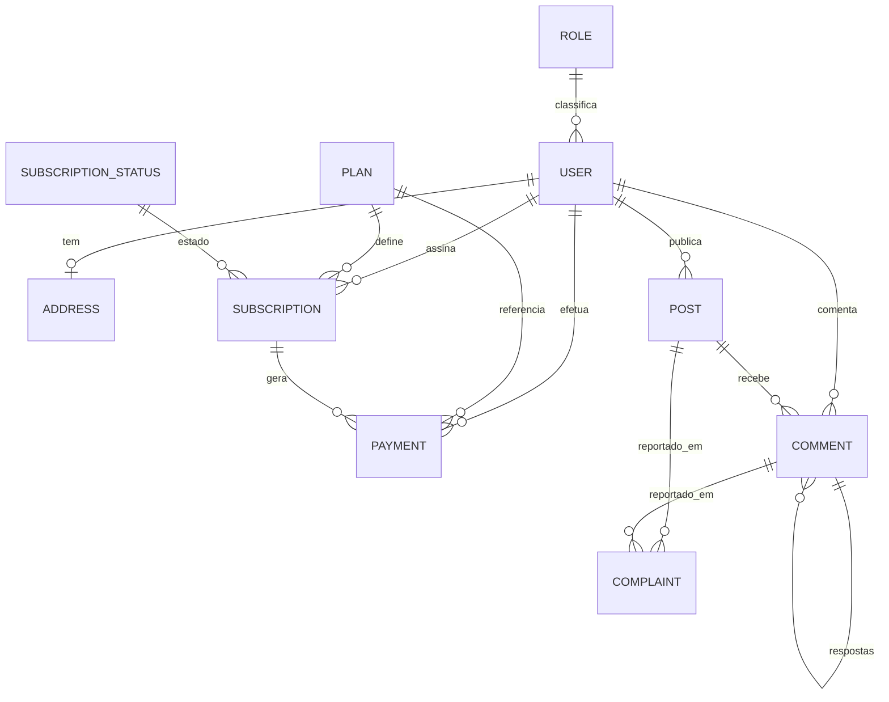

# Modelo de Dados

Este documento descreve o modelo de dados do projeto **Date - Me Encontre Aqui**, definido no schema Prisma em [`../prisma/schema.prisma`](../prisma/schema.prisma).

- **ORM:** Prisma (`prisma-client-js`).
- **Banco de dados:** PostgreSQL (`provider = "postgresql"`).
- **Convenção de nomes:** os modelos Prisma usam `PascalCase` e são mapeados para tabelas em `snake_case` via `@@map`. Diversos campos também são mapeados com `@map` (por exemplo, `createdAt` -> `created_at`).
- **Identificadores:** a maioria dos modelos usa `String @id @default(uuid())`. `Role` e `SubscriptionStatus` usam `Int @id @default(autoincrement())`.

## Diagrama ER

> Observação: o modelo `Complaint` possui os campos `reporterId` e `reportedUserId` (strings obrigatórias), mas o schema **não** declara `@relation` explícito entre `Complaint` e `User`, portanto essas associações não aparecem como FKs no Prisma.

## Entidades

### User (`users`)

| Campo | Tipo | Nullable | Default | Observação |
| --- | --- | --- | --- | --- |
| id | String | nao | `uuid()` | PK |
| fullName | String | nao | - | - |
| nickName | String | nao | - | - |
| email | String | nao | - | `@unique` |
| password | String | nao | - | - |
| smartphone | String | nao | - | - |
| birthdate | DateTime | nao | - | - |
| cpf | String | nao | - | `@unique` |
| deletedAt | DateTime? | sim | - | `@map("deleted_at")`, soft-delete |
| createdAt | DateTime | nao | `now()` | `@map("created_at")` |
| updatedAt | DateTime? | sim | - | `@updatedAt @map("updated_at")` |
| status | String | nao | `"PENDING"` | estado textual do usuario |
| verificationCode | Int | nao | - | - |
| resetPasswordToken | String? | sim | - | - |
| isOnline | Boolean? | sim | `false` | - |
| lastLogin | DateTime? | sim | - | - |
| roleId | Int | nao | - | FK para `Role.id` |

Relacoes:
- `address Address?` - relacionamento 1:1 opcional com `Address` (o lado FK fica em `Address.userId`).
- `role Role` - obrigatorio, via `roleId`.
- `subscriptions Subscription[]` - 1:N com `Subscription`.
- `payments Payment[]` - 1:N com `Payment`.
- `posts Post[]` - 1:N com `Post` (autoria).
- `comments Comment[]` - 1:N com `Comment` (autoria).

### Address (`addresses`)

| Campo | Tipo | Nullable | Default | Observação |
| --- | --- | --- | --- | --- |
| id | String | nao | `uuid()` | PK |
| street | String | nao | - | - |
| number | Int | nao | - | - |
| complement | String? | sim | - | - |
| district | String | nao | - | - |
| city | String | nao | - | - |
| state | String | nao | - | - |
| cep | String | nao | - | - |
| latitude | Float? | sim | - | - |
| longitude | Float? | sim | - | - |
| userId | String | nao | - | `@unique`, FK para `User.id` |

Relacoes:
- `user User` - FK `userId` com `onDelete: Cascade` (excluir o usuario remove o endereco).

### Role (`roles`)

| Campo | Tipo | Nullable | Default | Observação |
| --- | --- | --- | --- | --- |
| id | Int | nao | `autoincrement()` | PK |
| name | String | nao | - | - |

Relacoes:
- `users User[]` - 1:N inverso a `User.role`.

### Plan (`plans`)

| Campo | Tipo | Nullable | Default | Observação |
| --- | --- | --- | --- | --- |
| id | String | nao | `uuid()` | PK |
| name | String | nao | - | - |
| price | Int | nao | - | valor em unidade inteira |
| description | String | nao | - | - |
| isActive | Boolean | nao | `true` | - |
| currency | String | nao | `"BRL"` | - |
| deletedAt | DateTime? | sim | - | `@map("deleted_at")`, soft-delete |
| createdAt | DateTime | nao | `now()` | `@map("created_at")` |
| updatedAt | DateTime? | sim | - | `@updatedAt @map("updated_at")` |

Relacoes:
- `subscriptions Subscription[]` - 1:N com `Subscription`.
- `payments Payment[]` - 1:N com `Payment`.

### Subscription (`subscriptions`)

| Campo | Tipo | Nullable | Default | Observação |
| --- | --- | --- | --- | --- |
| id | String | nao | `uuid()` | PK |
| startDate | DateTime | nao | - | - |
| endDate | DateTime? | sim | - | - |
| isActive | Boolean | nao | `true` | - |
| autoRenew | Boolean | nao | `false` | - |
| amount | Int | nao | - | - |
| interval | String | nao | - | ex.: mensal, anual (texto livre) |
| discount | Int? | sim | - | - |
| userId | String | nao | - | FK para `User.id` |
| planId | String | nao | - | FK para `Plan.id` |
| statusId | Int | nao | - | FK para `SubscriptionStatus.id` |
| trialEnd | DateTime? | sim | - | - |
| deletedAt | DateTime? | sim | - | sem `@map` explicito (coluna `deletedAt`) |
| createdAt | DateTime | nao | `now()` | sem `@map` explicito |
| updatedAt | DateTime | nao | - | `@updatedAt`, sem `@map` explicito |

> A confirmar: em `Subscription`, `deletedAt`, `createdAt` e `updatedAt` **nao** possuem `@map` explicito, diferente dos demais models. Com `@@map("subscriptions")` a tabela fica em snake_case, mas esses campos permanecem em `camelCase` nas colunas geradas.

Relacoes:
- `user User` - via `userId`.
- `plan Plan` - via `planId`.
- `status SubscriptionStatus` - via `statusId`.
- `payment Payment[]` - 1:N inverso com `Payment`.

### SubscriptionStatus (`subscription_status`)

| Campo | Tipo | Nullable | Default | Observação |
| --- | --- | --- | --- | --- |
| id | Int | nao | `autoincrement()` | PK |
| slug | String | nao | - | - |
| description | String | nao | - | - |
| deletedAt | DateTime? | sim | - | `@map("deleted_at")`, soft-delete |
| createdAt | DateTime | nao | `now()` | `@map("created_at")` |
| updatedAt | DateTime? | sim | - | `@updatedAt @map("updated_at")` |

Relacoes:
- `subscription Subscription[]` - 1:N com `Subscription`.

### Payment (`payments`)

| Campo | Tipo | Nullable | Default | Observação |
| --- | --- | --- | --- | --- |
| id | String | nao | `uuid()` | PK |
| amount | Int | nao | - | - |
| currency | String | nao | - | - |
| status | String | nao | - | - |
| paymentDetails | Json | nao | - | detalhes do pagamento |
| paymentMethod | String | nao | - | - |
| orderId | String | nao | - | - |
| chargesId | String | nao | - | - |
| subscriptionId | String | nao | - | FK para `Subscription.id` |
| userId | String | nao | - | FK para `User.id` |
| planId | String | nao | - | FK para `Plan.id` |

> A confirmar: `Payment` **nao** declara `createdAt`, `updatedAt` nem `deletedAt`. Se auditoria de pagamentos for necessaria, esses campos nao existem hoje no schema.

Relacoes:
- `user User` - via `userId`.
- `plan Plan` - via `planId`.
- `subscription Subscription` - via `subscriptionId`.

### Post (`posts`)

| Campo | Tipo | Nullable | Default | Observação |
| --- | --- | --- | --- | --- |
| id | String | nao | `uuid()` | PK |
| content | String | nao | - | - |
| imageUrl | String[] | nao | `[]` | array de strings (Postgres) |
| videoUrl | String? | sim | - | - |
| authorId | String | nao | - | FK para `User.id` |
| deletedStatus | Boolean | nao | `false` | flag complementar ao soft-delete |
| deletedAt | DateTime? | sim | - | `@map("deleted_at")`, soft-delete |
| createdAt | DateTime | nao | `now()` | `@map("created_at")` |
| updatedAt | DateTime? | sim | - | `@updatedAt @map("updated_at")` |
| reportedPublication | Boolean | nao | `false` | sinaliza publicacao reportada |

Relacoes:
- `author User` - via `authorId`.
- `comments Comment[]` - 1:N com `Comment`.
- `complaints Complaint[]` - 1:N com `Complaint`.

### Comment (`comments`)

| Campo | Tipo | Nullable | Default | Observação |
| --- | --- | --- | --- | --- |
| id | String | nao | `uuid()` | PK |
| content | String | nao | - | - |
| authorId | String | nao | - | FK para `User.id` |
| postId | String | nao | - | FK para `Post.id` |
| parentId | String? | sim | - | FK opcional para `Comment.id` (respostas) |
| createdAt | DateTime | nao | `now()` | `@map("created_at")` |
| updatedAt | DateTime? | sim | - | `@updatedAt @map("updated_at")` |

Relacoes:
- `author User` - via `authorId`.
- `post Post` - via `postId`.
- `complaints Complaint[]` - 1:N com `Complaint`.
- Auto-relacao `parent Comment? / replies Comment[]` via `@relation("CommentToReplies")`, permitindo threads de respostas.

### Complaint (`complaints`)

| Campo | Tipo | Nullable | Default | Observação |
| --- | --- | --- | --- | --- |
| id | String | nao | `uuid()` | PK |
| reason | String | nao | - | - |
| description | String? | sim | - | - |
| status | String | nao | `"PENDING"` | - |
| analysesComplaints | Json? | sim | - | dados livres de analise |
| appraiser | String? | sim | - | - |
| createdAt | DateTime | nao | `now()` | `@map("created_at")` |
| updatedAt | DateTime? | sim | - | `@updatedAt @map("updated_at")` |
| postId | String? | sim | - | FK opcional para `Post.id` |
| commentId | String? | sim | - | FK opcional para `Comment.id` |
| reporterId | String | nao | - | id do usuario que reportou |
| reportedUserId | String | nao | - | id do usuario reportado |

> A confirmar: `reporterId` e `reportedUserId` sao armazenados como `String` obrigatorios mas **nao** possuem `@relation` para `User` no schema. Isto significa que o Prisma nao cria FKs nem impede ids orfaos.

Relacoes:
- `post Post?` - via `postId` (opcional).
- `comment Comment?` - via `commentId` (opcional).

## Cardinalidades explicadas

- **User 1:1 Address** - cada usuario pode ter no maximo um endereco. A FK fica em `Address.userId @unique` e `onDelete: Cascade` remove o endereco quando o usuario e deletado fisicamente.
- **Role 1:N User** - um papel pode ser compartilhado por varios usuarios; cada usuario tem exatamente um papel via `roleId`.
- **User 1:N Subscription / Plan 1:N Subscription / SubscriptionStatus 1:N Subscription** - uma assinatura pertence a um unico usuario, um unico plano e possui um unico status, mas cada um dos tres lados pode ter varias assinaturas.
- **Subscription 1:N Payment** - uma assinatura pode gerar varios pagamentos; alem disso, `Payment` tambem liga-se diretamente a `User` e a `Plan` atraves de `userId` e `planId` (redundancia intencional de referencias).
- **User 1:N Post** - cada post tem um unico autor; um usuario pode ter muitos posts.
- **Post 1:N Comment / User 1:N Comment** - um comentario pertence a um post e a um autor.
- **Comment 1:N Comment (auto-relacao)** - comentarios podem ter um `parent` opcional e varios `replies`, formando arvores de respostas via `@relation("CommentToReplies")`.
- **Post 1:N Complaint / Comment 1:N Complaint** - uma denuncia referencia opcionalmente um post ou um comentario (ambos os FKs sao nullable no schema).

## Soft-delete

Os seguintes models possuem o campo `deletedAt` para suportar exclusao logica:

- `User.deletedAt` (`@map("deleted_at")`)
- `Plan.deletedAt` (`@map("deleted_at")`)
- `Subscription.deletedAt` (sem `@map`)
- `SubscriptionStatus.deletedAt` (`@map("deleted_at")`)
- `Post.deletedAt` (`@map("deleted_at")`) - alem do boolean `deletedStatus`
- `Address`, `Role`, `Payment`, `Comment` e `Complaint` **nao** possuem `deletedAt`.

> Alerta: o Prisma **nao** aplica filtro global automatico por `deletedAt`. Qualquer consulta (`findMany`, `findFirst`, `count`, etc.) retornara registros com `deletedAt != null` a menos que o filtro seja adicionado explicitamente (por exemplo, `where: { deletedAt: null }`). Middlewares/extensions do Prisma ou camadas de repositorio sao responsaveis por garantir esse comportamento.

## Migrations

As migrations geradas pelo Prisma Migrate ficam em [`../prisma/migrations/`](../prisma/migrations/). Cada subdiretorio representa uma migration com o SQL aplicado ao banco PostgreSQL. Novas alteracoes no schema devem ser versionadas por `prisma migrate dev` / `prisma migrate deploy` para manter o historico coerente com o estado de `schema.prisma`.
