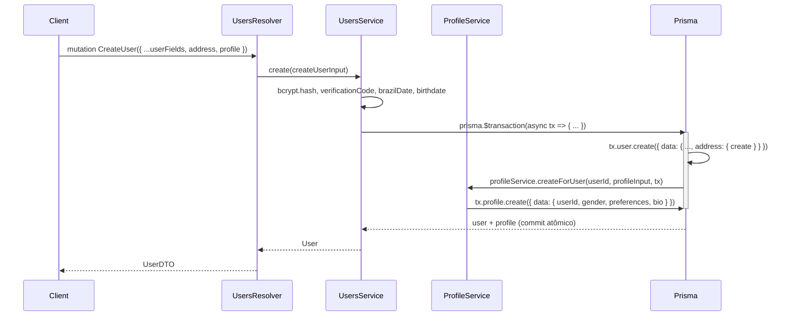

# Profile & Preferences — Design

- **Data:** 2026-04-18
- **Branch:** `feat/profile-preferences`
- **Escopo desta entrega:** módulo `Profile` 1:1 com `User` carregando `gender`, `preferences[]` e `bio`.
- **Fora desta entrega:** migração de avatar/galeria para `Profile`, seguidores, matching/feed.

## 1. Contexto e motivação

O `User` atual acumula responsabilidades de autenticação (email, senha, CPF, status, verificationCode) e de apresentação (avatarUrl, posts, comments, photos). Adicionar `gender`, `preferences` e `bio` direto no `User` agravaria a violação de SRP já apontada no README do módulo.

A plataforma é um app de encontros; o caso de uso 3 ("feed, descoberta, match consomem essas preferências") torna os campos críticos para o domínio de apresentação. Separá-los em um model dedicado:

- Mantém `User` focado em autenticação/conta.
- Permite evoluir `Profile` com galeria/bio/followers sem inchar `User`.
- Espelha o padrão de plataformas de médio/grande porte (Instagram, X, LinkedIn).

Como o banco está vazio (ambiente de desenvolvimento), **não há backfill**: o `Profile` é obrigatório em novos cadastros desde a migration.

## 2. Decisões

| # | Decisão | Opção escolhida |
|---|---|---|
| 1 | Entrega desta tarefa | Profile 1:1 apenas com `gender`, `preferences`, `bio` |
| 2 | Estratégia de migração | Profile como casca de apresentação; avatar/galeria/posts ficam no User |
| 3 | Obrigatoriedade no cadastro | `gender` e `preferences` (≥1) obrigatórios; `bio` opcional |
| 4 | Storage de `preferences` | Array de enum nativo Postgres (`Gender[]`) |
| 5 | Limite de `bio` | 500 caracteres |
| 6 | Exposição GraphQL | `User.profile` (field) + `myProfile` + `getProfileByUserId` + `updateMyProfile` |
| 7 | Usuários pré-existentes | N/A — banco vazio |

## 3. Arquitetura

Novo módulo: `src/modules/profile/`.

```
profile/
├── dto/
│   ├── create-profile.input.ts
│   ├── update-profile.input.ts
│   └── profile.dto.ts
├── enums/
│   └── gender.enum.ts
├── profile.module.ts
├── profile.resolver.ts
├── profile.service.ts
├── profile.service.spec.ts
├── profile.resolver.spec.ts
└── README.md
```

**Responsabilidades do `ProfileService`:**

- `createForUser(userId, input, tx?)` — cria profile na transação do `UsersService.create`. `tx` opcional permite composição.
- `findByUserId(userId)` — usado pelo field-resolver `User.profile`, pela query `myProfile` e por `getProfileByUserId`.
- `updateByUserId(userId, input)` — implementa `updateMyProfile`.
- Sem `remove`/`softDelete`: ciclo de vida atrelado ao User via `onDelete: Cascade`.

**Integração com `UsersModule`:**

- `UsersModule` importa `ProfileModule` (que exporta `ProfileService`).
- `UsersService.create` recebe `profile` no input e chama `profileService.createForUser(userId, profileInput, tx)` dentro de `prisma.$transaction`.
- `ProfileResolver` declara `@Resolver(() => UserDTO)` (importando `UserDTO` de `users/dto/user.dto.ts`) com `@ResolveField('profile')` — evita ciclo no module graph (não precisa importar `UsersModule`; só o tipo `UserDTO`). `UserDTO` é o tipo retornado pelas queries de listagem/detalhe, então o campo `profile` aparece onde o cliente mais o consome. `UserEntity` coexiste como débito técnico documentado no README de `users/` e fica fora de escopo.

**Autorização:**

| Operação | Guard | Regra |
|---|---|---|
| `User.profile` (field) | herda do resolver pai | público no schema |
| `myProfile` | `GqlAuthGuard` | usuário autenticado |
| `getProfileByUserId` | `GqlAuthGuard` | qualquer usuário autenticado |
| `updateMyProfile` | `GqlAuthGuard` | só o próprio user — `me.id` vem do JWT |

## 4. Modelo de dados (Prisma)

### Enum `Gender`

```prisma
enum Gender {
  WOMAN
  TRANS_WOMAN
  MAN
  TRANS_MAN
  COUPLE_HE_SHE
  COUPLE_HE_HE
  COUPLE_SHE_SHE
  GAY
  LESBIAN
  TRAVESTI

  @@map("gender")
}
```

Identificadores em UPPER_SNAKE_CASE (exigência do Prisma). Wire GraphQL/DTO usa os valores `woman`, `trans_woman`, ... via `registerEnumType`.

### Model `Profile`

```prisma
model Profile {
  id          String    @id @default(uuid())
  userId      String    @unique @map("user_id")
  gender      Gender
  preferences Gender[]  @default([])
  bio         String?   @db.VarChar(500)
  createdAt   DateTime  @default(now()) @map("created_at")
  updatedAt   DateTime? @updatedAt       @map("updated_at")

  user        User      @relation(fields: [userId], references: [id], onDelete: Cascade)

  @@index([gender])
  @@map("profiles")
}
```

### Alteração no `User`

```prisma
model User {
  // ... campos existentes
  profile  Profile?
}
```

### Migration

Nome sugerido: `add_profile_and_gender_enum`. Gerada via `npx prisma migrate dev --name add_profile_and_gender_enum`.

### Notas de design

- `userId @unique` garante 1:1 no banco.
- `onDelete: Cascade` — hard delete de User remove Profile.
- `preferences Gender[]` mapeia para `_gender` no Postgres (array do enum nativo). `@default([])` permite linhas iniciadas vazias, mas o DTO bloqueia com `@ArrayMinSize(1)`.
- `bio String? @db.VarChar(500)` faz cinto-e-suspensórios com `@MaxLength(500)` no DTO.
- `@@index([gender])` prepara filtragem rápida em futuras queries de descoberta/match.

## 5. API GraphQL

### `CreateProfileInput`

```ts
@InputType()
export class CreateProfileInput {
  @Field(() => Gender)
  @IsNotEmpty()
  @IsEnum(Gender)
  gender: Gender;

  @Field(() => [Gender])
  @IsArray()
  @ArrayMinSize(1, { message: 'Selecione ao menos uma preferência' })
  @IsEnum(Gender, { each: true })
  preferences: Gender[];

  @Field({ nullable: true })
  @IsOptional()
  @IsString()
  @MaxLength(500)
  bio?: string;
}
```

### `UpdateProfileInput`

```ts
@InputType()
export class UpdateProfileInput extends PartialType(CreateProfileInput) {}
```

`PartialType` preserva validações por campo; `preferences`, se enviado, ainda exige `ArrayMinSize(1)`.

### `ProfileDTO`

```ts
@ObjectType('Profile')
export class ProfileDTO {
  @Field(() => ID)
  id: string;

  @Field()
  userId: string;

  @Field(() => Gender)
  gender: Gender;

  @Field(() => [Gender])
  preferences: Gender[];

  @Field(() => String, { nullable: true })
  bio?: string | null;

  @Field(() => GraphQLISODateTime)
  createdAt: Date;

  @Field(() => GraphQLISODateTime, { nullable: true })
  updatedAt?: Date | null;
}
```

### Alteração em `CreateUserInput`

```ts
@Field(() => CreateProfileInput)
@IsNotEmpty({ message: 'Profile é obrigatório' })
@ValidateNested()
@Type(() => CreateProfileInput)
profile: CreateProfileInput;
```

Breaking change consciente: clientes antigos que chamam `CreateUser` precisam enviar `profile`. Aceitável — banco vazio, app em desenvolvimento.

### `ProfileResolver`

```ts
@Resolver(() => UserDTO)
export class ProfileResolver {
  constructor(private readonly profileService: ProfileService) {}

  @ResolveField('profile', () => ProfileDTO, { nullable: true })
  getProfile(@Parent() user: UserDTO) {
    return this.profileService.findByUserId(user.id);
  }

  @UseGuards(GqlAuthGuard)
  @Query(() => ProfileDTO, { name: 'myProfile' })
  myProfile(@CurrentUser() me) {
    return this.profileService.findByUserId(me.id);
  }

  @UseGuards(GqlAuthGuard)
  @Query(() => ProfileDTO, { name: 'getProfileByUserId' })
  getProfileByUserId(@Args('userId') userId: string) {
    return this.profileService.findByUserId(userId);
  }

  @UseGuards(GqlAuthGuard)
  @Mutation(() => ProfileDTO, { name: 'updateMyProfile' })
  updateMyProfile(
    @Args('input') input: UpdateProfileInput,
    @CurrentUser() me,
  ) {
    return this.profileService.updateByUserId(me.id, input);
  }
}
```

### Registro em `app.module.ts`

Adicionar `ProfileModule` em:

- `imports` do `AppModule`.
- `include` do `GraphQLModule.forRoot`.

## 6. Fluxos

### 6.1 Criação atômica de User + Profile



**Mudança cirúrgica em `UsersService.create`:**

- Extrair `profile` do input (análogo ao tratamento de `address`).
- Envolver `user.create` + `profileService.createForUser` em `prisma.$transaction`.
- `ProfileService.createForUser(userId, input, tx?: Prisma.TransactionClient)` aceita tx opcional; sem tx, usa `this.prisma`.
- SMS continua fire-and-forget **fora da transação** (não deve rollback cadastro se SMS falha).

### 6.2 Atualização `updateMyProfile`

- `prisma.profile.update({ where: { userId: me.id }, data: input })`.
- Retorna `ProfileDTO`.
- `userId` não é aceito pelo `UpdateProfileInput` (não consta em `CreateProfileInput`, herdado via `PartialType`) — usuário não pode trocar dono. O campo é exposto apenas na saída (`ProfileDTO`) para leitura.

### 6.3 Field-resolver `User.profile`

- `prisma.profile.findUnique({ where: { userId } })`.
- Tipo `nullable: true` como cinto-e-suspensórios; em produção real todo user terá profile (criado na transação).
- N+1 aceitável nesta fase. DataLoader é candidato a follow-up e ficará documentado no README do módulo.

## 7. Tratamento de erros

| Cenário | Origem | Resposta |
|---|---|---|
| `gender` ausente no create | `class-validator` | 400 Bad Request |
| `preferences` vazio/ausente | `ArrayMinSize(1)` | "Selecione ao menos uma preferência" |
| `bio` > 500 chars | `MaxLength(500)` | "bio must be shorter than or equal to 500 characters" |
| Gênero inválido | `IsEnum` | "gender must be a valid enum value" |
| Profile não encontrado em update | Prisma `P2025` | `NotFoundException` via filter global |
| Duplicate profile (userId unique) | Prisma `P2002` | "Usuário já possui um profile" — só ocorre em bug |
| Transação falha | Prisma `$transaction` | Rollback automático — nenhum dado persistido |

## 8. Testes

### `profile.service.spec.ts`

- `createForUser` — cria com/sem bio; usa tx quando fornecido; usa `this.prisma` quando ausente; propaga `P2002`.
- `findByUserId` — retorna profile existente; retorna `null` quando ausente.
- `updateByUserId` — update de cada campo; update parcial; propaga `P2025`.

### `profile.resolver.spec.ts`

- `myProfile` usa `me.id` do `CurrentUser`.
- `getProfileByUserId` usa o argumento.
- `updateMyProfile` usa `me.id` e repassa o input.
- `ResolveField('profile')` resolve `user.id` via service.

### `users.service.spec.ts` — atualização

- Novo caso: `create` persiste user + profile na mesma transação.
- Novo caso: rollback se `profile.create` falhar.
- Casos existentes (hash, verificationCode, createdAt) preservados.

### DTO validation

Spec em `profile/dto/create-profile.input.spec.ts`:

- Rejeita `preferences` vazio.
- Rejeita `bio > 500`.
- Rejeita `gender` fora do enum.
- Aceita input mínimo (sem bio).

### Execução

```bash
npm run test -- profile
npm run test -- users
```

## 9. Fluxo de trabalho de entrega

1. Branch `feat/profile-preferences` criada a partir de `main`.
2. Commits pequenos e atômicos via `gitmoji -c`:
   - `:sparkles: feat(prisma): add Profile model and Gender enum`
   - `:bricks: feat(profile): scaffold module, service, resolver`
   - `:sparkles: feat(profile): createForUser, findByUserId, updateByUserId`
   - `:sparkles: feat(profile): GraphQL resolver (myProfile, updateMyProfile, field)`
   - `:sparkles: feat(users): require profile on CreateUser, create in tx`
   - `:white_check_mark: test(profile): service + resolver + DTO validation`
   - `:white_check_mark: test(users): atomic profile creation on signup`
   - `:memo: docs(profile): README`
3. Push e PR via skill `github-pull-request-expect`.

## 10. Follow-ups conhecidos

- Migrar `avatarUrl`/`avatarMediaId` do User para Profile (PR dedicado).
- Migrar galeria (`photos[]`) para Profile (PR dedicado).
- Implementar `followers` em Profile.
- DataLoader para `User.profile` quando benchmarks justificarem.
- Guard "profile incompleto" que bloqueie ações de match/feed se `preferences` for vazio — depende do módulo de match existir.
