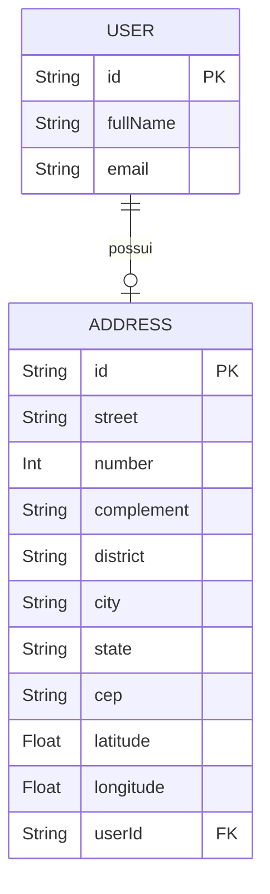

# Módulo: Addresses

## 1. Propósito

O módulo `addresses` é responsável pela persistência e manutenção dos endereços físicos vinculados aos usuários da plataforma. Cada `Address` mantém um relacionamento 1:1 opcional com `User` (ver [`../../../prisma/schema.prisma`](../../../prisma/schema.prisma)), e a sua criação efetiva ocorre, no fluxo atual, durante o cadastro do usuário no próprio [`../users/users.service.ts`](../users/users.service.ts) (método `createUser`, via nested `address.create`) — não por este módulo.

O módulo em si, conforme [`./addresses.module.ts`](./addresses.module.ts), expõe somente o provider `AddressesService` e um resolver (`AddressesResolver`) com **uma única mutation** para atualização do endereço de um usuário já cadastrado. Não há queries, operações de criação isolada nem remoção explícita implementadas aqui — a remoção ocorre por cascata a partir de `User` (`onDelete: Cascade`).

> ⚠️ **A confirmar**: se a criação de endereços deveria ser exposta como operação GraphQL dedicada a este módulo (hoje está acoplada ao fluxo de `createUser`).

## 2. Regras de Negócio

Regras observáveis a partir do código atual:

- **1:1 opcional com `User`.** O model Prisma `Address` declara `userId String @unique` (ver [`../../../prisma/schema.prisma`](../../../prisma/schema.prisma)), garantindo no máximo um `Address` por `User`. O lado de `User` mantém `address Address?` (opcional).
- **Remoção em cascata.** `onDelete: Cascade` em `Address.user` faz com que a exclusão do `User` remova automaticamente o `Address` correspondente.
- **Validação de entrada.** [`./dto/create-address.input.ts`](./dto/create-address.input.ts) aplica regras via `class-validator`:
  - `street`, `district`, `city`, `cep`, `state`, `number` são obrigatórios (`@IsNotEmpty`).
  - `state` deve ter exatamente 2 caracteres (`@Length(2, 2)`).
  - `cep` deve ter 8 ou 9 caracteres (`@Length(8, 9)`), o que comporta tanto `CEP` sem máscara (`12345678`) quanto com hífen (`12345-678`).
  - `latitude`/`longitude` são opcionais e, se presentes, devem ser válidos (`@IsLatitude` / `@IsLongitude`).
- **Atualização via id do usuário, não do endereço.** [`./addresses.service.ts`](./addresses.service.ts) recebe `userId`, carrega o usuário com `findUniqueOrThrow` (incluindo `address`) e então atualiza o endereço associado usando `user.address?.id`. Se o usuário não possuir endereço, `addressId` fica `undefined` e a chamada `prisma.address.update` subsequente tende a falhar em runtime — ver seção 10.

> ⚠️ **A confirmar**: se o fluxo de cadastro deve passar a **exigir** `address` no `createUser` (hoje `address` está como opcional via `@Field(() => UpdateAddressInput, {nullable: true})` em [`../users/dto/create-user.input.ts`](../users/dto/create-user.input.ts)). Essa definição impacta diretamente a obrigatoriedade descrita em [`./dto/create-address.input.ts`](./dto/create-address.input.ts).

## 3. Entidades e Modelo de Dados

### Model Prisma `Address`

Declarado em [`../../../prisma/schema.prisma`](../../../prisma/schema.prisma):

```prisma
model Address {
  id                    String   @id @default(uuid())
  street                String
  number                Int
  complement            String?
  district              String
  city                  String
  state                 String
  cep                   String
  latitude              Float?
  longitude             Float?

  //FK para User
  userId                String   @unique
  user                  User     @relation(fields: [userId], references: [id], onDelete: Cascade)

  @@map("addresses")
}
```

| Campo | Tipo | Obrigatório | Observação |
|---|---|---|---|
| `id` | `String` | Sim | UUID gerado por default. |
| `street` | `String` | Sim | — |
| `number` | `Int` | Sim | Numérico no banco; armazenado como inteiro. |
| `complement` | `String?` | Não | — |
| `district` | `String` | Sim | Bairro. |
| `city` | `String` | Sim | — |
| `state` | `String` | Sim | Validação de tamanho (2) feita no DTO, não no schema. |
| `cep` | `String` | Sim | Sem máscara imposta pelo banco. |
| `latitude` | `Float?` | Não | — |
| `longitude` | `Float?` | Não | — |
| `userId` | `String` | Sim | FK para `users.id`; `@unique` (1:1). |
| `user` | `User` | Sim (no banco) | Relação com `onDelete: Cascade`. |

A tabela é mapeada para `addresses` (`@@map("addresses")`).

### Diagrama ER (foco `Address` ↔ `User`)



Para a visão completa dos demais relacionamentos do domínio, consultar [`../../../docs/data-model.md`](../../../docs/data-model.md).

### Entidade/DTO GraphQL `Address`

Há duas classes TypeScript representando o endereço no schema GraphQL:

- [`./entities/address.entity.ts`](./entities/address.entity.ts) — registrada como `Address` (via `@ObjectType('Address')`). É o tipo retornado pela mutation `updateAddressForUser` (ver seção 4) e referenciado por `User.address` em [`../users/entities/user.entity.ts`](../users/entities/user.entity.ts).
- [`./dto/address.dto.ts`](./dto/address.dto.ts) — registrada como `AddressDTO`. Referenciada por `UserDTO.address` em [`../users/dto/user.dto.ts`](../users/dto/user.dto.ts).

Ambas expõem os mesmos campos (`id`, `street`, `number`, `complement?`, `district`, `city`, `state`, `cep`, `latitude?`, `longitude?`).

> ⚠️ **A confirmar**: a duplicação `Address` vs `AddressDTO` parece acidental (provável resquício do schematics). Convém consolidar em um único `ObjectType` para evitar divergência futura entre as duas formas de expor o mesmo modelo.

## 4. API GraphQL

O array `include` do `GraphQLModule.forRoot({...})` em [`../../app.module.ts`](../../app.module.ts) **não contém** `AddressesModule`. O `include` atual contém apenas `AuthModule`, `PagSeguroModule`, `PlansModule`, `SubscriptionsModule`, `SubscriptionStatusModule`, `PaymentsModule`, `PostsModule`, `UploadMediasModule` e `ComplaintsModule`.

Consequência prática: o schema GraphQL gerado (`src/schema.gql`) **não expõe** as operações do `AddressesResolver`. A mutation abaixo existe no código, mas não está acessível via API GraphQL no estado atual do `app.module.ts`.

### Mutations (definidas no resolver, não publicadas)

Declaradas em [`./addresses.resolver.ts`](./addresses.resolver.ts):

| Nome | Argumentos | Retorno | Auth | Descrição |
|---|---|---|---|---|
| `updateAddressForUser` | `userId: String!`, `updateAddressInput: UpdateAddressInput!` | `Address` | Nenhum guard aplicado no resolver | Atualiza o `Address` associado ao `User` identificado por `userId`. Internamente resolve o `addressId` pela relação 1:1 e chama `prisma.address.update`. |

Observações:

- O nome exposto no schema é `updateAddressForUser` (via `@Mutation(() => Address, { name: 'updateAddressForUser' })`), embora o método TypeScript se chame `updateAddress`.
- O tipo `UpdateAddressInput` é definido em [`./dto/update-address.input.ts`](./dto/update-address.input.ts) como `PartialType(CreateAddressInput)`, ou seja, todos os campos são opcionais (ver seção 5).
- Não há queries (`@Query`) declaradas neste módulo.

> ⚠️ **A confirmar**: intenção de expor `AddressesModule` no `include` do `GraphQLModule`. Até que isso aconteça, a mutation não está publicada; atualizações de endereço funcionam, na prática, por `UsersService.updateUser`, que trata `updateAddressInput` internamente em [`../users/users.service.ts`](../users/users.service.ts).

## 5. DTOs e Inputs

Localizados em [`./dto/`](./dto) e [`./entities/`](./entities).

### `CreateAddressInput` — [`./dto/create-address.input.ts`](./dto/create-address.input.ts)

```ts
@InputType()
export class CreateAddressInput {
  @Field() @IsNotEmpty() @IsString() street: string;
  @Field() @IsNotEmpty() @IsNumber() number: number;
  @Field({ nullable: true }) @IsOptional() @IsString() complement?: string;
  @Field() @IsNotEmpty() @IsString() district: string;
  @Field() @IsNotEmpty() @IsString() city: string;
  @Field() @IsNotEmpty() @IsString() @Length(2, 2) state: string;
  @Field() @IsNotEmpty() @IsString() @Length(8, 9) cep: string;
  @Field({ nullable: true }) @IsOptional() @IsLatitude() latitude?: number;
  @Field({ nullable: true }) @IsOptional() @IsLongitude() longitude?: number;
}
```

| Campo | Tipo | Obrigatório | Validação |
|---|---|---|---|
| `street` | `String` | Sim | `IsString`, `IsNotEmpty` — mensagem "Rua é obrigatória". |
| `number` | `Int` (mapeado como `number` TS) | Sim | `IsNumber`, `IsNotEmpty` — "Número é obrigatório". |
| `complement` | `String` | Não | `IsOptional`, `IsString`. |
| `district` | `String` | Sim | "Bairro é obrigatório". |
| `city` | `String` | Sim | "Cidade é obrigatória". |
| `state` | `String` | Sim | `Length(2,2)` — "Estado deve ter 2 caracteres". |
| `cep` | `String` | Sim | `Length(8,9)` — "CEP deve ter 8 ou 9 caracteres". |
| `latitude` | `Float` | Não | `IsLatitude`. |
| `longitude` | `Float` | Não | `IsLongitude`. |

### `UpdateAddressInput` — [`./dto/update-address.input.ts`](./dto/update-address.input.ts)

```ts
@InputType()
export class UpdateAddressInput extends PartialType(CreateAddressInput) {}
```

Herda todos os campos de `CreateAddressInput` como opcionais via `@nestjs/graphql`'s `PartialType`. Utilizado:

- Na mutation `updateAddressForUser` deste módulo.
- Como tipo aninhado em `CreateUserInput.address` ([`../users/dto/create-user.input.ts`](../users/dto/create-user.input.ts)) — ou seja, o mesmo input é reutilizado no cadastro do usuário (o que torna todos os campos opcionais naquele contexto).

### `AddressDTO` — [`./dto/address.dto.ts`](./dto/address.dto.ts)

`@ObjectType('AddressDTO')` espelhando os campos do model Prisma. Utilizado por [`../users/dto/user.dto.ts`](../users/dto/user.dto.ts).

### `Address` (entidade GraphQL) — [`./entities/address.entity.ts`](./entities/address.entity.ts)

`@ObjectType('Address')` com os mesmos campos. Referenciado por:

- [`./addresses.resolver.ts`](./addresses.resolver.ts) como tipo de retorno da mutation.
- [`../users/entities/user.entity.ts`](../users/entities/user.entity.ts) como `User.address`.

> ⚠️ **A confirmar**: o `UpdateAddressInput` ser usado diretamente no payload de criação do usuário (ao invés de `CreateAddressInput`) significa que, no cadastro, todas as validações obrigatórias de `CreateAddressInput` ficam relaxadas. Validar se esse é o comportamento desejado.

## 6. Fluxos Principais

### 6.1. Criação de endereço (dentro do cadastro do usuário)

1. Cliente chama a mutation de cadastro de usuário (em [`../users/users.resolver.ts`](../users/users.resolver.ts)), enviando `CreateUserInput` com `address: UpdateAddressInput` opcional.
2. `UsersService.createUser` em [`../users/users.service.ts`](../users/users.service.ts) separa `address` do restante via destructuring e chama `prisma.user.create({ data: { ...userData, address: { create: address } } })`.
3. O Prisma cria o registro em `addresses` e popula `userId` automaticamente via nested write.
4. O usuário é retornado com `include: { address: true, role: true }`.

Observação: esse fluxo **não passa** por `AddressesService`. O `AddressesModule` é importado em [`../users/users.module.ts`](../users/users.module.ts) (`imports: [PrismaModule, SmsModule, AddressesModule]`), mas `UsersService` injeta `PrismaService` diretamente — não `AddressesService`.

### 6.2. Atualização de endereço via `AddressesResolver`

1. Cliente envia `updateAddressForUser(userId, updateAddressInput)`.
2. [`./addresses.resolver.ts`](./addresses.resolver.ts) delega para `AddressesService.update`.
3. [`./addresses.service.ts`](./addresses.service.ts) faz `prisma.user.findUniqueOrThrow({ where: { id: userId }, include: { address: true } })`.
4. Extrai `addressId = user.address?.id`.
5. Executa `prisma.address.update({ where: { id: addressId }, data: updateAddressInput })` e retorna o resultado.

Caminho alternativo (usado em produção hoje): `UsersService.updateUser` em [`../users/users.service.ts`](../users/users.service.ts) também cuida de atualizar `Address` quando o payload de update do usuário contém `address`, chamando `prisma.address.update` diretamente.

### 6.3. Remoção

Não há operação explícita para remover um `Address` sem remover o usuário. Por conta do `onDelete: Cascade` no schema Prisma, a remoção do `User` remove o `Address` associado automaticamente (ver `UsersService.deleteUser`).

> ⚠️ **A confirmar**: se existe requisito de negócio para "desassociar" endereço mantendo o usuário — hoje isso não é suportado por `AddressesService` nem por `UsersService`.

## 7. Dependências

### Imports internos do módulo

Declarados em [`./addresses.module.ts`](./addresses.module.ts):

- `AddressesResolver` (provider).
- `AddressesService` (provider).
- **Não** importa `PrismaModule` explicitamente no próprio `@Module({})`. Funciona porque `PrismaModule` está configurado como `@Global()` (ver [`../prisma/README.md`](../prisma/README.md)) — ou seja, `PrismaService` está disponível em toda a aplicação.

O módulo **não** declara `exports`. Ainda assim, ele é importado por outros módulos (ver grep reverso).

### Grep reverso (`AddressesModule` / `AddressesService` em `src/**/*.ts`)

Ocorrências encontradas:

- [`../../app.module.ts`](../../app.module.ts): `import { AddressesModule }` e uso no array `imports` do `@Module` (porém **não** no `include` do GraphQL).
- [`../users/users.module.ts`](../users/users.module.ts): `import { AddressesModule }` e `imports: [PrismaModule, SmsModule, AddressesModule]`. Apesar disso, `UsersService` **não** injeta `AddressesService`; a importação parece redundante no estado atual.
- Arquivos internos do módulo (`addresses.module.ts`, `addresses.resolver.ts`, `addresses.service.ts`, specs).

`AddressesService` **não é injetado** fora de `src/modules/addresses/`.

### Integrações externas

Nenhuma. O módulo não chama APIs externas, filas, gateways de pagamento, Redis, GCP, serviços de geocoding, etc.

### Variáveis de ambiente

Nenhuma específica do módulo. O acesso à tabela `addresses` ocorre via `PrismaService` (que lê `DATABASE_URL`).

> ⚠️ **A confirmar**: se o módulo deveria integrar algum serviço de geolocalização/geocoding para popular `latitude`/`longitude` automaticamente a partir do CEP. Atualmente esses campos só chegam se forem enviados pelo cliente.

## 8. Autorização e Papéis

Não se aplica dentro deste módulo — [`./addresses.resolver.ts`](./addresses.resolver.ts) não declara `@UseGuards(...)`, `@Roles(...)` ou qualquer outro decorator de autenticação/autorização.

Consequência: caso `AddressesModule` passe a ser incluído no `GraphQLModule` (seção 4), a mutation `updateAddressForUser` ficaria **pública**, permitindo a qualquer cliente GraphQL alterar o endereço de qualquer usuário informando apenas o `userId`.

> ⚠️ **A confirmar**: política de autorização esperada (ex.: somente o próprio usuário autenticado pode atualizar seu endereço, ou somente administradores). Ver [`../auth/README.md`](../auth/README.md), quando disponível, e [`../../../docs/business-rules.md`](../../../docs/business-rules.md).

## 9. Erros e Exceções

Comportamento atual observável em [`./addresses.service.ts`](./addresses.service.ts):

- `prisma.user.findUniqueOrThrow({ where: { id: userId } })` lança `PrismaClientKnownRequestError` (código `P2025`, "No User found") quando o `userId` não existe. Não há `try/catch` no service para traduzir esse erro em uma exceção HTTP/GraphQL amigável — a exceção bruta propaga até o cliente.
- Quando o usuário existe mas **não possui endereço associado** (`address` é `null`), `addressId` fica `undefined`. A chamada subsequente `prisma.address.update({ where: { id: undefined }, ... })` resulta em erro do Prisma em runtime. Não há validação prévia nem mensagem customizada.
- Validações de input (`class-validator`) são aplicadas pelo pipeline global do NestJS (se habilitado na aplicação); violações geram `BadRequestException` padrão do framework.

Não há uso de `HttpException`, `BadRequestException`, `NotFoundException`, filtros customizados nem logger dedicado dentro do módulo. Existe um `console.log(user)` em [`./addresses.service.ts`](./addresses.service.ts) — ver seção 10.

> ⚠️ **A confirmar**: padrão de tratamento de erros adotado pelo projeto (exceções tipadas, `GraphQLError` custom, interceptors). Alinhar este módulo ao padrão quando ele for retomado.

## 10. Pontos de Atenção / Manutenção

- **Módulo ausente do `include` GraphQL.** [`../../app.module.ts`](../../app.module.ts) não lista `AddressesModule` no array `include` do `GraphQLModule.forRoot`; a mutation `updateAddressForUser` existe no TypeScript, mas não é exposta no schema. Incluir (ou remover definitivamente do resolver) quando a decisão for tomada.
- **Duplicação `Address` vs `AddressDTO`.** Dois `@ObjectType` equivalentes em [`./entities/address.entity.ts`](./entities/address.entity.ts) e [`./dto/address.dto.ts`](./dto/address.dto.ts). Consolidar.
- **`UpdateAddressInput` usado no cadastro.** [`../users/dto/create-user.input.ts`](../users/dto/create-user.input.ts) usa `UpdateAddressInput` (todos opcionais) como tipo de `address`, relaxando as validações obrigatórias de `CreateAddressInput`. Revisar se o correto seria usar `CreateAddressInput`.
- **`AddressesService` não é efetivamente utilizado.** Nenhum outro módulo injeta `AddressesService`; a atualização "real" de endereço acontece via `UsersService.updateUser`, que chama `prisma.address.update` diretamente em [`../users/users.service.ts`](../users/users.service.ts). Há duplicação de responsabilidade.
- **Falta de guard/autorização.** O resolver aceita `userId` arbitrário, sem verificar se o chamador é o próprio dono ou um administrador (ver seção 8).
- **Ausência de tratamento quando `user.address` é `null`.** Em [`./addresses.service.ts`](./addresses.service.ts), se o usuário não tem endereço, a atualização falha com erro genérico do Prisma — deveria lançar exceção explícita ou criar o endereço (upsert).
- **`console.log(user)` em produção.** Linha 20 de [`./addresses.service.ts`](./addresses.service.ts) imprime o objeto de usuário completo a cada chamada — removível.
- **`PrismaModule` não declarado nos imports do módulo.** Funciona apenas porque `PrismaModule` é `@Global()`. Isso dificulta testes unitários isolados (ver seção 11) e torna a dependência implícita.
- **`AddressesModule` importado em `UsersModule` sem consumo.** [`../users/users.module.ts`](../users/users.module.ts) importa `AddressesModule`, mas `UsersService` não injeta `AddressesService`. Import redundante.

## 11. Testes

Dois specs gerados pelo schematics padrão do Nest:

- [`./addresses.service.spec.ts`](./addresses.service.spec.ts) — instancia `AddressesService` via `Test.createTestingModule` com `providers: [AddressesService]` e verifica apenas `expect(service).toBeDefined()`. **Atenção**: este spec não declara `PrismaService` como provider; se `PrismaService` deixasse de ser resolvido por `@Global()` no futuro, ele começaria a falhar.
- [`./addresses.resolver.spec.ts`](./addresses.resolver.spec.ts) — instancia `AddressesResolver` com `AddressesService` e verifica apenas `expect(resolver).toBeDefined()`.

Nenhum dos specs cobre:

- Regras de validação de `CreateAddressInput` / `UpdateAddressInput`.
- Fluxo de `AddressesService.update` (sucesso, `userId` inexistente, usuário sem endereço).
- Cascade delete a partir de `User`.
- Integração do fluxo de criação de endereço via `UsersService.createUser`.

Execução:

```bash
npm run test -- src/modules/addresses
```

> ⚠️ **A confirmar**: política de cobertura mínima e se os testes de criação/atualização de endereço devem residir aqui ou em `src/modules/users/*.spec.ts` (dado que o fluxo real hoje está no `UsersService`).
