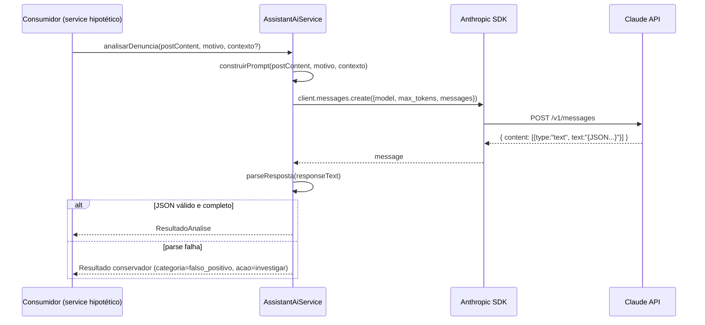

# Módulo: Assistant AI

## 1. Propósito

Módulo responsável por integrar a aplicação ao SDK da Anthropic (Claude) para analisar automaticamente denúncias (`Complaint`) sobre posts/comentários. O `AssistantAiService` recebe o texto do post denunciado e o motivo da denúncia, constrói um prompt moderador em pt-BR (diretrizes da plataforma, categorias e ações possíveis) e pede ao modelo `claude-sonnet-4-5-20250929` uma resposta em JSON estruturado (`categoria`, `severidade`, `confianca`, `justificativa`, `acao_recomendada`).

O módulo também expõe um modo "com cache de prompt" usando `cache_control: { type: 'ephemeral' }` do Anthropic SDK, útil quando muitas denúncias compartilham as mesmas diretrizes. Atualmente o resolver **não** declara nenhuma query/mutation — o service é consumível, mas nenhum outro módulo injeta-o ainda.

> ⚠️ **A confirmar:** o código não integra o `AssistantAiService` ao fluxo real de `complaints` (que hoje publica a denúncia no Pub/Sub do GCP e espera processamento externo). O consumidor real do prompt parece ser o workflow n8n — ver seção "Integração n8n-agent".

## 2. Regras de Negócio

1. **Modelo fixo.** Todas as chamadas usam `claude-sonnet-4-5-20250929` com `max_tokens: 1024` (ver [`./assistant_ai.service.ts:45,197`](./assistant_ai.service.ts)).
2. **Categorias fechadas.** A `ResultadoAnalise.categoria` é um literal union com os valores: `discurso_de_odio`, `ameaca`, `assedio`, `desinformacao_grave`, `golpe_financeiro`, `conteudo_sexual_explicito`, `spam`, `falso_positivo` (ver [`./assistant_ai.service.ts:6-14`](./assistant_ai.service.ts)).
3. **Severidade fechada.** `baixa | media | alta | critica`.
4. **Ações fechadas.** `acao_recomendada ∈ {ignorar, avisar, remover, banir, investigar}`.
5. **Confiança bounded.** O parser força `confianca` para `[0, 100]` via `Math.max(0, Math.min(100, parsed.confianca || 0))` (ver [`./assistant_ai.service.ts:143`](./assistant_ai.service.ts)).
6. **Fallback conservador.** Em caso de falha de parse (JSON inválido ou campos ausentes), o service **não lança**; retorna um objeto `{categoria: 'falso_positivo', severidade: 'baixa', confianca: 0, justificativa: 'Erro ao processar análise. Requer revisão manual.', acao_recomendada: 'investigar'}` (ver [`./assistant_ai.service.ts:152-158`](./assistant_ai.service.ts)).
7. **Erro no SDK propaga.** Em `analisarDenuncia`, erros vindos de `client.messages.create` são relançados como `Error('Falha na análise: <msg>')` (ver [`./assistant_ai.service.ts:63`](./assistant_ai.service.ts)). **Não** há fallback nesse caminho — só há fallback no parser.
8. **Batch limitado.** `analisarLote` processa no máximo 5 denúncias em paralelo por vez (`BATCH_SIZE = 5`) para respeitar rate-limit (ver [`./assistant_ai.service.ts:171`](./assistant_ai.service.ts)).
9. **Prompt e diretrizes codificados.** As diretrizes da plataforma (críticas políticas permitidas, palavrões isolados ok, assédio não tolerado, contexto brasileiro) vivem no código do prompt — alteração requer deploy.

## 3. Entidades e Modelo de Dados

Não se aplica — módulo **não** persiste em banco e não gera estruturas de dados além do tipo interno `ResultadoAnalise` (apenas TypeScript, não exposto ao GraphQL).

O arquivo [`./entities/assistant_ai.entity.ts`](./entities/assistant_ai.entity.ts) declara um `@ObjectType AssistantAi { exampleField: Int }` — **placeholder gerado pelo CLI Nest**, sem uso real.

## 4. API GraphQL

`AssistantAiModule` **não** está no `include` do `GraphQLModule.forRoot({...})` em [`../../app.module.ts`](../../app.module.ts) — o `include` atual contém apenas `AuthModule`, `PagSeguroModule`, `PlansModule`, `SubscriptionsModule`, `SubscriptionStatusModule`, `PaymentsModule`, `PostsModule`, `UploadMediasModule` e `ComplaintsModule`. Logo, mesmo que o resolver declare operações, elas não apareceriam no schema público.

### Queries

Não se aplica.

### Mutations

Não se aplica. O resolver [`./assistant_ai.resolver.ts`](./assistant_ai.resolver.ts) tem a mutation `createAssistantAi` completamente comentada.

### Subscriptions

Não se aplica.

### REST

Não se aplica — sem controller.

## 5. DTOs e Inputs

Scaffolds placeholder (código morto):

- [`./dto/create-assistant_ai.input.ts`](./dto/create-assistant_ai.input.ts) — `CreateAssistantAiInput { exampleField: Int }`.
- [`./dto/update-assistant_ai.input.ts`](./dto/update-assistant_ai.input.ts) — `UpdateAssistantAiInput extends PartialType(CreateAssistantAiInput)` com `id: Int`.

### Interface interna `ResultadoAnalise`

Declarada em [`./assistant_ai.service.ts:5-19`](./assistant_ai.service.ts). É o tipo de retorno das funções de análise, não exposto em GraphQL.

| Campo | Tipo | Valores |
| --- | --- | --- |
| categoria | union | ver regra #2 |
| severidade | union | `baixa`/`media`/`alta`/`critica` |
| confianca | number | 0-100 |
| justificativa | string | livre |
| acao_recomendada | union | `ignorar`/`avisar`/`remover`/`banir`/`investigar` |

## 6. Fluxos Principais

### Fluxo: Analisar denúncia individual (`analisarDenuncia`)

### Fluxo: Análise em lote (`analisarLote`)

Divide o array em chunks de 5, executa `Promise.all(chunk.map(analisarDenuncia))` serialmente por chunk. Cada denúncia passa pelo fluxo acima.

### Fluxo: Análise com prompt-cache (`analisarDenunciaComCache`)

Idêntico ao fluxo principal, mas envia o bloco de diretrizes como `system` com `cache_control: 'ephemeral'`. A partir da segunda chamada dentro da janela de cache (5 min por padrão no SDK), a Anthropic cobra menos tokens pelo prefixo cacheado.

### Integração n8n-agent

A pasta [`../n8n-agent/`](../n8n-agent/) (paralela a este módulo) contém o arquivo `Assistente de analise de postagens.json` — um workflow exportado do n8n. Propósito identificado pelos nós do workflow:

- **Webhook** `topic_reporting_reported-posts-queue` — recebe mensagens em base64 vindas do Pub/Sub do GCP (as mesmas que `complaints.service.ts` publica).
- **Code (JavaScript)** decodifica a mensagem base64 e converte para JSON.
- **Ollama Chat Model** (`glm-5:cloud`) + **AI Agent** + **Structured Output Parser** — analisam a denúncia.
- **Merge** consolida o resultado.
- **Telegram** envia mensagem para moderação humana.
- **Google Pub/Sub Publish** — publica o resultado no tópico `date-me-topic-reporting-reported-posts-resolved-queue`.

Este arquivo **não é executado pela aplicação NestJS**; é uma referência para a infraestrutura de automação externa (instância n8n). Ponto de atenção: o workflow usa Ollama/GLM, enquanto o `AssistantAiService` (TypeScript) usa Claude via Anthropic SDK — dois caminhos distintos para o mesmo objetivo.

## 7. Dependências

### Módulos internos importados

Declarados em [`./assistant_ai.module.ts`](./assistant_ai.module.ts): nenhum. O módulo define um provider próprio para `Anthropic` usando `ConfigService` — como `ConfigModule` é registrado com `isGlobal: true` em [`../../app.module.ts:31-34`](../../app.module.ts), funciona sem import explícito.

### Módulos que consomem este

Grep reverso (`AssistantAiService` / `AssistantAiModule`): **nenhum consumidor externo**. O módulo está importado apenas em `app.module.ts` (como módulo da aplicação), mas nenhum outro service injeta `AssistantAiService`.

### Integrações externas

- **Anthropic Claude API** (via `@anthropic-ai/sdk`). Modelo: `claude-sonnet-4-5-20250929`.
- **n8n workflow** (paralelo, fora da aplicação) que usa **Ollama** (`glm-5:cloud`) — ver subseção `Integração n8n-agent`.

### Variáveis de ambiente

| Variável | Uso |
| --- | --- |
| `ANTHROPIC_API_KEY` | Chave da Anthropic, injetada na factory em [`./assistant_ai.module.ts:15`](./assistant_ai.module.ts). |

## 8. Autorização e Papéis

Não se aplica — o módulo não expõe endpoints. Se for consumido por outro service no futuro, a autorização cabe ao service chamador.

## 9. Erros e Exceções

| Erro lançado | Condição | Origem |
| --- | --- | --- |
| `Error('Falha na análise: <mensagem>')` | `client.messages.create` lança (rate-limit, API down, key inválida, etc.) | `analisarDenuncia`, `analisarDenunciaComCache` |
| `Error('Resposta do Claude incompleta')` | JSON parseado mas sem `categoria`/`severidade`/`acao_recomendada` | `parseResposta` (capturado no catch do próprio parser — não propaga) |

Comportamento do parser: qualquer erro (`JSON.parse` inválido, markdown não removido, campos faltando) é **silenciado** — o método devolve o objeto conservador e loga no `console.error`. Não há `NestException`; os consumidores recebem ou um `Error` genérico (no caminho do SDK) ou um `ResultadoAnalise` "seguro".

## 10. Pontos de Atenção / Manutenção

- **Service não está integrado ao fluxo de denúncia.** O módulo `complaints` publica no Pub/Sub e **não** chama `AssistantAiService`. A análise real acontece no n8n externo. Decidir: manter o caminho TypeScript (e ligá-lo) ou remover `AssistantAiService`.
- **Resolver sem operações**, mas o módulo está registrado na aplicação — cria um provider de `AssistantAiService` inútil. Considerar remover do `app.module.ts` enquanto não for usado.
- **Scaffolds mortos** em `dto/`, `entities/`. Remover.
- **Diretrizes hardcoded no prompt.** Alterar política exige deploy — considerar extrair para config/BD.
- **Duplicação de prompt** entre `analisarDenuncia` (prompt tudo no `user`) e `analisarDenunciaComCache` (diretrizes no `system` com cache). O bloco de diretrizes aparece em dois lugares — DRY perdido.
- **Dois caminhos de IA divergentes** (Claude via TS e Ollama/GLM via n8n) podem evoluir independentemente e divergir em critérios. Consolidar.
- **Sem test real.** Apenas `should be defined`.
- **Sem retry.** Rate-limit ou 5xx transitório da Anthropic aborta imediatamente. Considerar `@anthropic-ai/sdk` retry options ou wrapper.
- **`console.error`** em vez de `Logger` do Nest — inconsistente com o resto do projeto.
- **`client: Anthropic`** é injetado, mas o comentário antigo (`// this.client = new Anthropic(...)`) está no construtor; remover comentário morto.

## 11. Testes

| Arquivo | Cenários cobertos | Observações |
| --- | --- | --- |
| [`./assistant_ai.service.spec.ts`](./assistant_ai.service.spec.ts) | `should be defined` | Placeholder CLI Nest. **Spec vai falhar em runtime** porque não fornece o provider `Anthropic` — ao criar `AssistantAiService`, o Nest tenta resolver a dependência `Anthropic` que não existe no `TestingModule`. |
| [`./assistant_ai.resolver.spec.ts`](./assistant_ai.resolver.spec.ts) | `should be defined` | Mesmo problema — `TestingModule` com apenas `[AssistantAiResolver, AssistantAiService]` sem provider para `Anthropic`. |

> ⚠️ **A confirmar:** rodar `npm test -- assistant_ai` para verificar se os specs passam. A configuração atual não parece suficiente.

Cenários claramente não cobertos: construção do prompt, parse da resposta (inclusive o fallback), batching, comportamento com cache, resiliência a erros do SDK.
