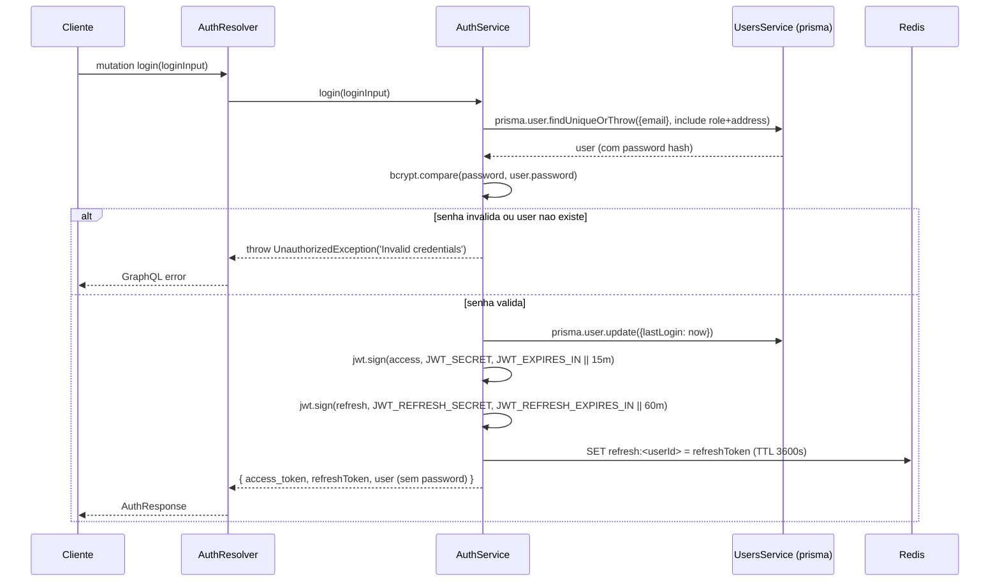
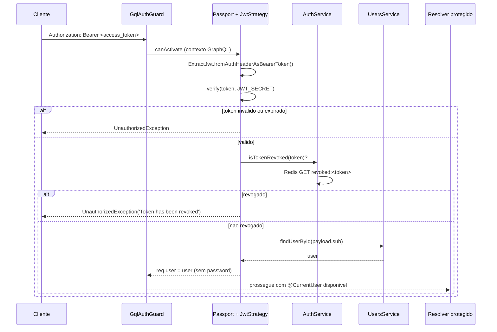

# Módulo: Auth

## 1. Propósito

O módulo `auth` é a fonte central de autenticação e autorização da aplicação. Ele é responsável por:

- Validar credenciais (email + senha) e emitir tokens JWT (access e refresh).
- Invalidar sessões de usuário via revogação de refresh token no Redis (logout).
- Disponibilizar a estratégia Passport JWT consumida pelos guards de todos os outros resolvers.
- Expor guards (`JwtAuthGuard`, `GqlAuthGuard`, `RolesGuard`) e decorators (`@Public`, `@Roles`, `@CurrentUser`) que são consumidos por outros módulos para proteger rotas.
- Gerenciar refresh de access token a partir de refresh token válido.

O módulo é declarado em [`./auth.module.ts`](./auth.module.ts) e expõe os seguintes artefatos:

- `AuthResolver` ([`./auth.resolver.ts`](./auth.resolver.ts)) — resolver GraphQL com mutations `login`, `logoutUser` e query `me`.
- `AuthService` ([`./auth.service.ts`](./auth.service.ts)) — lógica de validação, assinatura, verificação e revogação de tokens.
- `JwtStrategy` ([`./strategies/jwt.strategy.ts`](./strategies/jwt.strategy.ts)) — estratégia Passport para extrair e validar o Bearer token.
- `JwtAuthGuard` ([`./guards/jwt-auth.guard.ts`](./guards/jwt-auth.guard.ts)) — guard que respeita `@Public()` e libera a mutation `CreateUser`.
- `GqlAuthGuard` ([`./guards/qgl-auth.guard.ts`](./guards/qgl-auth.guard.ts)) — guard JWT adaptado para contexto GraphQL.
- `RolesGuard` ([`./guards/roles.guard.ts`](./guards/roles.guard.ts)) — guard de autorização por papel.
- Decorators `@Public`, `@Roles`, `@CurrentUser` reutilizados por outros módulos.

O `AuthModule` está no array `include` do `GraphQLModule.forRoot` em [`../../app.module.ts`](../../app.module.ts) (linha 60), portanto seus resolvers estão publicados no schema GraphQL.

## 2. Regras de Negócio

### Validação de credenciais (`validateUser`)

- Implementado em [`./auth.service.ts:21-41`](./auth.service.ts).
- Busca usuário pelo email com `prisma.user.findUniqueOrThrow` e inclui `address` e `role`.
- Acessa o Prisma **indiretamente** via `usersService['prisma']` — bracket notation que ignora o modificador `private` (ver Seção 10).
- Compara senha em texto-claro contra o hash persistido com `bcrypt.compare(password, user.password)` ([`./auth.service.ts:30`](./auth.service.ts)). O hash é gerado no `UsersService.create` com `bcrypt.hash(..., 10)` (ver [`../users/README.md`](../users/README.md)).
- Se a senha bate, atualiza `lastLogin = new Date()` via `prisma.user.update` ([`./auth.service.ts:31-36`](./auth.service.ts)) e retorna o usuário **sem o campo `password`** (destructuring).
- Se a senha não bate, retorna `null`.
- **Não há filtro por `status`**: usuários com `status = 'PENDING'` (default do banco, ver [`../../../prisma/schema.prisma:29`](../../../prisma/schema.prisma)) ou `INACTIVE`/`BLOCKED` conseguem autenticar normalmente. Ver Seção 10.

### Emissão de tokens (`login`)

Implementado em [`./auth.service.ts:43-74`](./auth.service.ts).

- Chama `validateUser`. Se retornar `null`, lança `UnauthorizedException('Invalid credentials')` ([`./auth.service.ts:46`](./auth.service.ts)).
- Monta o `JwtPayload` com `{ sub: user.id, email: user.email, role }` ([`./auth.service.ts:48`](./auth.service.ts), [`./interfaces/jwt-payload.interface.ts`](./interfaces/jwt-payload.interface.ts)). `role` é obtido de `user.role.name` (ou string direta, se já for string).
- **Access token**:
  - `expiresIn = configService.get('JWT_EXPIRES_IN') || '15m'` ([`./auth.service.ts:52`](./auth.service.ts)).
  - Assinado com `configService.get('JWT_SECRET')` ([`./auth.service.ts:53`](./auth.service.ts)).
- **Refresh token**:
  - `expiresIn = configService.get('JWT_REFRESH_EXPIRES_IN') || '60m'` ([`./auth.service.ts:58`](./auth.service.ts)).
  - Assinado com `configService.get('JWT_REFRESH_SECRET')` ([`./auth.service.ts:59`](./auth.service.ts)).
- Refresh token é armazenado no Redis sob a chave `refresh:<userId>` com TTL **fixo** de 3600 segundos (1 hora) ([`./auth.service.ts:63-67`](./auth.service.ts)). Isso independe do valor configurado em `JWT_REFRESH_EXPIRES_IN` — ver Seção 10.
- Retorna `{ access_token, refreshToken, user }` (chaves com *naming* inconsistente: snake_case e camelCase lado a lado, ver Seção 10).

### Registro do `JwtModule`

- Em [`./auth.module.ts:19-22`](./auth.module.ts), o `JwtModule.register` define `secret: process.env.JWT_SECRET` e `signOptions: { expiresIn: '60m' }`.
- Porém no `AuthService.login`, tanto a assinatura quanto o `secret` são **sobrescritos** por `configService.get(...)` no momento do `sign`. Ou seja, o `expiresIn: '60m'` do módulo é ignorado pelo caminho de login (ver Seção 10).

### Refresh de access token (`refresh`)

Implementado em [`./auth.service.ts:76-105`](./auth.service.ts). **Não está exposto como mutation GraphQL** (ver Seção 10).

- Verifica o refresh recebido com `jwtService.verify(refreshToken, { secret: JWT_REFRESH_SECRET })` ([`./auth.service.ts:79-81`](./auth.service.ts)).
- Confere se o refresh está armazenado em `refresh:<payload.sub>` no Redis e se bate com o recebido; caso contrário, lança `UnauthorizedException('Invalid refresh token')` ([`./auth.service.ts:84-87`](./auth.service.ts)).
- Gera **apenas** um novo access token com `{ sub, email }` (não preserva `role`), `expiresIn = JWT_EXPIRES_IN || '15m'` ([`./auth.service.ts:90-98`](./auth.service.ts)). Não reassina o refresh token.
- **Não passa `secret` explícito** ao assinar: usa o secret default do `JwtModule.register`, que é `process.env.JWT_SECRET` ([`./auth.module.ts:20`](./auth.module.ts)). Acaba funcionando só porque acidentalmente é o mesmo valor.
- Retorna `{ access_token }`.

### Revogação (`revokeToken`, `isTokenRevoked`)

Implementado em [`./auth.service.ts:107-115`](./auth.service.ts).

- `revokeToken(token, expiresInSeconds = 3600)` grava `revoked:<token>` com valor `true` no Redis.
- `isTokenRevoked(token)` retorna `true` se a chave existir.
- `JwtStrategy.validate` consulta `isTokenRevoked` a cada requisição autenticada ([`./strategies/jwt.strategy.ts:51-54`](./strategies/jwt.strategy.ts)).
- **Nota**: `AuthService.revokeToken` não é chamado em lugar nenhum do código atual (ver Seção 10). O `logout` atual remove apenas o refresh, não adiciona o access à blacklist.

### Validação de token arbitrário (`validateToken`)

Implementado em [`./auth.service.ts:117-132`](./auth.service.ts). Não é chamado em nenhum resolver/guard; pode ser código morto. Alerta: em [`./auth.service.ts:124`](./auth.service.ts), chama `findUniqueOrThrow(payload.sub)` passando a string como argumento posicional — essa forma não é a API pública do Prisma (que espera `{ where: { id } }`) e provavelmente está quebrada.

### Logout (`logout`)

Implementado em [`./auth.service.ts:134-142`](./auth.service.ts).

- Apaga `refresh:<userId>` do Redis (`cacheManager.del`).
- Retorna `true` em sucesso. Em exceção, instancia `new ExceptionsHandler(error)` (classe interna do NestJS, ver Seção 10) e **não retorna** (o `return false` é inalcançável).

### Carga útil do JWT

Definida em [`./interfaces/jwt-payload.interface.ts`](./interfaces/jwt-payload.interface.ts):

```ts
export interface JwtPayload {
  sub: string;    // userId
  email: string;
  role: string;   // nome do papel (ex.: 'ADMIN', 'USER')
}
```

## 3. Entidades e Modelo de Dados

O módulo `auth` **não possui model Prisma próprio**. Ele consome:

### Model `User` ([`../../../prisma/schema.prisma:17-50`](../../../prisma/schema.prisma))

Campos relevantes para autenticação:

| Campo | Tipo | Observação |
|---|---|---|
| `id` | `String` | PK, `uuid()`. Valor de `sub` no JWT. |
| `email` | `String` | Unique. Chave de login. |
| `password` | `String` | Hash bcrypt. |
| `status` | `String` | Default `"PENDING"`. **Não checado no login** (Seção 10). |
| `resetPasswordToken` | `String?` | Existe no schema, mas **não é usado em nenhum fluxo** deste módulo (Seção 10). |
| `verificationCode` | `Int` | Usado em `UsersService` (ativação), não em auth. |
| `isOnline` | `Boolean?` | Não é atualizado pelo auth. |
| `lastLogin` | `DateTime?` | Atualizado a cada `validateUser` bem-sucedido. |
| `roleId` | `Int` | FK para `Role`. |
| `role` | `Role` | Relation; `role.name` vai para o payload JWT. |

### Model `Role` ([`../../../prisma/schema.prisma:71-77`](../../../prisma/schema.prisma))

| Campo | Tipo | Observação |
|---|---|---|
| `id` | `Int` | autoincrement. |
| `name` | `String` | Nome do papel — string livre no schema, mas convenção do código é `ADMIN`, `SUPER_ADMIN`, `USER`. Ver Seção 8 e [`../roles/README.md`](../roles/README.md). |

### Chaves Redis usadas

| Chave | Valor | TTL | Definida em |
|---|---|---|---|
| `refresh:<userId>` | refresh token (string JWT) | 3600 s fixo | [`./auth.service.ts:63-67`](./auth.service.ts) |
| `revoked:<token>` | `true` | configurável, default 3600 s | [`./auth.service.ts:109`](./auth.service.ts) |

O `CacheModule` é registrado com `redisStore` apontando para `REDIS_PRIVATE_URL` ([`./auth.module.ts:23-33`](./auth.module.ts)), com `ttl: 0` (sem expiração automática global; cada `set` controla o próprio TTL).

## 4. API GraphQL

Declaradas em [`./auth.resolver.ts`](./auth.resolver.ts):

| Operação | Tipo | Args | Retorno | Guards | Descrição |
|---|---|---|---|---|---|
| `login` | Mutation | `loginInput: LoginInput` | `AuthResponse` | `@Public()` | Autentica email + senha, retorna access token + refresh token + user. ([`./auth.resolver.ts:15-22`](./auth.resolver.ts)) |
| `logoutUser` | Mutation | — | `Boolean` | `@UseGuards(GqlAuthGuard)` | Remove o refresh do Redis para o `currentUser.id`. ([`./auth.resolver.ts:24-31`](./auth.resolver.ts)) |
| `me` | Query | — | `User` | `@UseGuards(GqlAuthGuard)` | Retorna o `user` injetado pelo `JwtStrategy.validate`. ([`./auth.resolver.ts:33-37`](./auth.resolver.ts)) |

### Operações ausentes

As seguintes **não existem** como operações GraphQL no código atual:

- `refresh` / `refreshToken` — o método `AuthService.refresh` existe ([`./auth.service.ts:76-105`](./auth.service.ts)) mas **não está decorado como mutation**.
- `forgotPassword` / `requestPasswordReset` — não implementado.
- `resetPassword` — não implementado.
- `register` / `signup` — o registro de novo usuário é feito pela mutation `CreateUser` em [`../users/users.resolver.ts:19-25`](../users/users.resolver.ts) (módulo `users`), e é explicitamente permitida pelo `JwtAuthGuard` ([`./guards/jwt-auth.guard.ts:37-39`](./guards/jwt-auth.guard.ts)) pelo nome do campo `CreateUser`.

Ver Seção 10.

## 5. DTOs e Inputs

### `LoginInput` ([`./dto/login.input.ts`](./dto/login.input.ts))

```ts
@InputType()
export class LoginInput {
  @Field() @IsEmail() @IsNotEmpty()
  email: string;

  @Field() @IsNotEmpty() @MinLength(6)
  password: string;
}
```

Validadores (class-validator):

| Campo | Validators |
|---|---|
| `email` | `@IsEmail()`, `@IsNotEmpty()` |
| `password` | `@IsNotEmpty()`, `@MinLength(6)` |

### `AuthResponse` ([`./dto/auth-response.dto.ts`](./dto/auth-response.dto.ts))

```ts
@ObjectType()
export class AuthResponse {
  @Field() access_token: string;
  @Field() refreshToken: string;
  @Field(() => User) user: User;
}
```

| Campo | Tipo | Observação |
|---|---|---|
| `access_token` | `String` | snake_case. |
| `refreshToken` | `String` | camelCase. Inconsistência com `access_token` (Seção 10). |
| `user` | `UserDTO` | Reexporta o `User` de [`../users/dto/user.dto.ts`](../users/dto/user.dto.ts). Inclui `password`, `resetPasswordToken` e outros campos sensíveis no schema GraphQL (Seção 10). |

## 6. Fluxos Principais

### 6.1 Login



Referências: [`./auth.resolver.ts:15-22`](./auth.resolver.ts), [`./auth.service.ts:21-74`](./auth.service.ts).

### 6.2 Requisição autenticada (validação de access token)



Referências: [`./guards/qgl-auth.guard.ts`](./guards/qgl-auth.guard.ts), [`./strategies/jwt.strategy.ts:32-64`](./strategies/jwt.strategy.ts), [`./auth.service.ts:112-115`](./auth.service.ts).

### 6.3 Logout

```mermaid
sequenceDiagram
    participant C as Cliente
    participant R as AuthResolver
    participant S as AuthService
    participant RD as Redis

    C->>R: mutation logoutUser() [Bearer access_token]
    Note over R: @UseGuards(GqlAuthGuard) valida + injeta req.user
    R->>S: logout(currentUser.id)
    S->>RD: DEL refresh:<userId>
    alt sucesso
        S-->>R: true
        R-->>C: true
    else erro
        S->>S: new ExceptionsHandler(error)
        Note over S: nao retorna; 'return false' inalcancavel
    end
```

Referências: [`./auth.resolver.ts:24-31`](./auth.resolver.ts), [`./auth.service.ts:134-142`](./auth.service.ts). Ver Seção 10 sobre limitações deste fluxo.

### 6.4 Refresh de access token (somente serviço, não exposto)

```mermaid
sequenceDiagram
    participant X as Chamador (inexistente no GraphQL)
    participant S as AuthService
    participant RD as Redis

    X->>S: refresh(refreshToken)
    S->>S: jwt.verify(refreshToken, JWT_REFRESH_SECRET)
    alt invalido
        S-->>X: throw UnauthorizedException('Refresh token invalido ou expirado')
    else valido
        S->>RD: GET refresh:<payload.sub>
        alt nao bate
            S-->>X: throw UnauthorizedException('Invalid refresh token')
        else bate
            S->>S: jwt.sign({sub, email}, JWT_EXPIRES_IN || 15m)
            Note over S: NAO reassina refresh;<br/>NAO preserva role;<br/>NAO passa secret (usa default do JwtModule.register)
            S-->>X: { access_token }
        end
    end
```

Referências: [`./auth.service.ts:76-105`](./auth.service.ts). Ver Seção 10.

## 7. Dependências

### Dependências externas (npm)

Usadas pelo módulo ([`./auth.module.ts`](./auth.module.ts), [`./auth.service.ts`](./auth.service.ts), [`./strategies/jwt.strategy.ts`](./strategies/jwt.strategy.ts)):

- `@nestjs/jwt` — emissão/verificação de JWT.
- `@nestjs/passport` + `passport-jwt` — estratégia `jwt` registrada como default.
- `@nestjs/cache-manager` + `cache-manager-redis-yet` — Redis para `refresh:*` e `revoked:*`.
- `@nestjs/config` — `ConfigService` para `JWT_*`.
- `@nestjs/graphql` — `@Resolver`, `@Mutation`, `@Query`, `GqlExecutionContext`.
- `bcrypt` — `bcrypt.compare` em `validateUser` ([`./auth.service.ts:30`](./auth.service.ts)).
- `class-validator` — `@IsEmail`, `@IsNotEmpty`, `@MinLength` em `LoginInput`.
- `rxjs` — importado em `RolesGuard` (tipo `Observable`), embora o retorno seja síncrono ([`./guards/roles.guard.ts:3`](./guards/roles.guard.ts)).

### Módulos internos importados

Declarados em `imports` de [`./auth.module.ts:14-34`](./auth.module.ts):

- `ConfigModule` — variáveis de ambiente.
- `UsersModule` — fornece `UsersService` (ver [`../users/users.module.ts`](../users/users.module.ts)).
- `PassportModule.register({ defaultStrategy: 'jwt' })`.
- `JwtModule.register({ secret: process.env.JWT_SECRET, signOptions: { expiresIn: '60m' } })`.
- `CacheModule.registerAsync` — Redis global (`isGlobal: true`).

### Variáveis de ambiente

| Variável | Usada em | Descrição |
|---|---|---|
| `JWT_SECRET` | [`./auth.module.ts:20`](./auth.module.ts), [`./auth.service.ts:53`](./auth.service.ts), [`./strategies/jwt.strategy.ts:22`](./strategies/jwt.strategy.ts) | Segredo do access token. Se ausente em `jwt.strategy.ts`, usa `'fallback-secret-key'`. |
| `JWT_EXPIRES_IN` | [`./auth.service.ts:52,96`](./auth.service.ts) | TTL do access token. Default `'15m'`. |
| `JWT_REFRESH_SECRET` | [`./auth.service.ts:59,80`](./auth.service.ts) | Segredo do refresh token. |
| `JWT_REFRESH_EXPIRES_IN` | [`./auth.service.ts:58`](./auth.service.ts) | TTL do refresh token ao **assinar**. Default `'60m'`. Note que o TTL no Redis é fixo em 3600 s independente desse valor. |
| `REDIS_PRIVATE_URL` | [`./auth.module.ts:28`](./auth.module.ts) | URL do Redis usado pelo `cache-manager-redis-yet`. |
| `MOCK_PRISMA` | [`./guards/jwt-auth.guard.ts:17`](./guards/jwt-auth.guard.ts), [`./strategies/jwt.strategy.ts:19,34`](./strategies/jwt.strategy.ts) | Se `'true'`, desliga autenticação em runtime. Ver Seção 10. |

Ver também [`../../../docs/infrastructure.md`](../../../docs/infrastructure.md) seções 213-217.

### `exports` do módulo

`AuthModule` exporta ([`./auth.module.ts:42`](./auth.module.ts)):

- `JwtModule`, `PassportModule` — para consumo por outros módulos que queiram importar a configuração Passport.
- `JwtAuthGuard`, `GqlAuthGuard` — referenciados via `@UseGuards(...)`.
- `AuthService`.

`RolesGuard` **não está nos `providers` nem nos `exports`**, mas é usado diretamente por `@UseGuards(GqlAuthGuard, RolesGuard)` em vários resolvers — isso funciona porque o NestJS instancia a classe a partir do `useClass` implícito quando referenciada em `@UseGuards`. Ver Seção 10.

## 8. Autorização e Papéis

### Guards

#### `JwtAuthGuard` ([`./guards/jwt-auth.guard.ts`](./guards/jwt-auth.guard.ts))

- Estende `AuthGuard('jwt')` do `@nestjs/passport`.
- **Atalho de documentação/mock**: se `process.argv.includes('--generate-only')` **ou** `process.env.MOCK_PRISMA === 'true'`, retorna `true` **sem verificar JWT** ([`./guards/jwt-auth.guard.ts:17-19`](./guards/jwt-auth.guard.ts)). Ver Seção 10.
- Respeita `@Public()` via `Reflector.getAllAndOverride(IS_PUBLIC_KEY, ...)` ([`./guards/jwt-auth.guard.ts:22-30`](./guards/jwt-auth.guard.ts)).
- Libera **sempre** o field de nome `CreateUser` (via `GqlExecutionContext.create(context).getInfo().fieldName`) ([`./guards/jwt-auth.guard.ts:33-39`](./guards/jwt-auth.guard.ts)). Isso permite registrar novos usuários sem token.
- Sobrescreve `getRequest` para extrair `req` do contexto GraphQL ([`./guards/jwt-auth.guard.ts:45-49`](./guards/jwt-auth.guard.ts)).
- **Não está ativo globalmente**: em [`../../main.ts`](../../main.ts) e [`../../app.module.ts`](../../app.module.ts) não há `APP_GUARD` registrado, portanto `JwtAuthGuard` só age onde for explicitamente adicionado via `@UseGuards`. Na prática, os resolvers usam `GqlAuthGuard`, e `JwtAuthGuard` parece atualmente não ter consumidores diretos no código (apenas está registrado em `providers`/`exports`).

#### `GqlAuthGuard` ([`./guards/qgl-auth.guard.ts`](./guards/qgl-auth.guard.ts))

- Estende `AuthGuard('jwt')` e sobrescreve `getRequest` para GraphQL.
- **Não respeita `@Public()`** — é um guard puro; se aplicado, sempre exige JWT.
- **Não desliga com `MOCK_PRISMA`** — diferente de `JwtAuthGuard`. Mas o `JwtStrategy.validate` **sim** retorna um usuário fictício quando `MOCK_PRISMA === 'true'` ([`./strategies/jwt.strategy.ts:34-40`](./strategies/jwt.strategy.ts)), o que efetivamente passa por qualquer guard que delegue ao Passport.
- Nome do arquivo é `qgl-auth.guard.ts` (typo — `qgl` em vez de `gql`). Ver Seção 10.

#### `RolesGuard` ([`./guards/roles.guard.ts`](./guards/roles.guard.ts))

- Lê metadata de `ROLES_KEY` ([`./decorators/roles.decorator.ts:3`](./decorators/roles.decorator.ts)) com `Reflector.getAllAndOverride`.
- Se não houver roles exigidas, libera.
- Extrai `user = ctx.getContext().req.user` — depende de um guard JWT ter populado `req.user` antes (por isso é usado sempre após `GqlAuthGuard`).
- Lê `role = typeof user.role === 'string' ? user.role : user.role?.name` ([`./guards/roles.guard.ts:28`](./guards/roles.guard.ts)).
- Se o papel do usuário não está em `requiredRoles`, lança `ForbiddenException('Forbidden resource')`.

### Decorators

#### `@Public()` ([`./guards/public.decorator.ts`](./guards/public.decorator.ts), também redefinido em [`./guards/jwt-auth.guard.ts:7-8`](./guards/jwt-auth.guard.ts))

- `SetMetadata(IS_PUBLIC_KEY, true)`. Consumido apenas por `JwtAuthGuard` — **não tem efeito** se apenas `GqlAuthGuard` estiver em uso.
- **Duplicação**: o símbolo `Public` e a constante `IS_PUBLIC_KEY` estão declarados em dois arquivos (Seção 10).

#### `@Roles(...roles: string[])` ([`./decorators/roles.decorator.ts`](./decorators/roles.decorator.ts))

- Define metadata `ROLES_KEY` com a lista de papéis permitidos.
- Strings são livres no schema (não há enum), mas a convenção do código é `ADMIN`, `SUPER_ADMIN`, `USER`.

#### `@CurrentUser()` ([`./decorators/current-user.decorator.ts`](./decorators/current-user.decorator.ts))

- `createParamDecorator` que retorna `ctx.getContext().req.user` do contexto GraphQL.
- Populado pelo `JwtStrategy.validate`.

### Consumidores (grep em `src`)

Arquivos que consomem guards/decorators deste módulo:

| Arquivo | Uso |
|---|---|
| [`./auth.resolver.ts`](./auth.resolver.ts) | `GqlAuthGuard`, `@CurrentUser` em `logoutUser` e `me`. |
| [`../users/users.resolver.ts`](../users/users.resolver.ts) | `@Public()` em `CreateUser`; `GqlAuthGuard + RolesGuard + @Roles(...)` em `findAll` (`ADMIN`/`SUPER_ADMIN`), `findAllWithPagination` (`ADMIN`/`SUPER_ADMIN`/`USER`), `findUserById` (idem), `updateUser`, `verificationCode`, `deletedUser` (`ADMIN`/`SUPER_ADMIN`) e `softDeleted`. `@CurrentUser()` em `updateUser`, `verificationCode`, `softDeleted`. |
| [`../posts/posts.resolver.ts`](../posts/posts.resolver.ts) | `GqlAuthGuard` em `createPost`; `@CurrentUser` injeta o autor. Queries `posts` e `post` **não têm guard**. |
| [`../complaints/complaints.resolver.ts`](../complaints/complaints.resolver.ts) | `GqlAuthGuard + RolesGuard + @Roles('ADMIN','SUPER_ADMIN','USER')` em `createComplaint`; `@CurrentUser`. |

Grep de referência:

```
grep -rn "JwtAuthGuard\|GqlAuthGuard\|RolesGuard\|@Roles\|@CurrentUser" src --include="*.ts"
```

Os módulos a seguir **não** aplicam nenhum guard em seus resolvers (consumidores ausentes): `addresses`, `plans`, `payments`, `subscriptions`, `subscription-status`, `upload-medias`, `comments`, `assistant_ai`, `pag-seguro`, `reporting`, `sms`. Ver Seção 10 para o impacto de segurança.

### Matriz de papéis observados

| Papel | Operações permitidas |
|---|---|
| `SUPER_ADMIN` | Todas as anotadas com `@Roles('ADMIN','SUPER_ADMIN', ...)` + `getUsers`, `deletedUser`. |
| `ADMIN` | Idem. |
| `USER` | `findAllWithPagination`, `findUserById`, `updateUser`, `verificationCode`, `softDeleted`, `createComplaint`. |
| *(qualquer autenticado)* | `me`, `logoutUser`, `createPost`. |
| *(público)* | `login`, `CreateUser`, `posts`, `post`. |

## 9. Erros e Exceções

Lançados diretamente pelo módulo:

| Onde | Exceção | Mensagem | Condição |
|---|---|---|---|
| [`./auth.service.ts:46`](./auth.service.ts) | `UnauthorizedException` | `'Invalid credentials'` | `validateUser` retornou `null` (senha inválida) ou `findUniqueOrThrow` lançou (email inexistente; o `P2025` se propaga como `Error`, não é convertido — ver Seção 10). |
| [`./auth.service.ts:86`](./auth.service.ts) | `UnauthorizedException` | `'Invalid refresh token'` | Refresh enviado não bate com o armazenado em `refresh:<sub>` no Redis. |
| [`./auth.service.ts:103`](./auth.service.ts) | `UnauthorizedException` | `'Refresh token inválido ou expirado'` | `jwt.verify` do refresh falhou. |
| [`./auth.service.ts:119`](./auth.service.ts) | `UnauthorizedException` | `'Token has been revoked'` | `isTokenRevoked` retornou `true` em `validateToken`. |
| [`./auth.service.ts:126`](./auth.service.ts) | `UnauthorizedException` | `'User not found'` | `findUniqueOrThrow` não retornou user em `validateToken`. |
| [`./auth.service.ts:130`](./auth.service.ts) | `UnauthorizedException` | `'Invalid token'` | Catch-all de `validateToken`. |
| [`./strategies/jwt.strategy.ts:47`](./strategies/jwt.strategy.ts) | `UnauthorizedException` | `'No token provided'` | Token ausente no header Authorization. |
| [`./strategies/jwt.strategy.ts:53`](./strategies/jwt.strategy.ts) | `UnauthorizedException` | `'Token has been revoked'` | `isTokenRevoked(token)` retornou `true`. |
| [`./strategies/jwt.strategy.ts:60`](./strategies/jwt.strategy.ts) | `UnauthorizedException` | `'User not found'` | `findUserById(payload.sub)` retornou falsy. |
| [`./guards/roles.guard.ts:24`](./guards/roles.guard.ts) | `ForbiddenException` | `'User not found in request'` | `req.user` ausente. |
| [`./guards/roles.guard.ts:29`](./guards/roles.guard.ts) | `ForbiddenException` | `'User role not found'` | `role` não resolvido. |
| [`./guards/roles.guard.ts:33`](./guards/roles.guard.ts) | `ForbiddenException` | `'Forbidden resource'` | Papel do usuário não está em `requiredRoles`. |

Exceções indiretas:

- `Prisma.PrismaClientKnownRequestError` (ex.: `P2025` em `findUniqueOrThrow`) **não é capturado** em `validateUser`; propaga como erro genérico antes da conversão para `UnauthorizedException`, alterando a mensagem exposta ao cliente.
- `AuthService.logout` captura erro e instancia `new ExceptionsHandler(error)` — isso **não** lança para o cliente, e o `return false` é inalcançável pelo `return` embutido na classe (Seção 10).

## 10. Pontos de Atenção / Manutenção

### Bypass de autenticação com `MOCK_PRISMA` / `--generate-only`

- `JwtAuthGuard.canActivate` retorna `true` incondicionalmente se `MOCK_PRISMA === 'true'` ([`./guards/jwt-auth.guard.ts:17-19`](./guards/jwt-auth.guard.ts)).
- `JwtStrategy.validate` retorna um `user` fictício `{ id: 'doc-user-id', email: 'doc@example.com', fullName: 'Documentation User' }` ([`./strategies/jwt.strategy.ts:34-40`](./strategies/jwt.strategy.ts)).
- `JwtStrategy` constrói a `secretOrKey` com `'documentation_generation_secret_key'` ([`./strategies/jwt.strategy.ts:20-22`](./strategies/jwt.strategy.ts)) quando em modo mock.
- **Risco**: se `MOCK_PRISMA=true` acidentalmente chegar em produção, qualquer requisição passa como `doc-user-id` (sem role definida — `RolesGuard` lançaria `'User role not found'`, mas guards que usam apenas `GqlAuthGuard` ficariam abertos). Deve-se garantir que a flag só exista em ambientes de geração de docs/testes.

### Usuário `PENDING` consegue logar

- `validateUser` não filtra por `status`. Um usuário recém-criado com `status = 'PENDING'` (default do schema) e `verificationCode` não confirmado consegue obter access + refresh normalmente.
- Como o `JwtPayload` não carrega `status`, guards downstream também não bloqueiam.
- Recomendação: adicionar `if (user.status !== 'ACTIVE') throw new UnauthorizedException(...)` em `validateUser`.

### TTL do refresh no Redis é fixo em 3600 s

- Em [`./auth.service.ts:63-67`](./auth.service.ts), `cacheManager.set(..., 1 * 60 * 60)` (1 hora), **independente** de `JWT_REFRESH_EXPIRES_IN`.
- Consequência: se `JWT_REFRESH_EXPIRES_IN` for maior que 60 min, o refresh expira no Redis antes de expirar como JWT, e o usuário precisa relogar. Se for menor, o JWT expira primeiro e o Redis fica com chave órfã até expirar.

### Nenhuma mutation `refreshToken` exposta

- O método `AuthService.refresh` existe ([`./auth.service.ts:76-105`](./auth.service.ts)) mas não está decorado como `@Mutation`. Clientes não conseguem usá-lo via GraphQL.

### `AuthService.refresh` não preserva `role` e não passa `secret`

- Novo access token é assinado com payload `{ sub, email }` sem `role` ([`./auth.service.ts:91-94`](./auth.service.ts)). Guards baseados em `@Roles` passariam a falhar depois do refresh.
- O `jwt.sign` chamado em `refresh` **não recebe `secret`** ([`./auth.service.ts:95-97`](./auth.service.ts)), usando o default do `JwtModule.register` (que é `process.env.JWT_SECRET`, o mesmo do access token). Correto por coincidência, não por design explícito.

### `JwtModule.register` com configuração divergente

- `JwtModule.register` fixa `secret: process.env.JWT_SECRET` e `signOptions: { expiresIn: '60m' }` ([`./auth.module.ts:19-22`](./auth.module.ts)).
- `AuthService.login` sobrescreve **ambos** via `jwt.sign(payload, { expiresIn, secret })`. Resultado: o `'60m'` do módulo é inócuo para login e só se aplica em calls de `jwt.sign(payload)` sem override (como o acima no `refresh`).

### `validateToken` provavelmente quebrado

- [`./auth.service.ts:124`](./auth.service.ts): `prisma.user.findUniqueOrThrow(payload.sub)` — passa uma string como argumento, em vez de `{ where: { id: payload.sub } }`. Lançará erro.
- O método não é chamado em nenhum lugar do código, então o bug não é observável; é código morto suspeito.

### `revokeToken` nunca chamado

- `AuthService.revokeToken` existe e grava `revoked:<token>` ([`./auth.service.ts:107-110`](./auth.service.ts)), e `JwtStrategy` consulta a chave, mas **nenhum caller** invoca `revokeToken`. `logout` apaga apenas o refresh, não adiciona o access à blacklist. Um access token continua válido até expirar, mesmo após logout.

### Acesso `private` violado (`usersService['prisma']`)

- `AuthService` acessa `usersService['prisma']` em [`./auth.service.ts:22,31,124`](./auth.service.ts) para contornar o modificador `private` no `UsersService`. Faz o módulo depender da implementação interna do `UsersService`. Alternativa correta: injetar `PrismaService` diretamente ou expor métodos públicos.

### Nomenclatura inconsistente e typo de arquivo

- `AuthResponse`: mistura `access_token` (snake_case) e `refreshToken` (camelCase) ([`./dto/auth-response.dto.ts:7-10`](./dto/auth-response.dto.ts)).
- Arquivo do guard: `qgl-auth.guard.ts` (typo `qgl` em vez de `gql`), classe `GqlAuthGuard` correta ([`./guards/qgl-auth.guard.ts`](./guards/qgl-auth.guard.ts)).

### `AuthResponse.user` expõe `password` no schema GraphQL

- `UserDTO` declara `@Field(() => String) password` ([`../users/dto/user.dto.ts:20-21`](../users/dto/user.dto.ts)). Embora o `validateUser` remova `password` do objeto retornado, o **tipo GraphQL** continua declarando o campo, e `resetPasswordToken` e outros campos sensíveis também aparecem no schema.

### `Public` declarado duas vezes

- [`./guards/public.decorator.ts:3-4`](./guards/public.decorator.ts) exporta `IS_PUBLIC_KEY` e `Public`.
- [`./guards/jwt-auth.guard.ts:7-8`](./guards/jwt-auth.guard.ts) redeclara as mesmas constantes no mesmo arquivo do guard. São duas declarações independentes com o mesmo literal `'isPublic'` — a chave Reflector é a mesma, então funciona, mas é duplicação.

### `RolesGuard` não está em `providers` / `exports`

- Em [`./auth.module.ts`](./auth.module.ts), `RolesGuard` não é listado, mas é usado por outros resolvers via `@UseGuards(GqlAuthGuard, RolesGuard)`. Funciona porque NestJS resolve `@UseGuards(Class)` instanciando com scoping padrão, mas idealmente deveria estar declarado.

### `logout` com `ExceptionsHandler` interno

- [`./auth.service.ts:139`](./auth.service.ts) instancia `new ExceptionsHandler(error)` (import de `@nestjs/core/exceptions/exceptions-handler`). Isso não **lança** a exceção — apenas cria um objeto. O `return false` depois é inalcançável (pelo `throw`/`return` anterior? não — o `throw new ExceptionsHandler(...)` age como throw, então o `return false` é morto). Substituir por `throw error` ou `return false` direto.

### Reset de senha não implementado

- O schema `User` tem `resetPasswordToken` ([`../../../prisma/schema.prisma:31`](../../../prisma/schema.prisma)), mas **não há mutation** de forgot/reset password neste módulo nem em nenhum outro. Funcionalidade incompleta.

### Resolvers sem guard no restante da aplicação

- Conforme Seção 8, módulos como `addresses`, `plans`, `payments`, `subscriptions`, `upload-medias`, `comments`, `assistant_ai`, `pag-seguro`, `reporting` expõem mutations/queries sem `@UseGuards`. Qualquer cliente sem JWT pode chamá-las. Risco de segurança.

## 11. Testes

### Testes existentes

- [`./auth.resolver.spec.ts`](./auth.resolver.spec.ts) — smoke test: apenas verifica que `AuthResolver` é definido (`expect(resolver).toBeDefined()`). Não passa `AuthService` mockado corretamente (usa `providers: [AuthResolver, AuthService]` sem as deps que `AuthService` precisa: `UsersService`, `JwtService`, `ConfigService`, `CACHE_MANAGER`). **O teste não roda** se o módulo de testes tentar resolver dependências — provavelmente está quebrado ou não é executado regularmente.
- [`./auth.service.spec.ts`](./auth.service.spec.ts) — idem. `providers: [AuthService]` sem mocks. Mesmo problema.

### Cobertura ausente

Nenhum dos fluxos críticos tem teste:

- `login` (validação de senha bcrypt, emissão de tokens, persistência no Redis).
- `logout` (remoção da chave Redis).
- `refresh` (verificação, bate com Redis, emissão de novo access).
- `JwtStrategy.validate` (token revogado, usuário inexistente, payload inválido).
- `JwtAuthGuard` (rota `@Public`, mock mode, `CreateUser` bypass).
- `RolesGuard` (user sem role, role não permitida, role ok).

### Como rodar

Do diretório raiz do projeto:

```bash
npm run test -- --testPathPattern=src/modules/auth
```

Ou, pontualmente, os specs existentes:

```bash
npx jest src/modules/auth/auth.resolver.spec.ts
npx jest src/modules/auth/auth.service.spec.ts
```

### Recomendações

- Reescrever os specs injetando mocks de `UsersService`, `JwtService`, `ConfigService` e `CACHE_MANAGER`.
- Cobrir: senha inválida, usuário inexistente, login bem-sucedido, refresh com token não armazenado, logout removendo chave, revogação.
- Adicionar e2e com `supertest` simulando header `Authorization: Bearer <token>` contra a mutation `me`.
