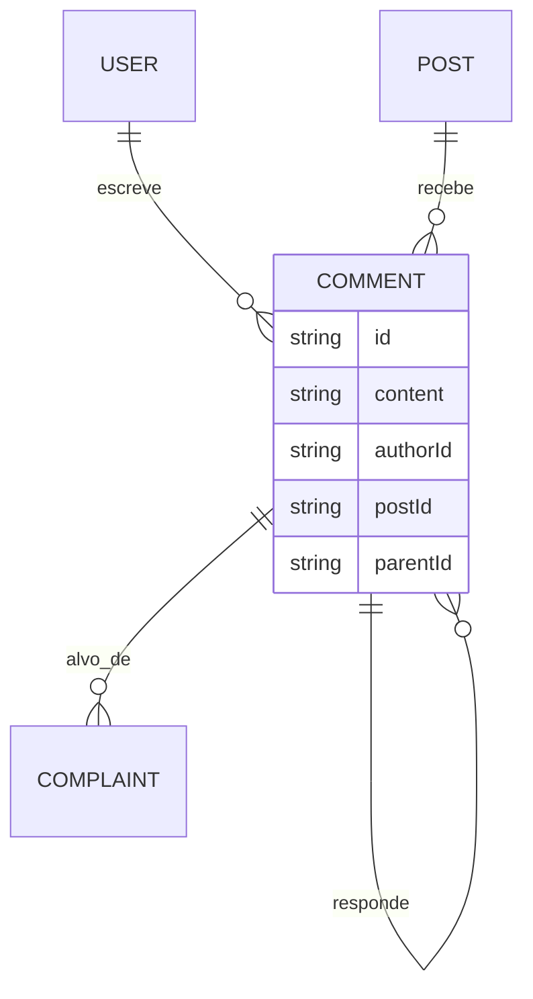
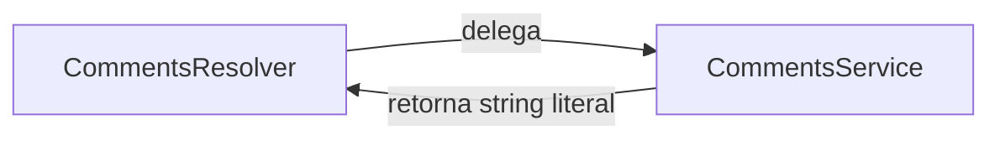
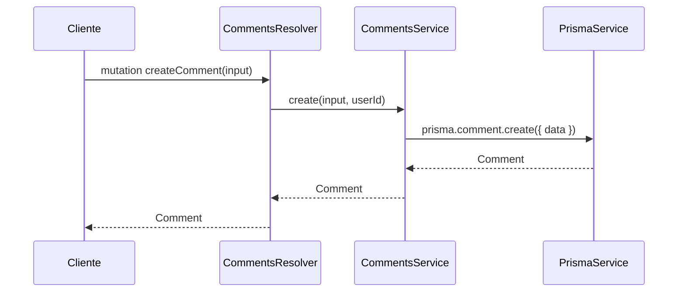

# Módulo: Comments

## 1. Propósito

Gerencia comentários em `Post` com suporte a comentários aninhados via
auto-relacionamento `parentId`/`replies`. O modelo de dados e o tipo GraphQL
já estão definidos, mas **o serviço é stub** (retorna strings literais) e o
módulo **não está exposto no schema GraphQL** — nenhuma operação funciona
end-to-end hoje.

Relacionamentos: cada `Comment` pertence a um `Post` e a um `User` (autor);
pode referenciar outro `Comment` como `parent`, formando árvore de respostas;
e pode ser alvo de `Complaint` (denúncia).

## 2. Regras de Negócio

> **Atualizado pelo Plan 2 (2026-04-18):** o service agora persiste via
> Prisma e `CreateCommentInput` tem formato real
> `{ postId, content, parentId?, mediaIds? }`. A mutation `createComment`
> exige JWT (`GqlAuthGuard`). Mídias passam por ownership check do
> `MediaService` antes de serem anexadas. Campos `imageUrl[]`/`videoUrl`
> foram adicionados à entity/tabela.

1. Um `Comment` pertence obrigatoriamente a um `Post` (FK `postId`) e a um
   `User` (FK `authorId`) — ver [`prisma/schema.prisma:177-196`](../../../prisma/schema.prisma).
2. Um `Comment` pode ter `parentId` opcional referenciando outro `Comment`,
   formando resposta (auto-relacionamento `CommentToReplies`).
3. Não há soft-delete no schema Prisma: o modelo `Comment` **não possui**
   `deletedAt` nem `deletedStatus` — apenas `createdAt`/`updatedAt`.
   > ⚠️ **Divergência:** `entities/comment.entity.ts:45-46` expõe
   > `deletedAt?: Date` como `@Field`, mas o campo não existe no banco.
   > Consultas que selecionarem esse campo via GraphQL retornarão
   > `undefined`/erro. Ver seção 10.
4. `commentsCount` e `replies` **não são campos persistidos** — são
   derivados (contagem/lista de filhos). Não há código que os popule hoje.
5. Nenhuma validação de profundidade de aninhamento é aplicada (qualquer
   `Comment` pode apontar para qualquer outro via `parentId`).

## 3. Entidades e Modelo de Dados

### `Comment` — tabela `comments` (ver [`prisma/schema.prisma:177-196`](../../../prisma/schema.prisma))

| Campo | Tipo | Nullable | Default | Observação |
| --- | --- | --- | --- | --- |
| `id` | String (uuid) | não | `uuid()` | PK |
| `content` | String | não | | texto do comentário |
| `authorId` | String | não | | FK → `users.id` |
| `postId` | String | não | | FK → `posts.id` |
| `parentId` | String | sim | | FK → `comments.id` (auto-relação) |
| `createdAt` | DateTime | não | `now()` | `@map("created_at")` |
| `updatedAt` | DateTime | sim | `@updatedAt` | `@map("updated_at")` |

Relações:
- N:1 com `User` via `authorId`.
- N:1 com `Post` via `postId`.
- Auto-relação N:1 → `parent` (pai) / 1:N → `replies` (filhos), ambos sob
  `@relation("CommentToReplies")`.
- 1:N com `Complaint` (`complaints`).

ERD completo em [`../../../docs/data-model.md`](../../../docs/data-model.md).

### Tipo GraphQL `Comment` (`entities/comment.entity.ts`)

| Campo | Tipo GraphQL | Origem | Observação |
| --- | --- | --- | --- |
| `id` | `String` | banco | |
| `content` | `String` | banco | |
| `postId` | `String` | banco | |
| `post` | `Post` | relação | — |
| `parentId` | `String` (nullable) | banco | |
| `parent` | `Comment` (nullable) | auto-relação | |
| `replies` | `[Comment]` (nullable) | auto-relação | derivado — sem populador |
| `commentsCount` | `Int` | derivado | **sem populador** |
| `authorId` | `String` | banco | |
| `author` | `User` | relação | |
| `createdAt` | `DateTime` (`created_at`) | banco | |
| `updatedAt` | `DateTime` (`updated_at`, nullable) | banco | |
| `deletedAt` | `DateTime` (`deleted_at`, nullable) | **não existe no banco** | ver seção 10 |
| `complaints` | `[Complaint]` | relação | |

## 4. API GraphQL

> O array `include` do `GraphQLModule.forRoot({...})` em
> [`../../app.module.ts`](../../app.module.ts) contém
> `AuthModule`, `PagSeguroModule`, `PlansModule`, `SubscriptionsModule`,
> `SubscriptionStatusModule`, `PaymentsModule`, `PostsModule`,
> `UploadMediasModule` e `ComplaintsModule` — **`CommentsModule` não está
> incluído**. Consequência: as operações abaixo **não aparecem no
> `schema.gql`** e não podem ser chamadas pelo cliente GraphQL hoje,
> apesar de declaradas.

### Queries declaradas (inativas no schema)

| Nome | Argumentos | Retorno | Auth | Descrição |
| --- | --- | --- | --- | --- |
| `comments` | — | `[Comment!]!` | nenhuma | Retorna string placeholder `"This action returns all comments"`. |
| `comment` | `id: Int!` | `Comment!` | nenhuma | Retorna string placeholder `"This action returns a #<id> comment"`. |

### Mutations declaradas (inativas no schema)

| Nome | Argumentos | Retorno | Auth | Descrição |
| --- | --- | --- | --- | --- |
| `createComment` | `createCommentInput: CreateCommentInput!` | `Comment!` | nenhuma | Retorna `"This action adds a new comment"`. |
| `updateComment` | `updateCommentInput: UpdateCommentInput!` | `Comment!` | nenhuma | Retorna `"This action updates a #<id> comment"`. |
| `removeComment` | `id: Int!` | `Comment!` | nenhuma | Retorna `"This action removes a #<id> comment"`. |

### Subscriptions

Não se aplica.

### REST

Não se aplica — módulo não declara controller.

> ⚠️ **Inconsistência de tipo:** operações declaram `id: Int` tanto em
> `findOne`/`removeComment` (`comments.resolver.ts:22,32`) quanto em
> `UpdateCommentInput.id` (`Int`), mas `Comment.id` no schema é
> `String (uuid)`. Qualquer integração real quebra.

## 5. DTOs e Inputs

### `CreateCommentInput` (`dto/create-comment.input.ts`)

| Campo | Tipo | Validadores | Obrigatório | Observação |
| --- | --- | --- | --- | --- |
| `exampleField` | `Int` | — | sim | placeholder gerado pelo CLI do Nest; **não corresponde a nenhum campo real de `Comment`** |

Nenhum dos campos esperados (`content`, `postId`, `parentId?`, `authorId`)
está presente. É preciso reescrever o DTO para uso real.

### `UpdateCommentInput` (`dto/update-comment.input.ts`)

Estende `PartialType(CreateCommentInput)` e adiciona `id: Int`.

| Campo | Tipo | Observação |
| --- | --- | --- |
| `id` | `Int` | **incoerente com `Comment.id: String (uuid)`** |
| (herdados) | `Int` | apenas `exampleField?` vem do pai |

## 6. Fluxos Principais

Não se aplica — não há fluxo operacional implementado. O que existe é a
casca gerada pelo `nest g resource comments`:

Quando o módulo for implementado, o fluxo esperado (a confirmar com o time)
é:

> ⚠️ **A confirmar:** critério exato de autorização para criar/atualizar/
> remover um comentário (autor, admin, moderator?) — hoje nenhum guard é
> aplicado.

## 7. Dependências

### Módulos internos importados

`comments.module.ts` declara apenas `providers: [CommentsResolver, CommentsService]`.
Não importa nenhum módulo via `imports: [...]`.

`CommentsService` **não injeta** `PrismaService`, `PostsService` ou
`UsersService` — constructor vazio. Para a implementação real, precisará
minimamente de `PrismaService`.

### Módulos que consomem este

Grep `grep -rn "CommentsModule\|CommentsService" src --include="*.ts"`:

- `src/app.module.ts:25,88` — registra `CommentsModule` nos `imports` do
  AppModule (mas não no `include` do GraphQL).

Nenhum outro módulo importa `CommentsService`.

No schema Prisma, `Comment` é referenciado por `Post.comments` (1:N) e por
`Complaint.commentId` (alvo de denúncia) — essas relações vivem nos módulos
[`../posts/README.md`](../posts/README.md) e
[`../complaints/README.md`](../complaints/README.md).

### Integrações externas

Não se aplica.

### Variáveis de ambiente

Não se aplica.

## 8. Autorização e Papéis

Nenhum `@UseGuards` ou `@Roles()` declarado. Como todas as operações
retornam strings literais, o tema de autorização é acadêmico até o service
ser implementado.

Quando ativado, aplicar `GqlAuthGuard` para operações de escrita e
considerar verificação de dono (`authorId === user.id`) para `update`/`remove`
como documentado em [`../auth/README.md`](../auth/README.md).

## 9. Erros e Exceções

Não se aplica — nenhuma exceção é lançada pelo service. Apenas retornos de
string literais.

## 10. Pontos de Atenção / Manutenção

- **Módulo não implementado.** Todos os cinco métodos em
  `comments.service.ts` são stubs de `nest g resource`. Nenhum grava,
  atualiza, deleta ou lê do banco.
- **Fora do schema GraphQL.** `CommentsModule` não está no `include` de
  `GraphQLModule.forRoot(...)` em `app.module.ts`. As operações do resolver
  não chegam ao cliente via Apollo.
- **`deletedAt` fantasma.** `entities/comment.entity.ts:45` expõe
  `deletedAt` como `@Field`, mas o modelo Prisma não tem esse campo.
  Falsa promessa de soft-delete — ou adicionar ao schema, ou remover do
  tipo GraphQL.
- **Tipo `id` divergente.** `findOne(id: number)`, `remove(id: number)` e
  `UpdateCommentInput.id: Int` usam `number`/`Int`, mas no banco `id` é
  `String (uuid)`. Padrão copiado do boilerplate do Nest CLI.
- **`CreateCommentInput` só tem `exampleField`.** Nenhum dos campos reais
  (`content`, `postId`, `parentId`, `authorId`) está modelado.
- **Campos derivados sem populador.** `commentsCount` e `replies` no tipo
  GraphQL precisam de `@ResolveField` ou de `include` no Prisma — nada
  disso existe hoje.
- **Sem `PrismaService` no constructor.** A implementação real exigirá
  injetá-lo e, muito provavelmente, `PostsService` (para validar o
  `postId` antes de persistir).
- **Nenhuma regra de aninhamento.** Não há limite de profundidade para
  `replies`, nem validação de que o `parentId` pertence ao mesmo `postId`
  do novo comentário.

## 11. Testes

| Arquivo | Cenários cobertos | Observações |
| --- | --- | --- |
| `comments.service.spec.ts` | Instancia `CommentsService` e verifica `toBeDefined`. | Como o service é puramente stub e sem dependências, o teste roda — mas não cobre comportamento útil. |
| `comments.resolver.spec.ts` | Instancia `CommentsResolver` com `CommentsService` e verifica `toBeDefined`. | Idem — smoke test sem asserts de integração. |

Não há cobertura de:

- Criação, leitura, atualização ou remoção real.
- Árvore de respostas (`parent`/`replies`).
- Integração com `Post`/`User` via FKs.
- Fluxo de denúncia sobre comentário (vive em
  [`../complaints/README.md`](../complaints/README.md)).
