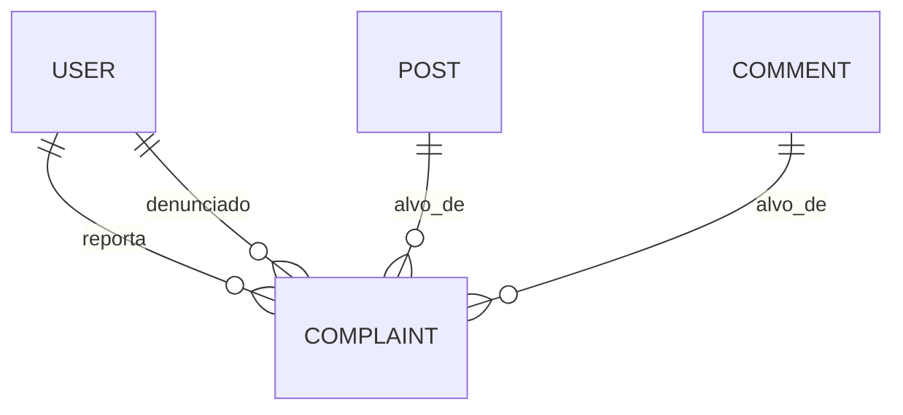
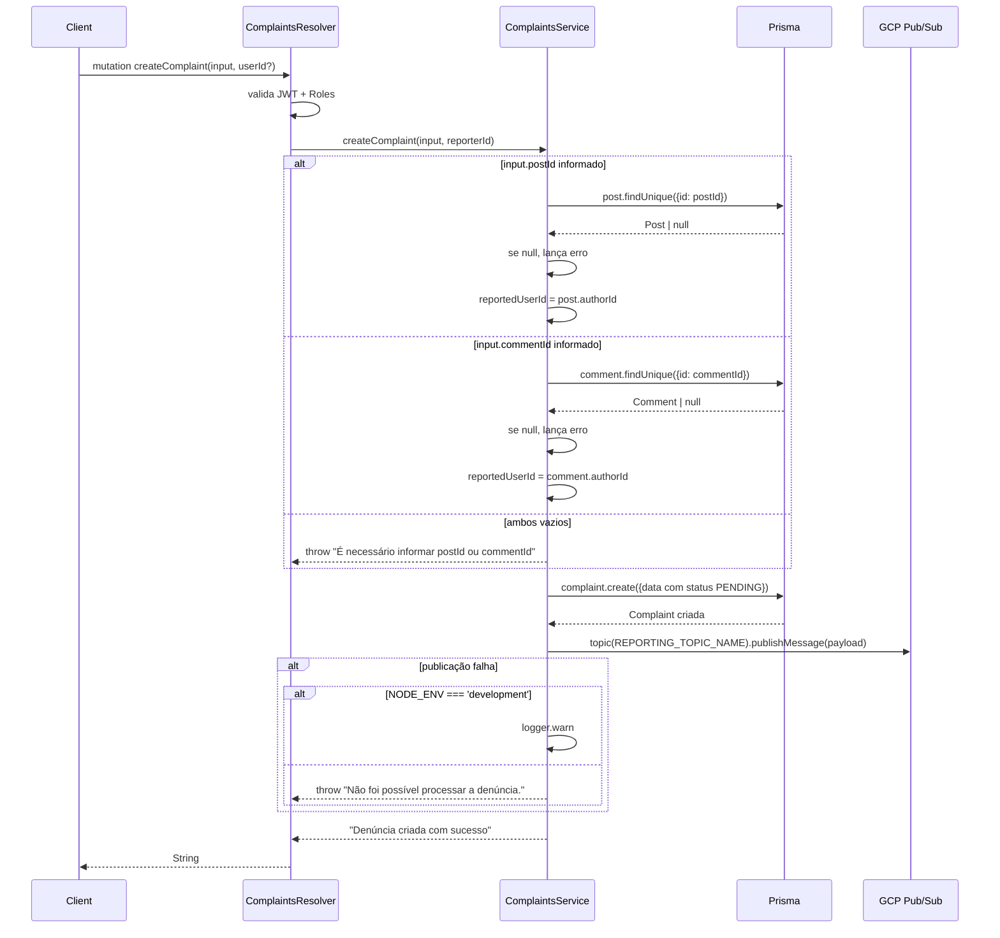

# Módulo: Complaints

## 1. Propósito

Módulo responsável por registrar denúncias feitas por usuários sobre postagens (`Post`) ou comentários (`Comment`). Uma denúncia captura o motivo, uma descrição opcional, o autor do conteúdo denunciado e o próprio denunciante. Além de persistir no banco (`complaints`), publica uma mensagem em um tópico GCP Pub/Sub (`date-me-topic-reporting-reported-posts-queue`) para que pipelines externos possam consumir (análise por IA, filas de moderação, etc.).

O fluxo canônico é: um usuário abre uma denúncia apontando para um `postId` **ou** `commentId`; o módulo valida a existência do alvo, resolve quem é o autor do conteúdo (reportedUserId), grava a denúncia com status `PENDING` e publica o evento para processamento posterior.

## 2. Regras de Negócio

1. A denúncia **deve** apontar para `postId` **ou** `commentId`. Se nenhum for informado, lança erro `"É necessário informar postId ou commentId"` (ver [`./complaints.service.ts:49`](./complaints.service.ts)).
2. O post/comentário denunciado deve existir; caso contrário lança `"Post não encontrado"` ou `"Comentário não encontrado"` (ver [`./complaints.service.ts:33,44`](./complaints.service.ts)).
3. O `reportedUserId` é derivado automaticamente do `authorId` do post/comentário — não vem do input do cliente (ver [`./complaints.service.ts:35,46`](./complaints.service.ts)).
4. O `reporterId` vem do token JWT via `@CurrentUser`. O resolver aceita um `userId` opcional como argumento — se informado, sobrescreve o `me.id`. Efeito prático: qualquer papel autorizado no resolver pode denunciar em nome de outra pessoa (ver [`./complaints.resolver.ts:24`](./complaints.resolver.ts)).
5. Toda denúncia recém-criada nasce com `status: 'PENDING'` (ver [`./complaints.service.ts:58,68`](./complaints.service.ts)) — valor também é o default no schema Prisma (`@default("PENDING")`).
6. Após gravar no banco, o evento é publicado no tópico Pub/Sub `date-me-topic-reporting-reported-posts-queue`. Se a publicação falhar:
   - Em `NODE_ENV !== 'development'` lança `"Não foi possível processar a denúncia."` (ver [`./complaints.service.ts:108`](./complaints.service.ts)).
   - Em ambiente de desenvolvimento o erro é apenas logado via `logger.warn`, e a denúncia persiste no banco mesmo sem publicação.
7. O campo `appraiser` (valores possíveis `ASSISTANT` ou `HUMAN`, ver [`./enum/appraiser.enum.ts`](./enum/appraiser.enum.ts)) é escrito por consumidores externos, não pelo fluxo de criação.
8. O campo `analysesComplaints` (Json) armazena o resultado da análise automática por IA — populado por consumidores externos (ver `assistant_ai`/`reporting`), não pelo fluxo de criação.

## 3. Entidades e Modelo de Dados

Modelo Prisma `Complaint` mapeado para a tabela `complaints`:

| Campo | Tipo | Nullable | Default | Observação |
| --- | --- | --- | --- | --- |
| id | String (uuid) | não | uuid() | PK |
| reason | String | não | | motivo livre |
| description | String | sim | | detalhamento opcional |
| status | String | não | "PENDING" | catálogo livre (string) |
| analysesComplaints | Json | sim | | resultado de análise automatizada |
| appraiser | String | sim | | "assistant" ou "human" (ver enum) |
| createdAt | DateTime | não | now() | `@map("created_at")` |
| updatedAt | DateTime | sim | @updatedAt | `@map("updated_at")` |
| postId | String | sim | | FK opcional → `posts.id` |
| commentId | String | sim | | FK opcional → `comments.id` |
| reporterId | String | não | | FK lógica → `User.id` |
| reportedUserId | String | não | | FK lógica → `User.id` |

Relações declaradas no schema: `post` (N:1 opcional com `Post`) e `comment` (N:1 opcional com `Comment`). `reporterId` e `reportedUserId` são strings sem `@relation` Prisma — são chaves lógicas.

Referência ao ERD completo: [`../../../docs/data-model.md`](../../../docs/data-model.md).

## 4. API GraphQL

### Queries

Não se aplica — o resolver atual não declara queries.

### Mutations

| Nome | Argumentos | Retorno | Auth | Descrição |
| --- | --- | --- | --- | --- |
| `createComplaint` | `createComplaintInput: CreateComplaintInput`, `userId: String` (opcional) | `String` (mensagem textual) | `GqlAuthGuard`, `RolesGuard`, `@Roles('ADMIN', 'SUPER_ADMIN', 'USER')` | Cria denúncia e publica evento no Pub/Sub |

Observação: retorna a string literal `"Denúncia criada com sucesso"` (ver [`./complaints.service.ts:113`](./complaints.service.ts)); não retorna o registro criado.

### Subscriptions

Não se aplica.

### REST

Não se aplica — sem controller.

## 5. DTOs e Inputs

### CreateComplaintInput

Arquivo: [`./dto/create-complaint.input.ts`](./dto/create-complaint.input.ts).

| Campo | Tipo | Validadores | Obrigatório | Observação |
| --- | --- | --- | --- | --- |
| reason | String | `@IsString`, `@IsNotEmpty` | sim | motivo da denúncia |
| description | String | `@IsString`, `@IsOptional` | não | texto adicional |
| postId | String | `@IsString`, `@IsOptional` | não (mas exige-se postId ou commentId) | id do post denunciado |
| commentId | String | `@IsString`, `@IsOptional` | não (mas exige-se postId ou commentId) | id do comentário denunciado |

A validação "precisa de postId OU commentId" é aplicada no service, não via `class-validator`.

### UpdateComplaintInput

Arquivo: [`./dto/update-complaint.input.ts`](./dto/update-complaint.input.ts). Estende `PartialType(CreateComplaintInput)` e adiciona `id: Int`.

> ⚠️ **A confirmar:** `UpdateComplaintInput` está declarado mas nenhuma mutation de update foi registrada no resolver. Parece ser código vestigial — validar antes de remover.

### Complaint (entity GraphQL)

Arquivo: [`./entities/complaint.entity.ts`](./entities/complaint.entity.ts). Expõe os campos do modelo Prisma mais referências opcionais a `Post` e `Comment`. Os campos Date são expostos com nomes `created_at` e `updated_at` no schema GraphQL.

> ⚠️ **A confirmar:** o entity declara `analysesComplaints?: string`, mas no Prisma o campo é `Json`. Desalinhamento de tipos — validar.

### Complaint (dto alternativo)

Arquivo: [`./dto/complaint.entity.dto.ts`](./dto/complaint.entity.dto.ts). Leitura por referência; atualmente não referenciado pelo resolver registrado.

## 6. Fluxos Principais

### Fluxo: Criar denúncia

Detalhes do payload publicado em Pub/Sub: objeto JSON com `complaintId`, `reason`, `description`, `reportedUserId`, `createdAt`, `postId`/`commentId` e `reportedContent` (texto do post ou comentário denunciado).

## 7. Dependências

### Módulos internos importados

Declarados em [`./complaints.module.ts`](./complaints.module.ts):
- `GcpModule` (provê `PUBSUB_CLIENT`).

Injetados via construtor no service:
- `PrismaService` (do `PrismaModule` — módulo global? conferir; o módulo atual não importa `PrismaModule` explicitamente, o que funciona porque `PrismaModule` está disponível via `app.module.ts`).

### Módulos que consomem este

Grep reverso em `src/`: `ComplaintsModule` é importado em `app.module.ts` (inclusive no `include` do `GraphQLModule`). Nenhum outro módulo importa `ComplaintsService`.

### Integrações externas

- **Google Cloud Pub/Sub** — publicação de eventos de denúncia via biblioteca `@google-cloud/pubsub`. Tópico fixo: `date-me-topic-reporting-reported-posts-queue`.

### Variáveis de ambiente

| Variável | Uso |
| --- | --- |
| `NODE_ENV` | Controla se a falha de publicação no Pub/Sub é silenciada (em `development`) ou relançada (fora de `development`) |

As credenciais do GCP/Pub/Sub são lidas pelo `GcpModule` — ver [`../gcp/README.md`](../gcp/README.md).

## 8. Autorização e Papéis

Guards aplicados à mutation `createComplaint` (via `@UseGuards(GqlAuthGuard, RolesGuard)`):

| Operação | Roles permitidas | Decorators |
| --- | --- | --- |
| createComplaint | `ADMIN`, `SUPER_ADMIN`, `USER` | `@Roles('ADMIN', 'SUPER_ADMIN', 'USER')`, `@CurrentUser` |

Referência aos guards/decoradores: [`../auth/README.md`](../auth/README.md).

> ⚠️ **A confirmar:** o argumento opcional `userId` permite escolher o `reporterId` — incluindo para papel `USER`. Regra de produto esperada? Provável débito de segurança: um usuário comum poderia abrir denúncia em nome de outro. Validar no módulo `auth`/produto.

## 9. Erros e Exceções

| Erro lançado | Condição | Mensagem |
| --- | --- | --- |
| `Error` | `postId` informado mas post não existe | `"Post não encontrado"` |
| `Error` | `commentId` informado mas comentário não existe | `"Comentário não encontrado"` |
| `Error` | nem `postId` nem `commentId` informados | `"É necessário informar postId ou commentId"` |
| `Error` | falha ao publicar no Pub/Sub **fora** de `development` | `"Não foi possível processar a denúncia."` |

Todos lançados via `new Error(...)` — não são subclasses de `@nestjs/common` (`NotFoundException`, `BadRequestException`, etc.). O cliente GraphQL receberá `INTERNAL_SERVER_ERROR` genérico.

> ⚠️ **Ponto de atenção:** trocar por `NotFoundException` / `BadRequestException` daria melhor semântica HTTP/GraphQL.

## 10. Pontos de Atenção / Manutenção

- **Logs `console.log` em produção.** O service tem três `console.log` ativos (`./complaints.service.ts:22,30,52`) que vazam payloads de denúncia nos logs. Substituir por `this.logger.debug`.
- **`Error` genérico.** Trocar por exceções do Nest (`NotFoundException`, `BadRequestException`) para códigos HTTP/GraphQL corretos.
- **Argumento `userId` na mutation.** Permite impersonação de `reporterId` por qualquer role autorizada. Restringir apenas a `ADMIN`/`SUPER_ADMIN` ou remover.
- **`GcpService` importado mas não usado** em [`./complaints.service.ts:3`](./complaints.service.ts) — só `PUBSUB_CLIENT` é injetado. Remover o import não utilizado.
- **Tipo do logger.** O service usa `new Logger(GcpService.name)` — instancia o logger com nome "GcpService" em vez de "ComplaintsService". Ruído para depuração.
- **Tipo desalinhado.** `analysesComplaints` é `Json?` no Prisma e `string?` no entity GraphQL — potencial erro em runtime.
- **`UpdateComplaintInput` sem resolver correspondente** — possível código morto.
- **Sem query de leitura.** Não há como um moderador listar denúncias via este módulo; essa função provavelmente vive em `reporting`. Validar contratos entre os dois módulos.
- **Nome de tópico hardcoded** (`REPORTING_TOPIC_NAME`). Mover para `ConfigService` para permitir ambientes distintos.

## 11. Testes

| Arquivo | Cenários cobertos | Observações |
| --- | --- | --- |
| [`./complaints.service.spec.ts`](./complaints.service.spec.ts) | `should be defined` | Teste placeholder gerado pelo CLI do Nest. Não cobre lógica. |
| [`./complaints.resolver.spec.ts`](./complaints.resolver.spec.ts) | `should be defined` | Idem. Não cobre lógica. |

Cenários claramente não cobertos: validações de `postId`/`commentId`, derivação de `reportedUserId`, publicação no Pub/Sub, política de erro por `NODE_ENV`, autorização por role.
