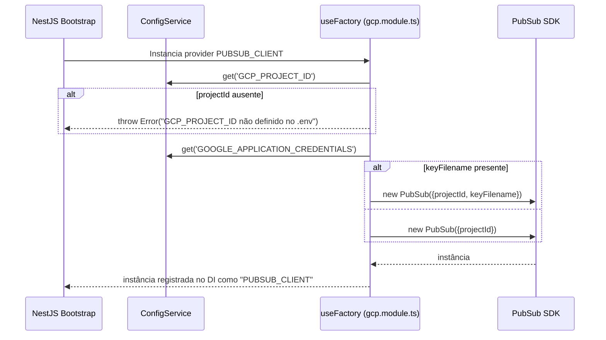

# Módulo: GCP

## 1. Propósito

Módulo de infraestrutura que centraliza a conexão com o Google Cloud Pub/Sub. Configura um provider Nest (`PUBSUB_CLIENT`) que expõe uma instância única de `PubSub` do pacote `@google-cloud/pubsub`, permitindo que outros módulos (atualmente apenas `complaints`) publiquem/assinem tópicos sem gerenciar credenciais ou instanciação diretamente.

Não expõe GraphQL/REST. Não persiste em banco. O `GcpService` existe como placeholder mas está vazio; toda a funcionalidade do módulo está na factory do provider definida em `gcp.module.ts`.

## 2. Regras de Negócio

Não se aplica — módulo de infraestrutura. A única invariante técnica é:

1. `GCP_PROJECT_ID` deve estar definido no `.env`; caso contrário a factory lança `Error('GCP_PROJECT_ID não definido no .env')` no bootstrap (ver [`./gcp.module.ts:16-18`](./gcp.module.ts)).
2. `GOOGLE_APPLICATION_CREDENTIALS` é opcional; se presente, é usado como `keyFilename`. Caso ausente, o SDK tenta encontrar credenciais pela descoberta padrão do GCP (metadata server, ADC, etc.) — ver [`./gcp.module.ts:20-23`](./gcp.module.ts).

## 3. Entidades e Modelo de Dados

Não se aplica — sem entidade persistida.

O arquivo [`./entities/gcp.entity.ts`](./entities/gcp.entity.ts) declara um `@ObjectType Gcp { exampleField: Int }` gerado pelo CLI Nest, mas **não é usado em lugar nenhum** (resolver está comentado, nenhum service retorna esse tipo).

## 4. API GraphQL

Não se aplica. `GcpModule` **não** está no `include` do `GraphQLModule.forRoot({...})` em [`../../app.module.ts`](../../app.module.ts) — o `include` atual contém apenas `AuthModule`, `PagSeguroModule`, `PlansModule`, `SubscriptionsModule`, `SubscriptionStatusModule`, `PaymentsModule`, `PostsModule`, `UploadMediasModule` e `ComplaintsModule`.

O arquivo [`./gcp.resolver.ts`](./gcp.resolver.ts) existe, mas todo o conteúdo está comentado — scaffold do CLI Nest não implementado.

### Queries

Não se aplica.

### Mutations

Não se aplica.

### Subscriptions

Não se aplica.

### REST

Não se aplica — sem controller.

## 5. DTOs e Inputs

Scaffolds não usados (código morto):

- [`./dto/create-gcp.input.ts`](./dto/create-gcp.input.ts) — `CreateGcpInput { exampleField: Int }`.
- [`./dto/update-gcp.input.ts`](./dto/update-gcp.input.ts) — `UpdateGcpInput extends PartialType(CreateGcpInput)` com `id: Int`.

> ⚠️ **A confirmar:** ambos são scaffolds do CLI Nest sem consumidor. Candidato a remoção.

## 6. Fluxos Principais

### Fluxo: Bootstrap do provider `PUBSUB_CLIENT`



### Fluxo: Consumo em outros módulos

Módulos que importam `GcpModule` podem injetar o cliente via:

```ts
@Inject(PUBSUB_CLIENT) private pubSubClient: PubSub
```

e então chamar `this.pubSubClient.topic('<nome>').publishMessage({data: Buffer})`.

Exemplo real: [`../complaints/complaints.service.ts:103-105`](../complaints/complaints.service.ts).

## 7. Dependências

### Módulos internos importados

Declarados em [`./gcp.module.ts`](./gcp.module.ts):
- `ConfigModule` (necessário para injeção de `ConfigService` na factory).

### Módulos que consomem este

Grep reverso (`GcpModule|PUBSUB_CLIENT`):
- [`../complaints/complaints.module.ts`](../complaints/complaints.module.ts) — único consumidor real.

### Integrações externas

- **Google Cloud Pub/Sub** via `@google-cloud/pubsub`.

### Variáveis de ambiente

| Variável | Uso |
| --- | --- |
| `GCP_PROJECT_ID` | Obrigatória. ID do projeto GCP (ex.: `dateme-474016`). |
| `GOOGLE_APPLICATION_CREDENTIALS` | Opcional. Caminho para arquivo JSON de service-account. Se ausente, SDK usa discovery padrão (ADC). |

## 8. Autorização e Papéis

Não se aplica — módulo interno sem endpoints. A autorização junto ao GCP é feita via Service Account (arquivo referenciado por `GOOGLE_APPLICATION_CREDENTIALS` ou descoberta automática do SDK).

## 9. Erros e Exceções

| Erro lançado | Condição | Origem |
| --- | --- | --- |
| `Error("GCP_PROJECT_ID não definido no .env")` | `GCP_PROJECT_ID` ausente no momento do bootstrap | factory do provider |

Erros de runtime do SDK (timeout, `PERMISSION_DENIED`, `NOT_FOUND`) aparecem no ponto de uso (`topic.publishMessage`, `topic.subscription(...)`), não aqui.

## 10. Pontos de Atenção / Manutenção

- **`package.json` próprio** em [`./package.json`](./package.json) com `"type": "module"` e `"main": "quickstart.js"`. Esse package.json **não é** o raiz da aplicação — serve apenas para permitir executar `quickstart.js` como script standalone com ESM. Sinaliza que `quickstart.js` é experimento isolado.
- **`quickstart.js`** é script de referência para criar tópico/subscription e trocar uma mensagem. Hardcoded para `projectId='dateme-474016'`, `topicNameOrId='report-posts-topic'`, `subscriptionName='analyze-post-sub'`. Não é executado pela aplicação NestJS.
- **`GcpService` vazio.** O `@Injectable` não tem método algum. Foi gerado pelo CLI e nunca implementado; ainda assim aparece como provider em alguns lugares. Candidato a remoção.
- **`GcpResolver` comentado.** Remover arquivo ou implementar.
- **Scaffolds não usados** em `dto/` e `entities/` — remover ou preencher com tipos reais.
- **`exports`** do módulo contém apenas `PUBSUB_CLIENT`. Se `GcpService` for implementado no futuro, precisará ser adicionado aos providers/exports.
- **Credencial em produção.** Preferir descoberta automática (ADC) em Cloud Run/GKE em vez de montar `keyFilename`.
- **Sem typing do provider.** `provide: PUBSUB_CLIENT` retorna `PubSub`, mas o token é string — consumidores precisam lembrar do tipo manualmente.

## 11. Testes

| Arquivo | Cenários cobertos | Observações |
| --- | --- | --- |
| [`./gcp.service.spec.ts`](./gcp.service.spec.ts) | `should be defined` | Placeholder CLI Nest. Testa apenas instanciação. |
| [`./gcp.resolver.spec.ts`](./gcp.resolver.spec.ts) | `should be defined` | Placeholder. Resolver está comentado; teste importa `GcpResolver` que atualmente **não é exportado** — esse spec deve falhar ao compilar. |

> ⚠️ **A confirmar:** o arquivo `gcp.resolver.ts` está todo comentado, logo `GcpResolver` não é exportado. Se o spec `gcp.resolver.spec.ts` tenta importá-lo, o teste quebra no compile. Validar rodando `npm run test`.

Cenários claramente não cobertos: inicialização da factory sem `GCP_PROJECT_ID`, com e sem `GOOGLE_APPLICATION_CREDENTIALS`, publicação real em tópico.
