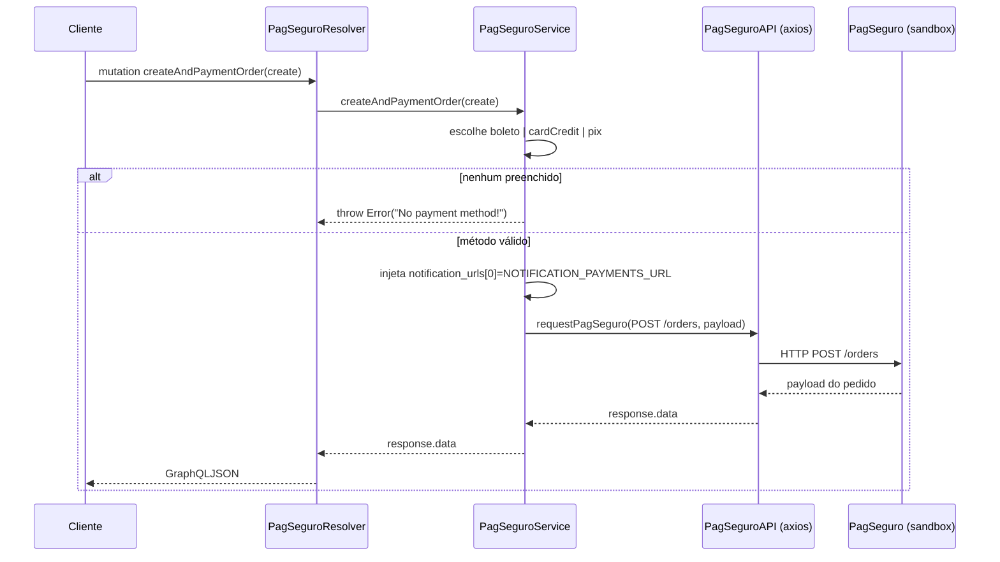
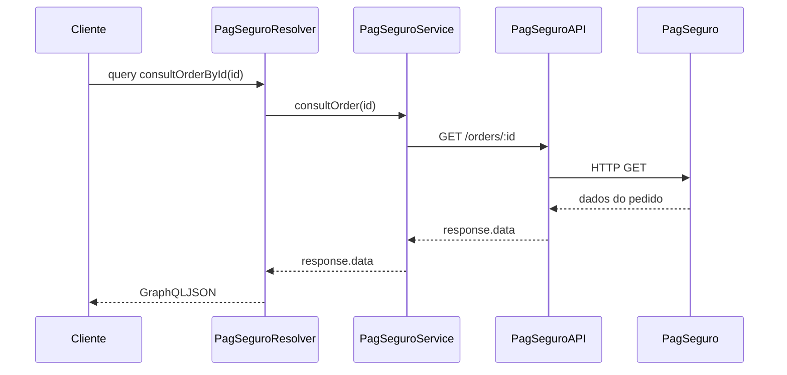
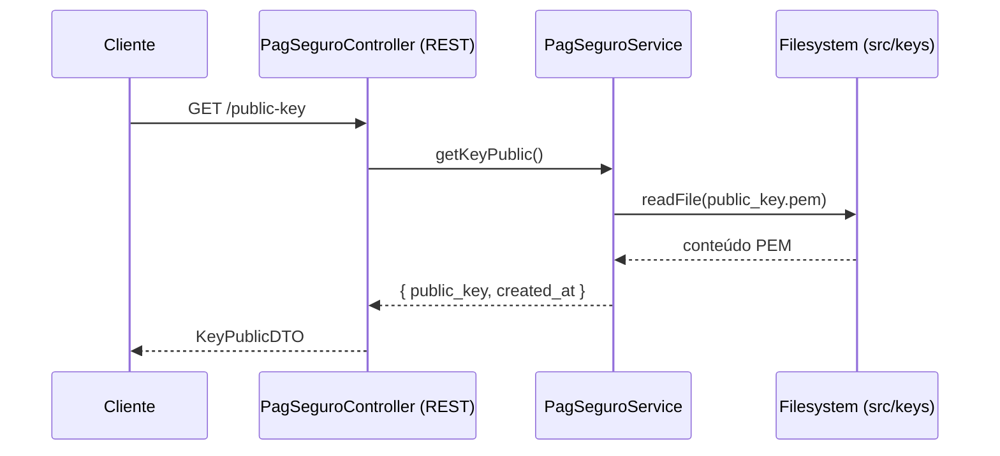
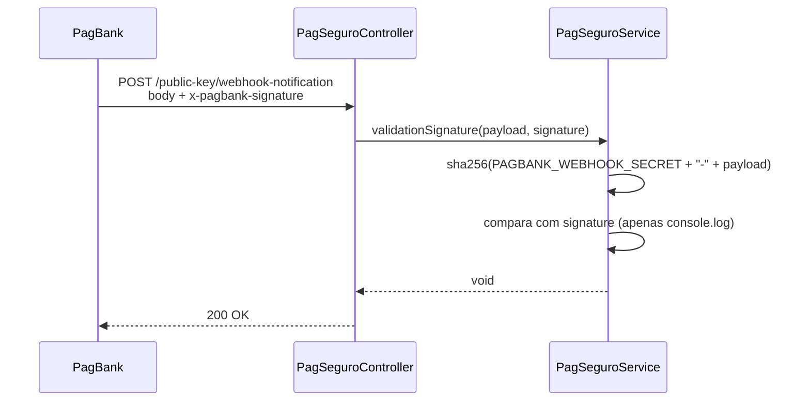

# Módulo: PagSeguro

## 1. Propósito

Camada de integração com a API PagSeguro/PagBank (sandbox em
`https://sandbox.api.pagseguro.com`) responsável por criar pedidos de cobrança
(cartão de crédito, boleto e Pix), consultar pedidos, disparar cobrança (`pay`),
emitir a chave pública usada para criptografar o cartão no cliente, gerar/expor
par de chaves RSA locais usadas pela integração e receber notificações via
webhook.

O módulo é a ponte entre os fluxos de assinatura (`subscriptions`) / pagamento
(`payments`) e o provedor externo. Não persiste dados próprios — repassa a
resposta da API PagSeguro e delega a gravação ao módulo `payments`.

## 2. Regras de Negócio

1. Para criar um pedido via `createAndPaymentOrder`, exatamente um dos três
   inputs de `CreateOrderInput` (`boleto`, `cardCredit`, `pix`) deve vir
   preenchido. Se nenhum vier, o service lança
   `Error('No payment method!')` (ver `pag-seguro.service.ts:117-119`).
2. Toda requisição à API PagSeguro é autenticada por Bearer token fornecido via
   `TOKEN_PAGSEGURO` e usa a base URL configurada em `URL_BASE`
   (injetados no provider `PagSeguroAPI` em `pag-seguro.module.ts:14-22`).
3. A URL de notificação anexada ao pedido (`notification_urls[0]`) é lida de
   `NOTIFICATION_PAYMENTS_URL` e sobrescrita pelo service antes do envio
   (`pag-seguro.service.ts:121-122`).
4. A assinatura do webhook PagBank é verificada via hash SHA-256 usando o
   segredo `PAGBANK_WEBHOOK_SECRET` concatenado ao payload — comparado com o
   header `x-pagbank-signature` (`pag-seguro.service.ts:168-180`).
   > ⚠️ **A confirmar:** o método `validationSignature` atualmente apenas
   > imprime a comparação no console; não rejeita requisições inválidas.
   > Tratar como regra parcialmente implementada.
5. As chaves RSA 2048 usadas no fluxo são geradas pelo método `generateKeys()`
   e gravadas em disco em `src/keys/` (`pag-seguro.service.ts:52-77`).
   > ⚠️ **A confirmar:** persistir chaves privadas no filesystem da aplicação
   > é um ponto sensível — avaliar uso de Secrets Manager (já há
   > `src/aws` no projeto).

## 3. Entidades e Modelo de Dados

Não se aplica — o módulo não define entidades Prisma próprias. As respostas
da API PagSeguro são repassadas como `GraphQLJSON` (objeto livre) ao cliente, e
os dados de pagamento persistidos ficam no módulo
[`payments`](../payments/README.md). ERD completo em
[`../../../docs/data-model.md`](../../../docs/data-model.md).

Artefatos locais em disco produzidos pelo módulo:

| Arquivo | Origem | Conteúdo |
| --- | --- | --- |
| `src/keys/public_key.pem` | `generateKeys()` | chave pública RSA 2048 (SPKI/PEM) |
| `src/keys/private_key.pem` | `generateKeys()` | chave privada RSA 2048 (PKCS8/PEM) |

## 4. API GraphQL

### Queries

| Nome | Argumentos | Retorno | Auth | Descrição |
| --- | --- | --- | --- | --- |
| `consultOrderById` | `id: String!` | `JSON` (`GraphQLJSON`) | nenhuma guard declarada no resolver | Consulta um pedido PagSeguro por id (`GET /orders/:id`). |

### Mutations

| Nome | Argumentos | Retorno | Auth | Descrição |
| --- | --- | --- | --- | --- |
| `createAndPaymentOrder` | `create: CreateOrderInput!` | `JSON` (`GraphQLJSON`) | nenhuma guard declarada no resolver | Cria (e, conforme método, paga) um pedido escolhendo entre `boleto`, `cardCredit` ou `pix`. |
| `payOrderById` | `id: String!` | `JSON` (`GraphQLJSON`) | nenhuma guard declarada no resolver | Apesar do nome, o resolver chama `naoSeiOrder`, que executa `GET /charges/:id` — ou seja, hoje **consulta a cobrança** em vez de pagar. Ver seção 10. |

> ⚠️ **A confirmar:** não há `@UseGuards` nem `@Roles` aplicados no resolver —
> conferir se existem guards globais em `app.module.ts`/`main.ts` antes de
> assumir operações públicas.

### Subscriptions

Não se aplica.

### REST

Controller: `PagSeguroController` (prefixo `/public-key`).

| Verbo | Rota | Body / Headers | Retorno | Descrição |
| --- | --- | --- | --- | --- |
| GET | `/public-key` | — | `KeyPublicDTO` | Lê `src/keys/public_key.pem` do disco e retorna `{ public_key, created_at }` para uso do cliente na criptografia do cartão. |
| POST | `/public-key/webhook-notification` | body livre; header `x-pagbank-signature` | `void` | Recebe notificação do PagBank e chama `validationSignature`. |

## 5. DTOs e Inputs

### `CreateOrderInput` (`dto/create-order.input.ts`)

Wrapper usado no resolver — o cliente preenche apenas uma das três formas.

| Campo | Tipo | Validadores | Obrigatório | Observação |
| --- | --- | --- | --- | --- |
| `boleto` | `CreateOrderBoletoInput` | `IsObject`, `IsOptional` | não | cobrança via boleto bancário |
| `cardCredit` | `CreateAndPaymentOrderWithCardInput` | `IsObject`, `IsOptional` | não | cobrança via cartão de crédito |
| `pix` | `CreateOrderQRCodePixInput` | `IsObject`, `IsOptional` | não | cobrança via QR Code Pix |

Validação funcional ("exatamente um deve vir") é feita pelo service, não pelo
`class-validator`.

### `CreateAndPaymentOrderWithCardInput` (`dto/create-and-payment-order-with-card.input.ts`)

| Campo | Tipo | Validadores | Obrigatório | Observação |
| --- | --- | --- | --- | --- |
| `reference_id` | `String` | `IsString` | sim | identificador do lojista |
| `customer` | `CustomerInput` | `IsObject` | sim | em `dto/common/input/customer.input.ts` |
| `items` | `[ItemsWithReferenceId]` | `IsArray`, `ValidateNested({each:true})`, `Type` | sim | itens do pedido |
| `shipping` | `ShippingInput` | `IsObject` | sim | endereço de entrega (arquivo `shipping,input.ts`) |
| `charges` | `[ChargesInput]` (inline) | `IsArray`, `ValidateNested`, `Type` | sim | ver abaixo |

`ChargesInput` inline (cartão): `reference_id: String`, `description: String`
(texto curto na fatura), `amount: AmountWithCurrencyInput`,
`payment_method: PaymentMethodCredit` (que estende `PaymentMethodInput` com
`installments: Int` (default 1), `capture: Boolean`, `card: CardInput` e
`holder: HolderInput`).

- `CardInput`: `encrypted: String`, `store: Boolean`.
- `HolderInput`: `name: String` (nome do proprietário do cartão),
  `tax_id: String` (CPF).

### `CreateOrderBoletoInput` (`dto/create-order-boleto.input.ts`)

Campos-raiz idênticos ao de cartão exceto pela estrutura de `charges`.

`ChargesBoleto` estende `ChargesInput` substituindo o `payment_method` por
`PaymentMethodBoleto`, cujo `boleto: BoletoInput` contém:

| Campo | Tipo | Observação |
| --- | --- | --- |
| `due_date` | `String` | formato exemplo "2023-06-20" |
| `instruction_lines` | `InstructionLinesInput { line_1, line_2 }` | instruções do boleto |
| `holder` | `HolderBoletoInput { name, tax_id, email, address: AddressHolder }` | dados do pagador |

### `CreateOrderQRCodePixInput` (`dto/create-order-QR-code-pix.input.ts`)

| Campo | Tipo | Obrigatório | Observação |
| --- | --- | --- | --- |
| `reference_id` | `String` | sim | |
| `customer` | `CustomerInput` | sim | |
| `items` | `[ItemsInput]` | sim | |
| `qr_codes` | `[QrCodes { amount: AmountInput, expiration_date: String }]` | sim | |
| `shipping` | `ShippingInput` | sim | |

### DTOs de saída

| DTO | Arquivo | Uso |
| --- | --- | --- |
| `KeyPublicDTO` | `dto/key-public.dto.ts` | retorno REST e do método `executionKeyPublic`/`getKeyPublic` |
| `OrderWithCardDTO` | `dto/create-and-payment-order-with-card.dto.ts` | tipagem rica da resposta de cartão (atualmente importado mas não usado no resolver, que retorna `GraphQLJSON`) |
| `CreateOrderBoletoDTO` | `dto/create-order-boleto.dto.ts` | análogo para boleto |
| `CreateOrderQRCodePixDTO` | `dto/create-order-QR-code-pix.dto.ts` | análogo para Pix |

### Inputs/DTOs comuns reutilizados

Em `dto/common/input/` e `dto/common/dto/`:
`customer`, `items`, `shipping,input` (nome do arquivo tem vírgula),
`address`, `amount`, `charges`, `payment-method`, `links`.

### Enums

| Enum | Arquivo | Valores |
| --- | --- | --- |
| `TypePaymentMethodEnum` | `enum/type-payment-method.enum.ts` | `CREDIT_CARD`, `DEBIT_CARD`, `BOLETO` |
| `TypePhoneEnum` | `enum/type-phone.enum.ts` | `MOBILE`, `BUSINESS`, `HOME` |

## 6. Fluxos Principais

### Fluxo: criar-e-pagar pedido via cartão

Observação: a linha `await this.payment.createPaymentDataRaw(response.data)`
está comentada no service (`pag-seguro.service.ts:133`) — hoje **o pedido não
é persistido em `payments`** no fluxo de criação; essa persistência dependeria
do webhook.

### Fluxo: consulta de pedido

### Fluxo: obtenção da chave pública para cripto do cartão no cliente

O método alternativo `executionKeyPublic()` vai direto à PagSeguro via
`POST /public-keys` — não é chamado pelo controller hoje.

### Fluxo: webhook de notificação

## 7. Dependências

### Módulos internos importados

Em `pag-seguro.module.ts` os providers são construídos diretamente:

- `PagSeguroService`
- `PagSeguroResolver`
- `PagSeguroController`
- `PagSeguroAPI` (via `useFactory` injetando `ConfigService`)
- `PaymentsService` (instanciado como provider local — **não** importa
  `PaymentsModule`).

> ⚠️ **A confirmar:** `PaymentsService` depende de `PrismaService`. Se
> `PrismaModule` não estiver como `global()` ou importado aqui, a injeção
> só funciona porque outro módulo global já o disponibiliza — conferir em
> `app.module.ts`.

### Módulos que consomem este

Grep `grep -rn "PagSeguroModule\|PagSeguroService" src --include="*.ts"`:

- `src/app.module.ts` importa `PagSeguroModule` e o inclui no schema GraphQL
  (`include: [...]`).
- Nenhum outro módulo importa `PagSeguroService` via `imports: [PagSeguroModule]`
  no momento.

### Integrações externas

- **PagSeguro/PagBank** via `axios` (wrapper em `pagseguro-api.ts`).
- **Node `crypto`** (`generateKeyPair`, `createHash`) para geração de chaves e
  verificação de assinatura.
- **Node `fs`** para persistir e ler `public_key.pem` / `private_key.pem`.

### Variáveis de ambiente

| Variável | Uso |
| --- | --- |
| `TOKEN_PAGSEGURO` | Bearer token para autenticação na API PagSeguro |
| `URL_BASE` | URL base usada pelo `PagSeguroAPI` (ex.: sandbox vs produção) |
| `NOTIFICATION_PAYMENTS_URL` | URL pública do webhook que recebe notificações |
| `PAGBANK_WEBHOOK_SECRET` | segredo usado no cálculo do SHA-256 de validação |

## 8. Autorização e Papéis

Nenhum `@UseGuards` ou `@Roles()` declarado no resolver ou no controller.
Os decorators `JwtAuthGuard` / `RolesGuard` (documentados em
[`../auth/README.md`](../auth/README.md)) **não** são aplicados localmente.

> ⚠️ **A confirmar:** avaliar se mutations financeiras devem exigir
> autenticação. Como estão, qualquer cliente GraphQL pode criar pedidos.

## 9. Erros e Exceções

| Situação | Origem | Mensagem |
| --- | --- | --- |
| Nenhum método de pagamento preenchido | `pag-seguro.service.ts:117-119` | `Error('No payment method!')` |
| Erro HTTP na API PagSeguro | `pagseguro-api.ts:31-39` | relança `err` de `axios`; antes, imprime `Status`, `Resposta PagSeguro` (JSON) ou `err.message` no console |
| Erro ao obter chave pública | `pag-seguro.service.ts:47-49` | loga `Erro na requisição PagSeguro: ...` e relança |
| Chave pública ausente no disco em `getKeyPublic()` | `fs.readFile` em `pag-seguro.service.ts:80-88` | erro nativo de FS (não tratado) |

Nenhuma `HttpException`/`NestException` é lançada hoje — o módulo devolve o
erro cru do axios para cima da pilha.

## 10. Pontos de Atenção / Manutenção

- **Mutation mal-nomeada:** `payOrderById` no resolver chama
  `naoSeiOrder(id)` que executa `GET /charges/:id` (consulta, não pagamento).
  O método `payOrder` (que faz `POST /orders/:id/pay`) existe no service mas
  não é exposto. O nome `naoSeiOrder` indica incerteza em código — renomear
  e corrigir a exposição é débito claro.
- **Persistência de pagamento comentada:** `await this.payment.createPaymentDataRaw(response.data)`
  está comentado em `createAndPaymentOrder`. O fluxo de criação atualmente
  não grava nada em `payments`. Conferir se a persistência está prevista
  para acontecer via webhook.
- **Validação de webhook inerte:** `validationSignature` calcula o hash mas
  não compara nem rejeita — só imprime no console. Sem isso, o endpoint
  `POST /public-key/webhook-notification` aceita qualquer requisição.
- **Chaves privadas no FS do container:** `generateKeys()` escreve
  `private_key.pem` em `src/keys/`. Em container imutável, perde-se a cada
  restart; além disso, subir a chave junto com a imagem é má prática.
- **`getAccessToken` nunca é aguardado nem retornado:** usa `.then/.catch` e
  retorna `undefined`. Morto ou incompleto.
- **Hard-coded sandbox URL:** `getAccessToken` referencia
  `https://sandbox.api.pagseguro.com/oauth2/token` em vez de usar `URL_BASE`
  (`pag-seguro.service.ts:93`). Produção quebra.
- **Arquivo `shipping,input.ts`** tem vírgula no nome em vez de ponto.
  Importações no projeto referenciam esse caminho exato — mudar o nome
  quebra código.
- **`pag-seguro.service.spec.ts` / `.resolver.spec.ts`** são smoke tests
  genéricos (só `toBeDefined`) e falham se executados porque não provêem
  `ConfigService`, `PagSeguroAPI` nem `PaymentsService`. Ver seção 11.
- **Arquivo `config/generated-key_pulbic.ts`** (note o typo "pulbic")
  contém código inteiramente comentado — cadidato a remoção. **Não remover
  nesta doc — este módulo apenas documenta.**
- **Ausência de guards de autenticação** em rotas financeiras — ver seção 8.

## 11. Testes

| Arquivo | Cenários cobertos | Observações |
| --- | --- | --- |
| `pag-seguro.service.spec.ts` | Instancia `PagSeguroService` e verifica `toBeDefined`. | Não injeta `ConfigService`, `PagSeguroAPI` nem `PaymentsService` — o `Test.createTestingModule` atual provavelmente **falha** na resolução de dependências. Teste não cobre comportamento. |
| `pag-seguro.resolver.spec.ts` | Instancia `PagSeguroResolver` e verifica `toBeDefined`. | Mesma limitação: provides apenas `PagSeguroResolver` e `PagSeguroService` sem as dependências transitivas. |

Não há cobertura de:

- Fluxo de criação de pedido (nenhum método de pagamento, cartão, boleto, Pix).
- Consulta de pedido.
- Validação de assinatura de webhook.
- Leitura/geração de chaves RSA.
- Conversão da resposta PagSeguro para os DTOs `OrderWithCardDTO`,
  `CreateOrderBoletoDTO`, `CreateOrderQRCodePixDTO` (que hoje não são
  usados no resolver).
