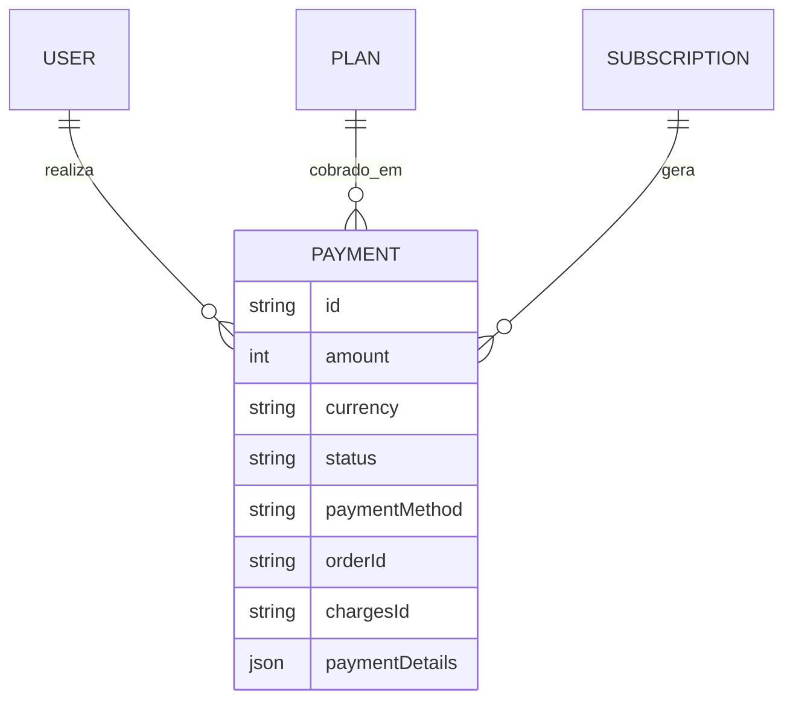
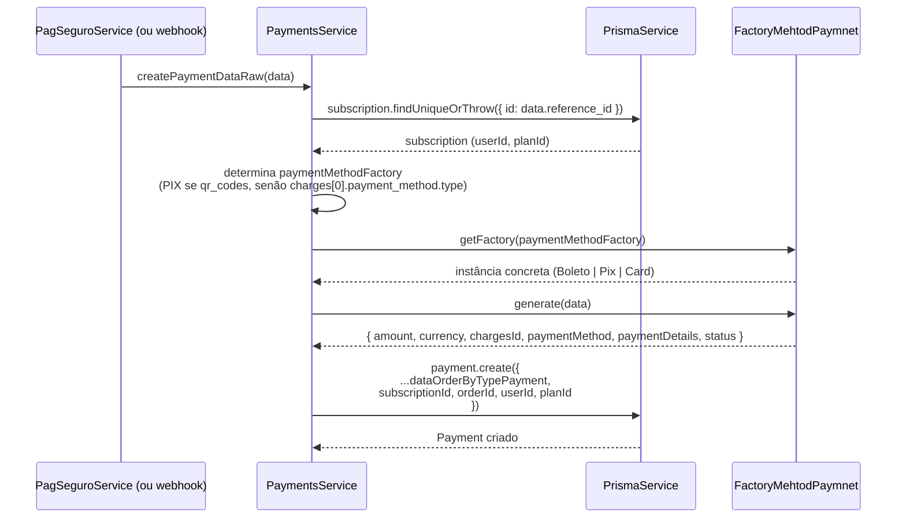

# Módulo: Payments

## 1. Propósito

Persistir os registros de pagamento (`Payment`) gerados a partir das respostas
do gateway PagSeguro. O módulo expõe um `PaymentsService` com um único método
operacional — `createPaymentDataRaw(data)` — que recebe o payload cru devolvido
pela API PagSeguro, normaliza-o por tipo de meio de pagamento (cartão, boleto,
Pix) usando o Factory Method em `factory/` e grava um novo registro na tabela
`payments`. Vincula `Payment` a `User`, `Plan` e `Subscription` via FKs.

Observação: o resolver GraphQL associado existe (`payments.resolver.ts`) mas
todas as operações estão comentadas — o módulo **não expõe queries ou mutations
hoje**. A criação de pagamentos acontece por chamada direta de outro módulo
(atualmente `PagSeguroModule`) ao `PaymentsService`.

## 2. Regras de Negócio

1. Todo `Payment` criado precisa referenciar um `Subscription` existente. O
   service busca a assinatura por id usando
   `prisma.subscription.findUniqueOrThrow` — se não existir, lança
   `NotFoundError` do Prisma (ver `payments.service.ts:17-22`).
2. O identificador da assinatura é recebido em `data.reference_id` no payload
   do PagSeguro — ou seja, o campo `reference_id` enviado ao criar a ordem
   PagSeguro **deve ser o `Subscription.id`**. Essa convenção é usada
   implicitamente e cruza o módulo `subscriptions`/`pag-seguro`.
3. O método de pagamento gravado depende da forma detectada no payload
   (`payments.service.ts:24-27`):
   - se `data.qr_codes[0].expiration_date` existir → `'PIX'`;
   - caso contrário, usa `data.charges[0].payment_method.type` (por exemplo
     `CREDIT_CARD`, `BOLETO`).
4. A factory `FactoryMehtodPaymnet.getFactory(method)` reconhece hoje apenas
   `'BOLETO'` e `'PIX'` (ver `factory/factorymethod-paymnet.ts:15-21`). Para
   `'CREDIT_CARD'` (ou qualquer outro valor) lança
   `Error('Método de pagamento não suportado')`.
   > ⚠️ **Inconsistência:** existe `ResponseDataCardCreditFactory` no
   > diretório, mas ela **não está registrada** em `getFactory`. Resultado
   > prático: pagamentos por cartão não são persistidos, apesar de suportados
   > pelo gateway. Ver seção 10.
5. `currency` default é `'BRL'` quando Pix (hard-coded na factory de Pix) e
   `data.charges[0].amount.currency` para boleto/cartão.
6. `status` inicial do `Payment` para Pix é `'WAITING'` (hard-coded); para
   boleto/cartão, usa `data.charges[0].status` devolvido pelo PagSeguro.
7. `paymentDetails` é o JSON completo da resposta PagSeguro
   (`JSON.stringify(data)`) — registro forense do que foi enviado pelo gateway.
8. `userId` e `planId` do novo `Payment` são copiados da `Subscription`
   encontrada — nunca do payload.
   > ⚠️ **A confirmar:** o serviço ignora qualquer `userId`/`planId` vindo
   > do payload. Esperado para consistência; confirmar que é intencional.

## 3. Entidades e Modelo de Dados

### `Payment` — tabela `payments` (ver [`prisma/schema.prisma:136-155`](../../../prisma/schema.prisma))

| Campo | Tipo | Nullable | Default | Observação |
| --- | --- | --- | --- | --- |
| `id` | String (uuid) | não | `uuid()` | PK |
| `amount` | Int | não | | valor em centavos |
| `currency` | String | não | | ex.: `BRL` |
| `status` | String | não | | estado retornado pelo gateway ou `WAITING` no Pix |
| `paymentDetails` | Json | não | | payload completo do gateway |
| `paymentMethod` | String | não | | ex.: `CREDIT_CARD`, `BOLETO`, `PIX` |
| `orderId` | String | não | | id do pedido no gateway |
| `chargesId` | String | não | | id da cobrança no gateway |
| `subscriptionId` | String | não | | FK → `subscriptions.id` |
| `userId` | String | não | | FK → `users.id` |
| `planId` | String | não | | FK → `plans.id` |

Relações: N:1 com `User`, `Plan` e `Subscription`. `Subscription` tem lado
oposto `payment: Payment[]` (1:N). Sem `deletedAt` — `Payment` não tem
soft-delete.

### Tipo GraphQL exposto

`entities/payment.entity.ts` declara `@ObjectType() Payment` com os campos
acima + as relações `user: User`, `plan: Plan`, `subscription: Subscription`.
Por ora o tipo só é declarado — não é usado por nenhum query/mutation ativo.

> ⚠️ **Inconsistência no schema GraphQL:** o campo é declarado como `ordedrId`
> (typo) em `entities/payment.entity.ts:25`, enquanto o input usa `orderId`.
> Ver seção 10.

ERD completo em [`../../../docs/data-model.md`](../../../docs/data-model.md).



## 4. API GraphQL

### Queries

Não se aplica — todas as queries no resolver estão comentadas.

### Mutations

Não se aplica — todas as mutations no resolver estão comentadas.

### Subscriptions

Não se aplica.

### REST

Não se aplica — módulo não declara controller.

> ⚠️ **A confirmar:** o módulo **está listado** no `include` do
> `GraphQLModule.forRoot` em [`../../app.module.ts`](../../app.module.ts),
> portanto o tipo `Payment` é emitido no `schema.gql` (para ser referenciado
> por outros tipos, como `Subscription.payment`), mas sem operações próprias.

## 5. DTOs e Inputs

### `CreatePaymentInput` (`dto/create-payment.input.ts`)

| Campo | Tipo | Validadores | Obrigatório | Observação |
| --- | --- | --- | --- | --- |
| `amount` | `Int` | — | sim | valor em centavos |
| `currency` | `String` | — | sim | default GraphQL `'BRL'` |
| `status` | `String` | — | sim | |
| `paymentMethod` | `String` | — | sim | |
| `orderId` | `String` | — | sim | id do recibo no gateway |
| `chargesId` | `String` | — | sim | |
| `paymentDetails` | `JSON` (`GraphQLJSON`) | — | sim | payload do gateway |
| `userId` | `String` | — | sim | |
| `planId` | `String` | — | sim | |
| `subscriptionId` | `String` | — | sim | |

> ⚠️ Nenhum decorator `class-validator` é aplicado. O input depende dos valores
> preparados internamente por `PaymentsService.createPaymentDataRaw`.

### `UpdatePaymentInput` (`dto/update-payment.input.ts`)

Estende `PartialType(CreatePaymentInput)` e adiciona `id: Int`.

> ⚠️ **Incoerência:** `id` é declarado `Int`, mas `Payment.id` é `String (uuid)`
> no Prisma. O DTO não é usado hoje; se for ativado, o tipo precisa ser
> `String`. Ver seção 10.

### `InterfaceResponseDataFormaPayment` (`factory/factorymethod-paymnet.ts`)

Interface TypeScript devolvida por cada factory:

| Campo | Tipo |
| --- | --- |
| `amount` | number |
| `currency` | string |
| `chargesId` | string |
| `paymentMethod` | string |
| `paymentDetails` | string (JSON serializado) |
| `status` | string |

## 6. Fluxos Principais

### Fluxo: registro de pagamento a partir de payload do PagSeguro

Contexto: `PaymentsService` é injetado em `PagSeguroService` como provider
local — a chamada para `createPaymentDataRaw(response.data)` existe em
`pag-seguro.service.ts:133` mas está **comentada**. Quando for reativada, o
fluxo é:



> ⚠️ Atualmente a reativação da chamada depende da correção da factory
> para também cobrir `CREDIT_CARD`. Ver seção 10.

### Fluxo: seleção da factory

```mermaid
flowchart TD
  A[payload data] --> B{data.qr_codes[0].expiration_date existe?}
  B -- sim --> C[paymentMethod = 'PIX']
  B -- não --> D[paymentMethod = data.charges[0].payment_method.type]
  C --> E[getFactory('PIX')]
  D --> F{method em ['BOLETO','PIX']?}
  F -- sim --> G[retorna factory correspondente]
  F -- não --> H[throw 'Método de pagamento não suportado']
```

## 7. Dependências

### Módulos internos importados

`payments.module.ts` declara apenas `providers: [PaymentsResolver, PaymentsService]`.
Não importa nenhum outro módulo via `imports: [...]`.

`PaymentsService` depende de `PrismaService` (construtor em
`payments.service.ts:12-14`). Essa injeção funciona porque `PrismaModule` é
importado no `AppModule` e `PrismaService` é provido lá.

> ⚠️ **Risco de acoplamento:** o service também importa
> `CreateOrderBoletoDTO` de `../pag-seguro/dto/...` para tipagem, embora
> `createPaymentDataRaw(data: any)` aceite `any`. Import atualmente não
> usado de forma efetiva.

### Módulos que consomem este

Grep `PaymentsModule|PaymentsService` em `src/**/*.ts`:

- `src/app.module.ts` — registra `PaymentsModule` e o inclui no `include` do
  GraphQL (apesar do resolver não expor operações).
- `src/modules/pag-seguro/pag-seguro.module.ts` — declara `PaymentsService`
  como provider local e o injeta em `PagSeguroService` (ver
  [`../pag-seguro/README.md`](../pag-seguro/README.md) seção 7). **Não importa
  `PaymentsModule`** — injeta o service direto.
- Referências em `subscriptions/README.md` e outros docs.

Nenhum outro módulo importa `PaymentsModule` via `imports`.

### Integrações externas

Não se aplica diretamente — este módulo não conversa com provedores externos.
A integração com PagSeguro é feita pelo
[`pag-seguro`](../pag-seguro/README.md), que entrega o payload cru para este
módulo.

### Variáveis de ambiente

Não se aplica — o módulo não lê variáveis de ambiente próprias.

## 8. Autorização e Papéis

Não se aplica — o módulo não expõe operações GraphQL/REST com guards.
Operações são chamadas internamente por outros services, sem verificação
adicional de papel. Quando as mutations/queries comentadas forem ativadas,
aplicar `JwtAuthGuard` + `@Roles()` conforme documentado em
[`../auth/README.md`](../auth/README.md).

## 9. Erros e Exceções

| Situação | Origem | Mensagem / Tipo |
| --- | --- | --- |
| `reference_id` não corresponde a uma `Subscription` existente | `payments.service.ts:18-22` | `Prisma.NotFoundError` (lançado por `findUniqueOrThrow`) |
| `paymentMethodFactory` não suportado pela factory | `factory/factorymethod-paymnet.ts:22` | `Error('Método de pagamento não suportado')` |
| `data.charges[0]` ou `data.qr_codes[0]` ausente quando esperado | factories concretas | `TypeError` do runtime (`Cannot read properties of undefined`) — não tratado |
| `prisma.payment.create` falha por FK inválida (ex.: `userId` inexistente) | Prisma | `P2003` FK violation (não tratado no service) |

Nenhuma `HttpException`/`NestException` é lançada explicitamente.

## 10. Pontos de Atenção / Manutenção

- **Factory de cartão não registrada.** `ResponseDataCardCreditFactory`
  existe em `factory/response-data-card-credit.factory.ts`, mas
  `FactoryMehtodPaymnet.getFactory(...)` só contempla `'BOLETO'` e `'PIX'`.
  Qualquer payload de cartão cai na exceção "Método de pagamento não suportado".
- **Resolver inteiramente comentado.** `payments.resolver.ts` declara o
  resolver mas todas as operações (`createPayment`, `findAll`, `findOne`,
  `updatePayment`, `removePayment`) estão comentadas. `PaymentsService` não
  implementa `create`/`findAll`/`findOne`/`update`/`remove` — a reativação
  exige implementar o service também.
- **Typo no entity GraphQL:** `ordedrId` em
  `entities/payment.entity.ts:25` (deveria ser `orderId`). Se exposto, cria
  divergência entre schema Prisma, `CreatePaymentInput` e entity GraphQL.
- **`UpdatePaymentInput.id` é `Int`** enquanto `Payment.id` no Prisma é
  `String (uuid)`. Incompatibilidade que vai travar qualquer mutation que
  tente usar esse DTO.
- **Import não usado.** `CreateOrderBoletoDTO` e
  `import { subscribe } from 'diagnostics_channel'` em
  `payments.service.ts:5-6` não são utilizados — lixo.
- **Erros de digitação em nomes de arquivos e classes:**
  `factorymethod-paymnet.ts`, classe `FactoryMehtodPaymnet` (deveria ser
  `FactoryMethodPayment`). Renomear implica atualizar todos os imports.
- **Chamada à factory via `require` dinâmico** em vez de `import`
  (`factorymethod-paymnet.ts:16,19`) — evita circular dependency mas quebra
  tree-shaking e o tipo estático.
- **Ausência de atualização de `Subscription.statusId`.** Após criar um
  `Payment`, o status da assinatura permanece no valor inicial que o cliente
  enviou. Isso já é apontado em
  [`../subscriptions/README.md`](../subscriptions/README.md) seção 10 como
  débito compartilhado.
- **`console.log` em produção.** Três chamadas em `createPaymentDataRaw`
  imprimem payload e método no stdout — reveladores de dados sensíveis do
  gateway.
- **Sem idempotência.** Se o webhook do PagSeguro reenviar a notificação,
  `createPaymentDataRaw` cria outro `Payment` (não há verificação por
  `orderId` + `chargesId` antes de persistir).

## 11. Testes

| Arquivo | Cenários cobertos | Observações |
| --- | --- | --- |
| `payments.service.spec.ts` | Instancia `PaymentsService` e verifica `toBeDefined`. | Não provê `PrismaService` — o teste **não compila** o módulo corretamente. Smoke test inoperante. |
| `payments.resolver.spec.ts` | Instancia `PaymentsResolver` e verifica `toBeDefined`. | Mesma limitação: passa apenas `PaymentsResolver` e `PaymentsService` sem `PrismaService`. |

Não há cobertura de:

- Fluxo `createPaymentDataRaw` (mapeamento payload → entity).
- Cada factory (`ResponseDataBoletoFactory`, `ResponseDataPixFactory`,
  `ResponseDataCardCreditFactory`).
- Comportamento quando `Subscription` não existe.
- Branch de detecção de método (`qr_codes.expiration_date` vs
  `charges[0].payment_method.type`).
