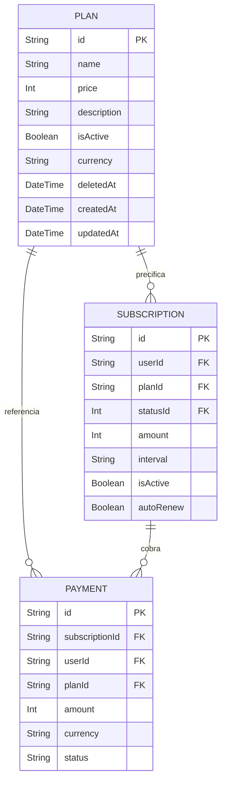
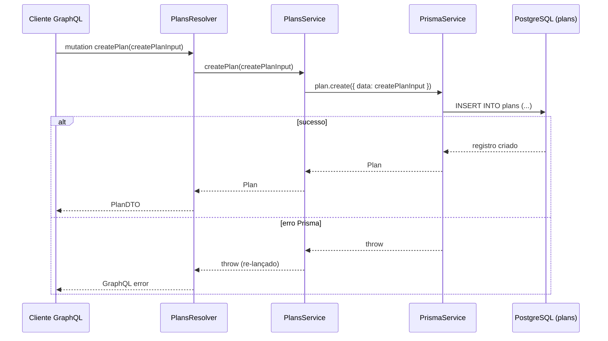
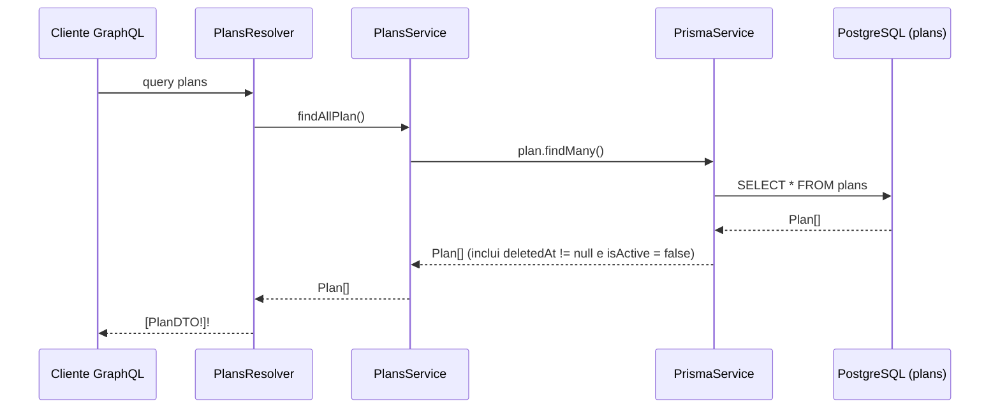

# Módulo: Plans

## 1. Propósito

O módulo `plans` é responsável pelo catálogo de planos de assinatura da plataforma. Declarado em [`./plans.module.ts`](./plans.module.ts), expõe `PlansResolver` e `PlansService` como providers e exporta `PlansService` para consumo por outros módulos.

A entidade `Plan` representa um item precificado (valor em centavos), com moeda (default `BRL`), flag de atividade (`isActive`, default `true`) e suporte a soft-delete via `deletedAt`. Planos são referenciados por `Subscription` (via `planId`) e por `Payment` (via `planId`), no model Prisma definido em [`../../../prisma/schema.prisma`](../../../prisma/schema.prisma).

`PlansModule` está listado tanto no array `imports` quanto no array `include` do `GraphQLModule.forRoot` em [`../../app.module.ts`](../../app.module.ts), portanto as operações declaradas em [`./plans.resolver.ts`](./plans.resolver.ts) são efetivamente expostas no schema GraphQL (`src/schema.gql`).

> **A confirmar**: se o cadastro de planos deve permanecer exposto via GraphQL sem guards (ver seção 8) ou se deve migrar para um canal administrativo protegido.

## 2. Regras de Negócio

Regras observáveis a partir do código atual:

- **Preço em centavos.** O campo `price` é tipado como `Int` tanto no model Prisma quanto em [`./entities/plan.entity.ts`](./entities/plan.entity.ts) e [`./dto/create-plan.input.ts`](./dto/create-plan.input.ts). O consumidor (`SubscriptionsService`) em [`../subscriptions/subscriptions.service.ts`](../subscriptions/subscriptions.service.ts) multiplica `plan.price` pelo número de meses do intervalo (`Math.trunc(timeInterval / 30) * plan.price`), o que pressupõe inteiros.
- **Moeda default `BRL`.** Definida em [`../../../prisma/schema.prisma`](../../../prisma/schema.prisma) (`currency String @default("BRL")`). O DTO [`./dto/create-plan.input.ts`](./dto/create-plan.input.ts), porém, declara `currency` como `@Field()` **obrigatório** — o default do banco só é aplicado se o campo não for enviado via Prisma, mas o GraphQL exige o valor no input.
- **Ativo por padrão.** `isActive` tem default `true` tanto no model Prisma quanto em [`./entities/plan.entity.ts`](./entities/plan.entity.ts). Não há campo `isActive` no `CreatePlanInput`, portanto planos são sempre criados ativos pela API.
- **Soft-delete modelado, mas não aplicado.** A coluna `deletedAt` existe no schema e na entidade, mas [`./plans.service.ts`](./plans.service.ts) `removePlan` usa `prisma.plan.delete`, que executa **hard-delete** (ver seção 10). Além disso, `findAllPlan` não filtra por `deletedAt`/`isActive`.
- **Slugs de plano padronizados.** O enum [`./enum/plan-slug.enum.ts`](./enum/plan-slug.enum.ts) define `FREE`, `PRO` e `ULTIMATE`. Existe **enum duplicado** em [`../subscriptions/enum/plan-slug.enum.ts`](../subscriptions/enum/plan-slug.enum.ts) com os mesmos valores — é este último que [`./plans.resolver.ts`](./plans.resolver.ts) efetivamente importa (ver seção 10). O enum é utilizado na query `findByName` (`CreatePlanNameInput.name`).
- **Busca por nome usa o slug.** `findByName` realiza `prisma.plan.findFirstOrThrow({ where: { name } })` em [`./plans.service.ts`](./plans.service.ts) — ou seja, assume que o campo `Plan.name` armazena exatamente o valor do enum `PlanSlugEnum`.

> **A confirmar**: se `Plan.name` deveria ser `@unique` no schema Prisma — hoje não há restrição de unicidade, logo `findFirstOrThrow` pode retornar apenas o primeiro de eventuais duplicatas.

## 3. Entidades e Modelo de Dados

### Model Prisma `Plan`

Declarado em [`../../../prisma/schema.prisma`](../../../prisma/schema.prisma):

| Campo | Tipo Prisma | Obrigatório | Default | Observação |
|---|---|---|---|---|
| `id` | `String` | Sim | `uuid()` | Chave primária. |
| `name` | `String` | Sim | — | Nome/slug do plano. Sem `@unique`. |
| `price` | `Int` | Sim | — | Valor em centavos. |
| `description` | `String` | Sim | — | — |
| `isActive` | `Boolean` | Sim | `true` | Flag de atividade. |
| `currency` | `String` | Sim | `"BRL"` | Moeda. |
| `deletedAt` | `DateTime?` | Não | — | Mapeada como `deleted_at`. Soft-delete não aplicado pelo service (ver seção 10). |
| `createdAt` | `DateTime` | Sim | `now()` | Mapeada como `created_at`. |
| `updatedAt` | `DateTime?` | Não | `@updatedAt` | Mapeada como `updated_at`. |
| `subscriptions` | `Subscription[]` | — | — | Relação reversa 1:N com `Subscription`. |
| `payments` | `Payment[]` | — | — | Relação reversa 1:N com `Payment`. |

Tabela mapeada como `plans` (`@@map("plans")`).

### Diagrama ER (foco `Plan` ↔ `Subscription` ↔ `Payment`)



Para a visão completa dos demais relacionamentos, consultar [`../../../docs/data-model.md`](../../../docs/data-model.md).

### Tipos GraphQL

Há duas classes TypeScript distintas para `Plan` no schema GraphQL:

- [`./entities/plan.entity.ts`](./entities/plan.entity.ts) — `@ObjectType()` registrado como `Plan`. Expõe `id`, `name`, `description`, `price`, `isActive`, `currency`, `deleted_at` (aliased a partir de `deletedAt`), `created_at` (aliased a partir de `createdAt`), `update_at` (aliased a partir de `updatedAt`). É o tipo de retorno da mutation `removePlan`.
- [`./dto/plan.dto.ts`](./dto/plan.dto.ts) — `@ObjectType('PlanDTO')`. Expõe `id`, `name`, `description`, `price`, `currency`, `deletedAt`, `createdAt`, `updatedAt` (sem o campo `isActive`). É o tipo de retorno de `createPlan`, `updatePlan`, `findByName` e da query `plans`.

A coexistência de `Plan` e `PlanDTO` gera nomes e snake_case/camelCase divergentes no `src/schema.gql`. Ver seção 10.

## 4. API GraphQL

`PlansModule` consta no `include` de [`../../app.module.ts`](../../app.module.ts), portanto todas as operações abaixo são publicadas em `src/schema.gql`.

### Queries

| Nome | Argumentos | Retorno | Guards/Autorização | Descrição |
|---|---|---|---|---|
| `plans` | — | `[PlanDTO!]!` | Nenhum | Lista todos os planos. Delegado a `PlansService.findAllPlan` → `prisma.plan.findMany()` sem filtro de `deletedAt`/`isActive`. |
| `findByName` | `namePlan: CreatePlanNameInput!` | `PlanDTO!` | Nenhum | Retorna o plano cujo `name` corresponde ao `PlanSlugEnum` enviado. Lança erro do Prisma (`P2025`) se não encontrar. |

### Mutations

| Nome | Argumentos | Retorno | Guards/Autorização | Descrição |
|---|---|---|---|---|
| `createPlan` | `createPlanInput: CreatePlanInput!` | `PlanDTO!` | Nenhum | Cria um novo plano. `isActive` vai com o default `true` do Prisma. |
| `updatePlan` | `id: String!`, `updatePlanInput: UpdatePlanInput!` | `PlanDTO!` | Nenhum | Atualiza um plano existente. Usa `findUniqueOrThrow` antes do `update`. |
| `removePlan` | `id: String!` | `Plan!` | Nenhum | Remove o plano. **Hard-delete** via `prisma.plan.delete`. Retorna o tipo `Plan` (com `isActive` e nomes snake_case), não `PlanDTO`. |

**Nenhum resolver aplica `@UseGuards(...)`, `@Roles(...)` ou decoradores equivalentes.** Ver seção 8.

> **A confirmar**: se `plans` deveria filtrar automaticamente `isActive: true` e `deletedAt: null` para não expor planos administrativos/descontinuados a clientes finais.

## 5. DTOs e Inputs

Localizados em [`./dto/`](./dto), [`./entities/`](./entities) e [`./enum/`](./enum).

### `CreatePlanInput` — [`./dto/create-plan.input.ts`](./dto/create-plan.input.ts)

| Campo | Tipo GraphQL | Obrigatório | Validação (`class-validator`) |
|---|---|---|---|
| `name` | `String` | Sim | `@IsString()` |
| `description` | `String` | Sim | `@IsString()` |
| `price` | `Int` | Sim | `@IsInt()` |
| `currency` | `String` | Sim | `@IsString()` |

Observações:

- Não há campo `isActive` no input; sempre usa o default `true` do Prisma.
- O arquivo importa `PlanSlugEnum` de [`../enum/plan-slug.enum.ts`](./enum/plan-slug.enum.ts), porém o enum é usado apenas em `CreatePlanNameInput` abaixo, não em `CreatePlanInput.name` (que é apenas `String` livre).

### `CreatePlanNameInput` — [`./dto/create-plan.input.ts`](./dto/create-plan.input.ts)

| Campo | Tipo GraphQL | Obrigatório | Validação |
|---|---|---|---|
| `name` | `PlanSlugEnum!` | Sim | `@IsString()` (a validação efetiva de enum é feita pelo GraphQL) |

Utilizado pela query `findByName`.

### `UpdatePlanInput` — [`./dto/update-plan.input.ts`](./dto/update-plan.input.ts)

`PartialType(CreatePlanInput)` — todos os campos (`name`, `description`, `price`, `currency`) tornam-se opcionais.

### `PlanDTO` — [`./dto/plan.dto.ts`](./dto/plan.dto.ts)

`@ObjectType('PlanDTO')` — expõe `id`, `name`, `description`, `price`, `currency`, `deletedAt?`, `createdAt`, `updatedAt?`. **Não inclui** `isActive`. Retornado por `createPlan`, `updatePlan`, `findByName` e `plans`.

### `Plan` (entidade) — [`./entities/plan.entity.ts`](./entities/plan.entity.ts)

`@ObjectType()` — expõe `id`, `name`, `description`, `price`, `isActive` (default `true`), `currency`, `deleted_at?` (alias), `created_at` (alias), `update_at?` (alias). Retornado apenas por `removePlan`.

### `PlanSlugEnum` — [`./enum/plan-slug.enum.ts`](./enum/plan-slug.enum.ts)

Enum com valores `FREE`, `PRO`, `ULTIMATE`, registrado em GraphQL como `PlanSlugEnum` via `registerEnumType`. Um enum equivalente existe em [`../subscriptions/enum/plan-slug.enum.ts`](../subscriptions/enum/plan-slug.enum.ts) — e é este último que [`./plans.resolver.ts`](./plans.resolver.ts) importa (ver seção 10).

## 6. Fluxos Principais

### 6.1. Criar plano

Mutation `createPlan` publicada via [`./plans.resolver.ts`](./plans.resolver.ts), delegando para [`./plans.service.ts`](./plans.service.ts) (`createPlan`). O service chama `prisma.plan.create({ data: createPlanInput })`, deixando o Prisma aplicar os defaults (`isActive = true`, `currency = BRL` se não enviado — mas o input exige `currency`). Qualquer erro do Prisma é relançado via `try/catch` sem tradução para exceção HTTP/GraphQL amigável.



### 6.2. Listar planos (ativos)

Query `plans` publicada via [`./plans.resolver.ts`](./plans.resolver.ts), delegando para `PlansService.findAllPlan`, que executa `prisma.plan.findMany()` **sem cláusula `where`**. Consequência: a query retorna inclusive planos com `isActive = false` e/ou `deletedAt != null`. Não há filtro de soft-delete aplicado (ver seção 10).



### 6.3. Buscar plano pelo slug

Query `findByName` recebe `CreatePlanNameInput` com um `PlanSlugEnum` e executa `prisma.plan.findFirstOrThrow({ where: { name } })`. Não filtra `deletedAt`/`isActive`. Lança erro do Prisma (`P2025`) se não houver correspondência.

### 6.4. Atualizar plano

`updatePlan(id, updatePlanInput)` em [`./plans.service.ts`](./plans.service.ts): primeiro chama `prisma.plan.findUniqueOrThrow({ where: { id } })` para validar existência; depois `prisma.plan.update({ where: { id }, data: updatePlanInput })`. `try/catch` re-lança qualquer erro.

### 6.5. Remover plano

`removePlan(id)` em [`./plans.service.ts`](./plans.service.ts): `prisma.plan.delete({ where: { id } })`. **Hard-delete**: não respeita o campo `deletedAt`. Caso existam `subscriptions` ou `payments` referenciando o `planId`, a remoção falha por violação de FK (não há `onDelete` declarado no schema).

## 7. Dependências

### Imports internos do módulo

Declarados em [`./plans.module.ts`](./plans.module.ts):

- `PlansResolver` (provider).
- `PlansService` (provider).
- Exporta `PlansService`.
- **Não** importa `PrismaModule` explicitamente. Funciona porque `PrismaModule` é `@Global()` (ver [`../prisma/README.md`](../prisma/README.md)), disponibilizando `PrismaService` em toda a aplicação.

### Grep reverso (`PlansModule` / `PlansService` em `src/**/*.ts`)

Ocorrências relevantes:

- [`../../app.module.ts`](../../app.module.ts): importa `PlansModule` e o inclui tanto em `imports` quanto em `include` do `GraphQLModule.forRoot`.
- Arquivos internos do módulo (`plans.module.ts`, `plans.resolver.ts`, `plans.service.ts`, specs).

`PlansService` **não é injetado diretamente por nenhum outro módulo**, apesar de ser exportado. O consumo do domínio de planos por `SubscriptionsModule`, `PaymentsModule` e `PagSeguroModule` ocorre por outras vias:

- [`../subscriptions/subscriptions.service.ts`](../subscriptions/subscriptions.service.ts) acessa o model `Plan` diretamente via `prisma.plan.findUniqueOrThrow` (linha 29), sem passar por `PlansService`.
- [`../subscriptions/entities/subscription.entity.ts`](../subscriptions/entities/subscription.entity.ts) e [`../subscriptions/dto/subscription.dto.ts`](../subscriptions/dto/subscription.dto.ts) importam os ObjectTypes `Plan` e `PlanDTO` deste módulo para tipar os campos `plan` / `plan`.
- [`../payments/entities/payment.entity.ts`](../payments/entities/payment.entity.ts) importa `Plan` deste módulo para tipar `payment.plan`.
- [`../pag-seguro/`](../pag-seguro) **não importa** `PlansModule`/`PlansService` nem acessa o model `Plan` via Prisma (nenhuma ocorrência de `plan.` ou `planId` em `src/modules/pag-seguro/`). O vínculo a planos chega de forma indireta via `Payment.planId` / `Subscription.planId`.

### Integrações externas

Nenhuma. O módulo não faz chamadas HTTP, não usa Redis, filas ou GCP diretamente.

### Variáveis de ambiente

Nenhuma específica do módulo. O acesso à tabela `plans` ocorre via `PrismaService` (que lê `DATABASE_URL`).

> **A confirmar**: se a intenção futura é que `SubscriptionsService` e `PaymentsService` passem a consumir `PlansService` (centralizando regras de preço, moeda e validação) em vez de acessar `prisma.plan.*` diretamente.

## 8. Autorização e Papéis

Não se aplica dentro deste módulo — [`./plans.resolver.ts`](./plans.resolver.ts) **não declara** `@UseGuards(...)`, `@Roles(...)`, `@Public(...)` ou qualquer outro decorator de autenticação/autorização.

Consequência prática: no estado atual do `app.module.ts`, todas as queries e mutations da tabela abaixo ficam **públicas** (qualquer cliente com acesso ao endpoint GraphQL pode executá-las):

| Operação | Guard aplicado | Exposição |
|---|---|---|
| `plans` | Nenhum | Pública |
| `findByName` | Nenhum | Pública |
| `createPlan` | Nenhum | Pública |
| `updatePlan` | Nenhum | Pública |
| `removePlan` | Nenhum | Pública |

Como o módulo de autenticação (`AuthModule`) existe e está incluído no `GraphQLModule` (ver [`../../app.module.ts`](../../app.module.ts) e [`../auth/README.md`](../auth/README.md), quando disponível), a aplicação de guards — ao menos para `createPlan`, `updatePlan` e `removePlan` — é plausível e deveria ser confirmada.

> **A confirmar**: política esperada de autorização. Planos são, tipicamente, dados administrativos; mutations deveriam exigir papel `admin`/`staff`. Queries `plans` e `findByName` podem permanecer públicas para o cliente final escolher assinatura. Ver [`../../../docs/business-rules.md`](../../../docs/business-rules.md).

## 9. Erros e Exceções

Comportamento atual observável em [`./plans.service.ts`](./plans.service.ts):

- `createPlan` envolve o `prisma.plan.create` em `try/catch` e apenas **re-lança** o erro original. Não há tradução para `BadRequestException`/`GraphQLError` nem logging.
- `findAllPlan` não trata erros; qualquer exceção do Prisma propaga diretamente.
- `findByName` usa `prisma.plan.findFirstOrThrow`, que lança `PrismaClientKnownRequestError` com código `P2025` ("No Plan found") quando não há correspondência. Sem tradução.
- `updatePlan` usa `findUniqueOrThrow` seguido de `update` dentro de `try/catch` que re-lança. Se o `id` não existe, o erro é `P2025`. Se o `update` falha por constraint, o erro original do Prisma é propagado.
- `removePlan` executa `prisma.plan.delete` sem `try/catch`. Caso existam FKs apontando para o `Plan` (via `Subscription.planId`/`Payment.planId`), o Prisma lança `P2003` ("Foreign key constraint failed") e o hard-delete falha.

Adicionalmente, o arquivo [`./plans.service.ts`](./plans.service.ts) importa `UnauthorizedException` de `@nestjs/common`, mas **nunca a utiliza** — import morto (ver seção 10).

Não há uso de `Logger`, filtros customizados, `GraphQLError` personalizado nem interceptors dentro do módulo.

> **A confirmar**: padrão esperado de tratamento de erros no projeto (exceções tipadas vs. re-throw do Prisma bruto) e se `P2025`/`P2003` devem ser convertidos em mensagens amigáveis.

## 10. Pontos de Atenção / Manutenção

- **Soft-delete modelado mas não aplicado.** O campo `deletedAt` existe no schema e nos ObjectTypes, mas [`./plans.service.ts`](./plans.service.ts) `removePlan` executa `prisma.plan.delete` (hard-delete). Além disso, `findAllPlan` e `findByName` **não filtram** por `deletedAt`/`isActive` — planos marcados como inativos ou "excluídos" continuam aparecendo nas listagens. Para manter a semântica de soft-delete, `removePlan` deveria ser um `update { deletedAt: new Date() }`, e as queries deveriam aplicar `where: { deletedAt: null }`.
- **Enum `PlanSlugEnum` duplicado e resolver usa o do módulo errado.** Existem dois arquivos idênticos em [`./enum/plan-slug.enum.ts`](./enum/plan-slug.enum.ts) e [`../subscriptions/enum/plan-slug.enum.ts`](../subscriptions/enum/plan-slug.enum.ts). [`./plans.resolver.ts`](./plans.resolver.ts) importa do módulo `subscriptions` (`import { PlanSlugEnum } from '../subscriptions/enum/plan-slug.enum'`), criando acoplamento reverso indesejado. Consolidar em um único arquivo — preferencialmente neste módulo — e ajustar imports.
- **Duplicação `Plan` vs `PlanDTO`.** [`./entities/plan.entity.ts`](./entities/plan.entity.ts) e [`./dto/plan.dto.ts`](./dto/plan.dto.ts) descrevem o mesmo recurso, mas diferem em (a) presença de `isActive` apenas na entidade e (b) nomes de campos (`created_at`/`updated_at`/`deleted_at` na entidade vs. camelCase no DTO). A mutation `removePlan` retorna `Plan` enquanto `createPlan`/`updatePlan`/`findByName`/`plans` retornam `PlanDTO` — inconsistência visível no `src/schema.gql`.
- **Import morto de `UnauthorizedException`.** [`./plans.service.ts`](./plans.service.ts) importa `UnauthorizedException` de `@nestjs/common` mas nunca a utiliza.
- **Import morto de `Int`.** [`./plans.resolver.ts`](./plans.resolver.ts) importa `Int` de `@nestjs/graphql` sem utilizá-lo.
- **Ausência total de guards.** Todas as mutations estão públicas (ver seção 8). Risco: qualquer cliente pode criar, atualizar ou remover planos.
- **`Plan.name` não é `@unique`.** `findByName` usa `findFirstOrThrow`, que retorna o primeiro em caso de duplicatas. O banco não previne inserção de dois planos com o mesmo nome/slug.
- **`currency` obrigatório no input, mas com default no banco.** [`./dto/create-plan.input.ts`](./dto/create-plan.input.ts) declara `currency` como `@Field()` (obrigatório). O default `"BRL"` do Prisma nunca é exercido via API.
- **`isActive` não é manipulável via API.** Não está em `CreatePlanInput` nem em `UpdatePlanInput` (já que `UpdatePlanInput = PartialType(CreatePlanInput)`). Para desativar um plano, é preciso ir direto ao banco ou estender o input.
- **Hard-delete viola FKs.** Como `Subscription` e `Payment` declaram `planId` sem `onDelete: Cascade`, `removePlan` falhará com `P2003` sempre que houver assinaturas/pagamentos associados. Soft-delete resolveria isso naturalmente.
- **`PrismaModule` não declarado nos imports do módulo.** Funciona apenas pelo `@Global()` em `PrismaModule`. Dificulta testes unitários isolados (ver seção 11).
- **`PlansService` exportado mas não consumido.** Nenhum outro módulo injeta `PlansService`; o acesso a `Plan` é feito via `prisma.plan.*` diretamente por `SubscriptionsService`, o que duplica regras (ex.: cálculo de `amount` em [`../subscriptions/subscriptions.service.ts`](../subscriptions/subscriptions.service.ts)).

## 11. Testes

Dois specs gerados pelo schematics padrão do Nest:

- [`./plans.service.spec.ts`](./plans.service.spec.ts) — instancia `PlansService` via `Test.createTestingModule` com `providers: [PlansService]` e verifica apenas `expect(service).toBeDefined()`. **Atenção**: não declara `PrismaService` como provider; o teste só passa porque `PlansService` **não chama** Prisma dentro do construtor. Se `PlansService` passasse a injetar dependências adicionais, o spec começaria a falhar.
- [`./plans.resolver.spec.ts`](./plans.resolver.spec.ts) — instancia `PlansResolver` com `PlansResolver` e `PlansService` como providers e verifica apenas `expect(resolver).toBeDefined()`. Também não provê `PrismaService`.

Nenhum dos specs cobre:

- Regras de criação (defaults aplicados, validação de `CreatePlanInput`).
- Comportamento de `findAllPlan` em presença de registros com `deletedAt != null` ou `isActive = false`.
- `findByName` quando não há correspondência (esperado: `P2025`).
- `updatePlan` quando o `id` não existe.
- `removePlan` em presença de FKs (`Subscription`/`Payment`).

Execução:

```
npm run test -- src/modules/plans
```

> **A confirmar**: política de cobertura mínima esperada e se testes de soft-delete/filtragem por `isActive` devem ser adicionados antes ou depois de corrigir o comportamento de `removePlan` (ver seção 10).
