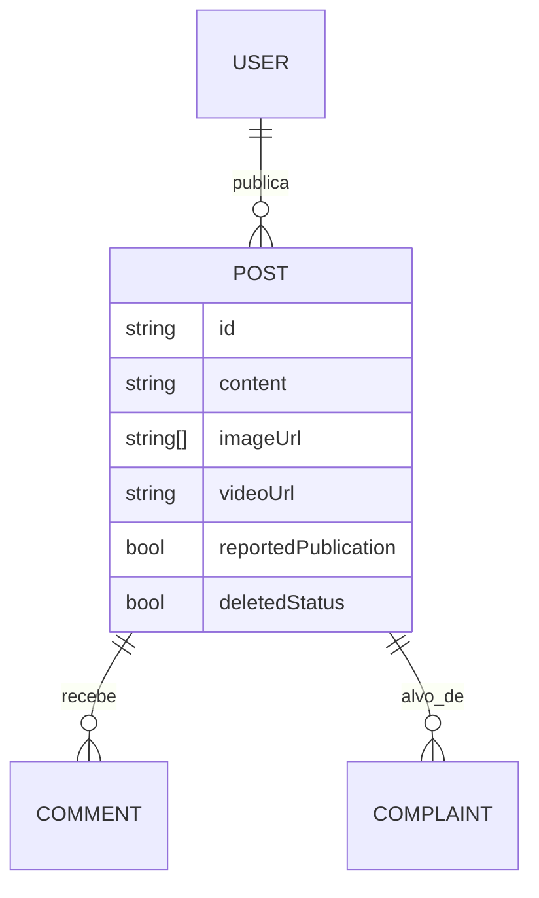
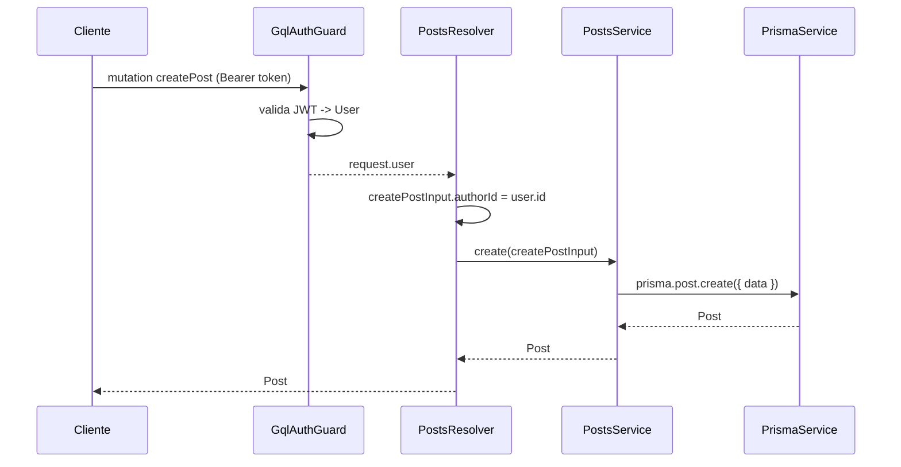
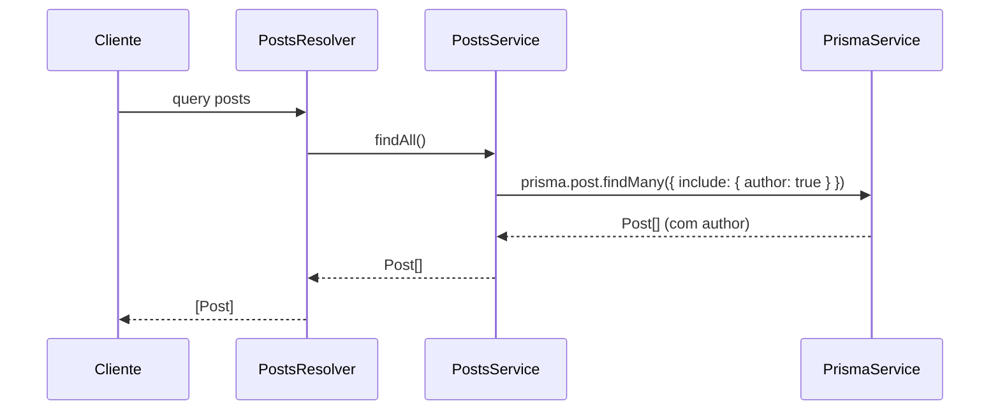

# Módulo: Posts

## 1. Propósito

Gerencia as publicações feitas por usuários na plataforma. Expõe queries e
mutation GraphQL para criar posts com conteúdo textual e mídia (array de
imagens e/ou vídeo), listar todos os posts com o autor carregado, e buscar
um post por id. Autor do post é sempre extraído do token JWT no momento da
criação — nunca do input do cliente.

O módulo é consumido pelos módulos `comments` (cada `Comment` referencia um
`Post`) e `complaints` (denúncias podem ter `postId`). O upload das mídias
em si (S3) é delegado ao módulo
[`upload-medias`](../upload-medias/README.md); `Post` armazena apenas as
URLs resultantes.

## 2. Regras de Negócio

1. A criação de um `Post` exige usuário autenticado. `PostsResolver.createPost`
   aplica `@UseGuards(GqlAuthGuard)` e injeta o usuário atual via
   `@CurrentUser()` (ver `posts.resolver.ts:14-23`).
2. O campo `authorId` do `CreatePostInput` é **sobrescrito pelo resolver**
   com `user.id` antes de chamar o service — ou seja, é inócuo o cliente
   enviar esse campo, ele sempre vira o dono do JWT.
3. `imageUrl` e `videoUrl` são opcionais (`nullable: true`). O schema Prisma
   inicializa `imageUrl` com array vazio (`@default([])`). `videoUrl` é
   opcional.
4. Posts têm soft-delete (`deletedStatus`, `deletedAt` no schema Prisma).
   O service **não filtra `deletedAt: null` / `deletedStatus: false`** em
   nenhuma das consultas (`findAll`, `findOne`, `findByAuthor`) — ver seção 10.
5. `reportedPublication` (Boolean, default `false`) sinaliza posts reportados
   via o fluxo de denúncias. Nenhum ponto neste módulo altera o campo hoje.
6. O relacionamento `author` é carregado em `findAll` e `findOne` via
   `include: { author: true }`. Relações `comments` e `complaints` **não são
   incluídas** nas consultas existentes.

> ⚠️ **A confirmar:** o spec do projeto e
> [`../../../docs/business-rules.md`](../../../docs/business-rules.md)
> mencionam um "gate Ultimate" (conteúdo pago acessível apenas a assinantes
> Ultimate). Hoje **nenhuma verificação de assinatura existe** em
> `posts.service.ts` ou em `posts.resolver.ts`. Se a regra for esperada,
> ela ainda não está implementada.

## 3. Entidades e Modelo de Dados

### `Post` — tabela `posts` (ver [`prisma/schema.prisma:157-175`](../../../prisma/schema.prisma))

| Campo | Tipo | Nullable | Default | Observação |
| --- | --- | --- | --- | --- |
| `id` | String (uuid) | não | `uuid()` | PK |
| `content` | String | não | | texto do post |
| `imageUrl` | String[] | não | `[]` | array de URLs (Postgres text[]) |
| `videoUrl` | String | sim | | URL única de vídeo |
| `authorId` | String | não | | FK → `users.id` |
| `deletedStatus` | Boolean | não | `false` | flag de soft-delete |
| `deletedAt` | DateTime | sim | | `@map("deleted_at")` |
| `createdAt` | DateTime | não | `now()` | `@map("created_at")` |
| `updatedAt` | DateTime | sim | `@updatedAt` | `@map("updated_at")` |
| `reportedPublication` | Boolean | não | `false` | sinaliza post denunciado |

Relações: N:1 com `User` (`author`), 1:N com `Comment` (`comments`), 1:N com
`Complaint` (`complaints`).

ERD completo em [`../../../docs/data-model.md`](../../../docs/data-model.md).

### Dois arquivos de entity GraphQL

| Arquivo | Uso |
| --- | --- |
| `entities/post.entity.ts` | `@ObjectType Post` usado pelo resolver (retorno das operações). Campos: `id`, `content`, `imageUrl?`, `videoUrl`, `comments?`, `commentsCount`, `authorId`, `author`, `deletedStatus`, `deletedAt?`, `createdAt`, `updatedAt?`, `reportedPublication`, `complaints`. |
| `dto/post.entity.dto.ts` | Segunda declaração `@ObjectType Post` dentro de `dto/`. Campos quase idênticos, mas sem `comments`/`commentsCount`. Não é referenciado pelo resolver atual. |

> ⚠️ **Débito:** duas entidades GraphQL com o mesmo nome (`Post`) podem
> causar colisão no schema code-first caso ambas sejam registradas. A versão
> em `entities/` é a que o resolver importa. Ver seção 10.

## 4. API GraphQL

### Queries

| Nome | Argumentos | Retorno | Auth | Descrição |
| --- | --- | --- | --- | --- |
| `posts` | — | `[Post!]!` | nenhuma | Lista todos os posts, com `author` incluído. Não filtra soft-delete. |
| `post` | `id: String!` | `Post` | nenhuma | Busca um post por id, com `author` incluído. |

### Mutations

| Nome | Argumentos | Retorno | Auth | Descrição |
| --- | --- | --- | --- | --- |
| `createPost` | `createPostInput: CreatePostInput!` | `Post!` | `GqlAuthGuard` | Cria um post usando o usuário autenticado como autor. |

### Subscriptions

Não se aplica.

### REST

Não se aplica — módulo não declara controller.

## 5. DTOs e Inputs

### `CreatePostInput` (`dto/create-post.input.ts`)

| Campo | Tipo | Validadores | Obrigatório | Observação |
| --- | --- | --- | --- | --- |
| `content` | `String` | `IsString` | sim | texto do post |
| `imageUrl` | `[String]` (nullable) | `IsString({ each: true })` | não | array de URLs |
| `videoUrl` | `String` (nullable) | `IsString` | não | URL única |
| `authorId` | `string` | — | — | **não exposto no schema GraphQL** (sem `@Field`); preenchido pelo resolver com `user.id` |

O campo `comments` está comentado no DTO.

### `UpdatePostInput` (`dto/update-post.input.ts`)

Estende `PartialType(CreatePostInput)`. Sem campo `id` adicional. Não é
referenciado pelo resolver atual (existe apenas o import).

## 6. Fluxos Principais

### Fluxo: criação de post

### Fluxo: listagem (`posts`)

### Fluxo: busca por id (`post`)

Análogo à listagem, usando `findUnique({ where: { id }, include: { author: true } })`.

### Método auxiliar não exposto: `findByAuthor(authorId)`

Implementado em `posts.service.ts:34-41` mas **não é chamado por nenhum
resolver** atualmente (ver seção 10).

## 7. Dependências

### Módulos internos importados

`posts.module.ts` declara apenas `providers: [PostsResolver, PostsService]`.
Não importa outros módulos via `imports: [...]`.

`PostsService` depende de `PrismaService` (disponibilizado pelo `PrismaModule`
no `AppModule`).

O resolver importa do módulo `auth`:
- `GqlAuthGuard` de `../auth/guards/qgl-auth.guard` (note o typo "qgl" no
  nome do arquivo — ver [`../auth/README.md`](../auth/README.md));
- Decorator `@CurrentUser()` de `../auth/decorators/current-user.decorator`.

E importa `User` de `../users/entities/user.entity` apenas para tipagem.

### Módulos que consomem este

Grep `grep -rn "PostsModule\|PostsService" src --include="*.ts"`:

- `src/app.module.ts` — importa `PostsModule` e inclui no `include` do
  GraphQL.
- Nenhum outro módulo importa `PostsService` via `imports` do NestJS.

Relacionamentos a nível de domínio (schema Prisma) existem em `Comment` e
`Complaint`, mas essas referências vivem nos módulos correspondentes
([`../comments/README.md`](../comments/README.md) e
[`../complaints/README.md`](../complaints/README.md)).

### Integrações externas

Não se aplica diretamente.

### Variáveis de ambiente

Não se aplica — o módulo não lê variáveis próprias.

## 8. Autorização e Papéis

| Operação | Guard | Roles permitidas |
| --- | --- | --- |
| `createPost` | `GqlAuthGuard` (JWT) | qualquer usuário autenticado — nenhum `@Roles()` |
| `posts` | nenhuma | público |
| `post` | nenhuma | público |

Decorators customizados usados: `@CurrentUser()` para resgatar o usuário do
contexto GraphQL.

> ⚠️ **A confirmar:** leitura pública de todos os posts (`posts`, `post`) é
> intencional? Com soft-delete não filtrado (ver seção 10), isso também
> inclui posts deletados. Gate Ultimate, se existir, não é aplicado aqui.

## 9. Erros e Exceções

| Situação | Origem | Mensagem / Tipo |
| --- | --- | --- |
| Criar post sem token válido | `GqlAuthGuard` | `UnauthorizedException` (padrão Nest/Passport) |
| `post(id)` com id inexistente | `prisma.post.findUnique` | retorna `null` — o cliente recebe `null` sem erro |
| `authorId` inválido (FK) | Prisma no `create` | `P2003` foreign key constraint — não tratado |

Nenhuma `HttpException`/`NotFoundException`/`BadRequestException` é lançada
explicitamente no service.

## 10. Pontos de Atenção / Manutenção

- **Soft-delete ignorado.** Nenhuma das consultas filtra `deletedAt: null`
  ou `deletedStatus: false`. Posts deletados aparecem em `posts` e `post`.
  Ponto documentado em
  [`../../../docs/business-rules.md`](../../../docs/business-rules.md) como
  regra transversal que todo service deveria aplicar.
- **Duas entidades GraphQL `Post`.** Existem
  `entities/post.entity.ts` (usada pelo resolver) e `dto/post.entity.dto.ts`
  (não usada). Se a segunda for registrada em algum outro ponto do app,
  haverá colisão de nomes no schema.
- **Campo `deletedStatus` na entity sem descrição.** Em
  `dto/post.entity.dto.ts:26` aparece `@Field({description: ""})` — label
  vazio. Sem impacto funcional, só de documentação gerada.
- **`UpdatePostInput` não é usado.** O import existe no resolver mas não
  há mutation `updatePost`.
- **`findByAuthor` não é exposto.** Service tem o método, mas nenhum
  resolver o chama.
- **Gate Ultimate ausente.** Plano/spec menciona, código não aplica.
- **`console.log('User creating post:', user);`** em produção
  (`posts.resolver.ts:20`) — imprime dados do usuário autenticado.
- **Typo no arquivo de guard:** `qgl-auth.guard.ts` deveria ser
  `gql-auth.guard.ts`. Não é responsabilidade deste módulo corrigir.
- **Tipo GraphQL `comments: [Comment]`/`commentsCount`** declarados na
  entity mas nunca preenchidos pelas queries — clientes que pedirem esses
  campos recebem `null`/indefinido.
- **Sem paginação.** `findAll` retorna todos os posts sem limite — risco
  em bases com volume.

## 11. Testes

| Arquivo | Cenários cobertos | Observações |
| --- | --- | --- |
| `posts.service.spec.ts` | Instancia `PostsService` e verifica `toBeDefined`. | Não provê `PrismaService` — smoke test falha na resolução de dependência se `Test.createTestingModule` for executado. |
| `posts.resolver.spec.ts` | Instancia `PostsResolver` e verifica `toBeDefined`. | Mesma limitação: providers passados sem dependências transitivas. |

Não há cobertura de:

- `create` (sobrescrita do `authorId`, persistência).
- `findAll`/`findOne` (include do autor).
- `findByAuthor` (método implementado porém não exposto).
- Comportamento frente a soft-delete.
- Autorização com `GqlAuthGuard`.
