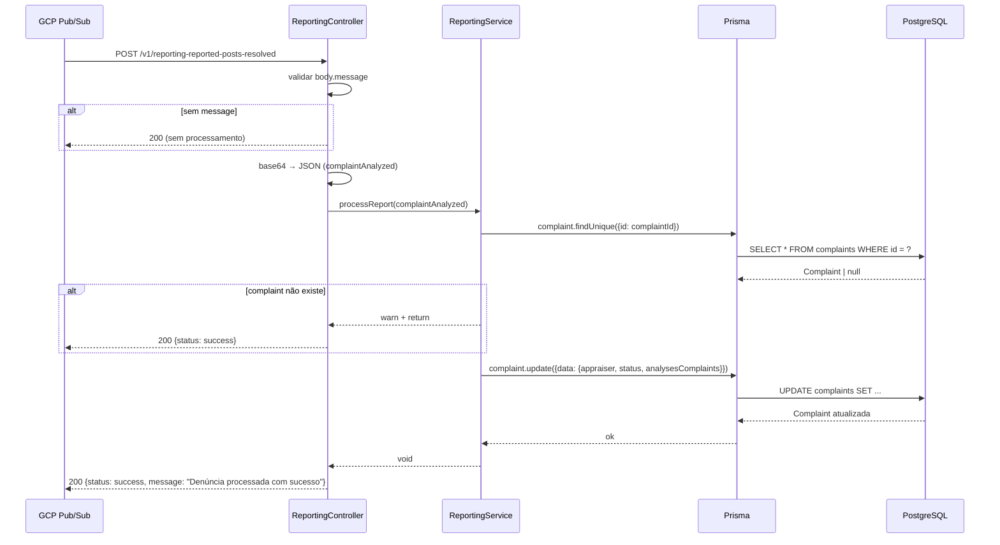

# Módulo: Reporting

## 1. Propósito

Módulo que recebe **o resultado** da análise de denúncias feita por processos externos (workflow n8n com Ollama/GLM, ou potencialmente o `AssistantAiService` com Claude) e atualiza o registro de `Complaint` no banco com: o autor da análise (`appraiser = ASSISTANT`), o novo `status` (equivalente à ação recomendada) e o objeto completo da análise (`analysesComplaints`).

Fechando o ciclo, a pipeline é:
1. `complaints` cria uma `Complaint` e publica no tópico GCP `date-me-topic-reporting-reported-posts-queue`.
2. Agente externo consome, analisa, publica resultado no tópico `date-me-topic-reporting-reported-posts-resolved-queue`.
3. GCP Pub/Sub entrega via **push** ao endpoint HTTP `POST /v1/reporting-reported-posts-resolved` deste módulo.
4. `ReportingService.processReport` atualiza a `Complaint` correspondente.

## 2. Regras de Negócio

1. **Webhook público.** O controller aplica `@Public()` ([`./reporting.service.controller.ts:17`](./reporting.service.controller.ts)). Junto com o `IS_PUBLIC_KEY` definido em [`../auth/guards/public.decorator.ts`](../auth/guards/public.decorator.ts), marca a rota como isenta de autenticação JWT — necessário para receber push do Pub/Sub.
2. **Idempotência por `complaintId`.** O service carrega `Complaint` via `findUnique({id: complaintPayload.complaintId})`. Se não existe, apenas loga `warn` e retorna sem erro (ver [`./reporting.service.ts:21-24`](./reporting.service.ts)).
3. **Decodificação base64.** O body Pub/Sub chega com `body.message.data` em base64; o controller decodifica para UTF-8 e faz `JSON.parse` (ver [`./reporting.service.controller.ts:34-35`](./reporting.service.controller.ts)).
4. **Short-circuit sem `message`.** Se o body não tiver a propriedade `message`, o handler loga warning e retorna sem processar (ver [`./reporting.service.controller.ts:30-33`](./reporting.service.controller.ts)).
5. **Marcação `ASSISTANT`.** Toda análise recebida por este endpoint é atribuída a `AppraiserEnum.ASSISTANT` (ver [`./reporting.service.ts:31`](./reporting.service.ts)) — não há ramo para `HUMAN`.
6. **Status = `acao_recommended`.** O novo `Complaint.status` é copiado literalmente do campo `complaintPayload.agent.acao_recommended` recebido. Não há normalização contra um enum.
7. **Resposta HTTP 200 sempre.** Mesmo em caso de exceção dentro do handler, o controller captura com `try/catch`, loga o erro e retorna `{status: 'error', message, error: stack}` com **HTTP 200** (via `@HttpCode(HttpStatus.OK)`). Evita retries automáticos do Pub/Sub, mas engole erros silenciosamente.

## 3. Entidades e Modelo de Dados

Não se aplica — o módulo **não** possui entidade Prisma própria. Ele lê/atualiza a tabela `complaints` (entidade `Complaint`), cujo modelo está documentado em [`../complaints/README.md`](../complaints/README.md) e [`../../../docs/data-model.md`](../../../docs/data-model.md).

Campos da `Complaint` escritos por este módulo: `appraiser`, `status`, `analysesComplaints`.

O arquivo [`./entities/reporting.entity.ts`](./entities/reporting.entity.ts) declara um `@ObjectType Reporting { exampleField: Int }` — placeholder do CLI Nest, não usado.

## 4. API GraphQL

### Queries

Não se aplica.

### Mutations

Não se aplica. O arquivo [`./reporting.resolver.ts`](./reporting.resolver.ts) existe mas está inteiramente comentado (scaffold do CLI). `ReportingModule` também **não** está no `include` do `GraphQLModule.forRoot({...})`.

### Subscriptions

Não se aplica.

### REST

Controller: [`./reporting.service.controller.ts`](./reporting.service.controller.ts). Base path `/v1`. Todas as rotas são `@Public()`.

| Método | Rota | Body | Retorno | Auth | Descrição |
| --- | --- | --- | --- | --- | --- |
| POST | `/v1/reporting-reported-posts-resolved` | `PubSubMessage` | `{status, message}` ou `{status, message, error}` | `@Public()` | Webhook de push do GCP Pub/Sub com o resultado da análise |

Formato `PubSubMessage` (declarado inline no controller):

```ts
interface PubSubMessage {
  message: {
    data: string;                           // base64 com JSON do resultado
    messageId: string;
    attributes: { [key: string]: string };
  };
  subscription: string;
}
```

Conteúdo do `data` decodificado (contrato observado no service):

```ts
{
  complaintId: string,
  agent: {
    acao_recommended: string,               // usado como novo Complaint.status
    // demais campos da análise (categoria, severidade, confianca, justificativa, ...)
  }
}
```

> ⚠️ **A confirmar:** o código usa `acao_recommended` (com "m"), mas o prompt do `AssistantAiService` e o workflow n8n geram `acao_recomendada` (com "d"). Divergência de nome de campo — validar contrato entre produtor e consumidor.

## 5. DTOs e Inputs

Scaffolds não usados (código morto):

- [`./dto/create-reporting.input.ts`](./dto/create-reporting.input.ts) — `CreateReportingInput { exampleField: Int }`.
- [`./dto/update-reporting.input.ts`](./dto/update-reporting.input.ts) — `UpdateReportingInput extends PartialType(CreateReportingInput)` + `id: Int`.
- [`./entities/reporting.entity.ts`](./entities/reporting.entity.ts) — `Reporting { exampleField: Int }`.

A única "DTO" viva é a interface interna `PubSubMessage` declarada no controller ([`./reporting.service.controller.ts:6-15`](./reporting.service.controller.ts)).

## 6. Fluxos Principais

### Fluxo: Processar análise recebida via Pub/Sub push



Em caso de exceção dentro do `try/catch` do controller, a resposta é `200 {status: 'error', message, error: stack}` — o Pub/Sub considera entregue e não tenta novamente.

## 7. Dependências

### Módulos internos importados

Declarados em [`./reporting.module.ts`](./reporting.module.ts): nenhum import explícito. O service injeta `PrismaService` via construtor, que funciona porque `PrismaModule` é global (ou está disponível no container global a partir de `app.module.ts`).

Usa também o enum `AppraiserEnum` de [`../complaints/enum/appraiser.enum.ts`](../complaints/enum/appraiser.enum.ts) e o decorator `Public` de [`../auth/guards/public.decorator.ts`](../auth/guards/public.decorator.ts).

### Módulos que consomem este

Grep reverso (`ReportingModule` / `ReportingService`): apenas [`../../app.module.ts`](../../app.module.ts), que registra `ReportingModule` entre os módulos da aplicação. Nenhum outro service injeta `ReportingService` — a superfície do módulo é o webhook HTTP.

### Integrações externas

- **Google Cloud Pub/Sub** (push). O GCP faz POST para `/v1/reporting-reported-posts-resolved` quando a subscription `push` do tópico `date-me-topic-reporting-reported-posts-resolved-queue` recebe uma mensagem.
- Indiretamente: **workflow n8n** (ou o `AssistantAiService` TS) é o produtor das mensagens que chegam aqui.

### Variáveis de ambiente

Nenhuma variável consumida por este módulo diretamente. As credenciais do Pub/Sub no lado produtor são gerenciadas pelo `GcpModule` e pelo n8n. O endpoint `/v1/reporting-reported-posts-resolved` precisa estar **publicamente acessível** para o GCP — ver `docs/infrastructure.md`.

## 8. Autorização e Papéis

O controller é marcado com `@Public()`. Isso só surte efeito se existir um guard global que leia `IS_PUBLIC_KEY` para pular autenticação. No projeto atual há:

- `JwtAuthGuard` e `RolesGuard` em [`../auth/guards/`](../auth/guards/).
- `Public` decorator em [`../auth/guards/public.decorator.ts`](../auth/guards/public.decorator.ts).

> ⚠️ **A confirmar:** não há `APP_GUARD` global registrado em `app.module.ts` — os guards são aplicados manualmente via `@UseGuards(...)` nos resolvers/controllers. Logo, o `@Public()` deste controller é **redundante**: mesmo sem ele, a rota já estaria aberta (nenhum guard aplicado). Validar.

Implicação prática: **qualquer cliente HTTP** que conheça o endpoint pode publicar denúncias "analisadas" e sobrescrever `Complaint.status`/`analysesComplaints`. Débito de segurança.

## 9. Erros e Exceções

| Erro lançado | Condição | Código HTTP | Comportamento |
| --- | --- | --- | --- |
| Nenhum explicitamente | `complaint` não encontrado no banco | 200 | `warn` + retorno vazio do service, controller responde `{status: success}` |
| Qualquer `throw` dentro do `try` do controller | Parse JSON falha, `complaint.update` falha, etc. | **200** | Capturado pelo catch, responde `{status: 'error', message, error: stack}` |

Consequência: o Pub/Sub **sempre** recebe 200 — não há retry automático mesmo para falhas reais (ex.: banco fora do ar). Mensagens perdidas.

## 10. Pontos de Atenção / Manutenção

- **Nome de arquivo duplicado.** `reporting.service.controller.ts` tem nomenclatura mista (service + controller no mesmo nome). O conteúdo é um `@Controller` puro — renomear para `reporting.controller.ts`.
- **`@Public()` sem guard global.** Decoração atualmente redundante; mesmo removendo, a rota fica aberta porque nenhum guard é aplicado. Recomenda-se **adicionar autenticação** no webhook (ex.: assinatura JWT do OIDC do Pub/Sub, token compartilhado).
- **Segurança do webhook.** Qualquer um pode falsificar análises. Mínimo: validar o header `Authorization: Bearer <JWT do Pub/Sub>` usando a chave pública de `https://www.googleapis.com/oauth2/v1/certs`.
- **Divergência de contrato.** Campo `acao_recommended` (reporting) vs `acao_recomendada` (assistant_ai/n8n). Uma das pontas está errada; a atualização provavelmente grava `undefined` como `status`.
- **Erros engolidos.** Retornar 200 mesmo em erro derruba o retry do Pub/Sub. Trocar para 5xx quando o processamento falhar (para garantir re-entrega).
- **Sem validação de payload.** Faltando `complaintId`, `agent`, `acao_recommended` — o código vai ou lançar ou gravar `undefined`. Adicionar `class-validator` e `ValidationPipe`.
- **Scaffolds mortos.** Resolver, DTOs e entity são placeholders do CLI. Remover.
- **Logger nome de classe.** Usa `ReportingService.name` no service e `ReportingController.name` no controller — correto. Bom.
- **Sem testes cobrindo lógica** (só `should be defined`). Alto risco dado que é a ponta de escrita no banco vinda de fonte externa.
- **Sem rastreabilidade.** Não se grava `messageId` do Pub/Sub nem timestamp da análise — dificulta auditoria.

## 11. Testes

| Arquivo | Cenários cobertos | Observações |
| --- | --- | --- |
| [`./reporting.service.spec.ts`](./reporting.service.spec.ts) | `should be defined` | Placeholder. Não mocka `PrismaService` — o `TestingModule` é inválido para o construtor real; spec deve falhar em runtime. |
| [`./reporting.resolver.spec.ts`](./reporting.resolver.spec.ts) | `should be defined` | Importa `ReportingResolver` que **não existe** (arquivo inteiramente comentado). Spec quebra no compile. |

Cenários claramente não cobertos: decodificação base64, JSON mal-formado, `complaintId` inexistente, ausência de `message` no body, divergência `acao_recommended`/`acao_recomendada`, falha na escrita do banco.
