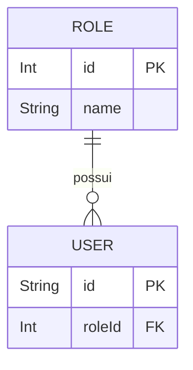

# Módulo: Roles

## 1. Propósito

O módulo `roles` foi gerado pelo schematics padrão do NestJS (`nest g resource roles`) e representa o ponto de extensão previsto para a gestão de papéis/perfis de usuário (`Role`). Atualmente ele está **em estado de esqueleto**: o módulo ([`./roles.module.ts`](./roles.module.ts)) registra `RolesResolver` e `RolesService`, mas todos os métodos de negócio em [`./roles.service.ts`](./roles.service.ts) e todos os handlers GraphQL em [`./roles.resolver.ts`](./roles.resolver.ts) estão comentados.

A entidade `Role` persiste, no entanto, no banco (tabela `roles` via Prisma) e é referenciada diretamente pelo model `User` através de `roleId`/`role` (ver [`../../../prisma/schema.prisma`](../../../prisma/schema.prisma)). O cadastro de roles é feito hoje fora deste módulo — seja por seed/migration ou diretamente via Prisma pelos demais serviços.

> ⚠️ **A confirmar**: se a intenção é ativar o CRUD de roles no futuro (descomentando os métodos) ou se o módulo permanecerá apenas como placeholder e a administração será feita exclusivamente via banco/seed.

## 2. Regras de Negócio

Nenhuma regra de negócio está implementada neste módulo no momento. Os métodos previstos (`create`, `findAll`, `findOne`, `update`, `remove`) estão comentados em [`./roles.service.ts`](./roles.service.ts) e não contêm lógica ativa — apenas strings de placeholder geradas pelo schematics.

Regras relacionadas ao consumo de `roleId` pelo domínio de usuários estão descritas em [`../users/README.md`](../users/README.md) (quando aplicável) e em [`../../../docs/business-rules.md`](../../../docs/business-rules.md).

> ⚠️ **A confirmar**: regras como unicidade de `Role.name`, roles default atribuídas ao criar um usuário e permissões necessárias para administrar roles não estão codificadas em `src/modules/roles/` e devem ser documentadas quando o módulo for ativado.

## 3. Entidades e Modelo de Dados

### Model Prisma `Role`

Declarado em [`../../../prisma/schema.prisma`](../../../prisma/schema.prisma):

```prisma
model Role {
  id                    Int   @id @default(autoincrement())
  name                  String
  users                 User[]

  @@map("roles")
}
```

Campos:

| Campo | Tipo | Observação |
|---|---|---|
| `id` | `Int` | Chave primária auto-incrementada. |
| `name` | `String` | Nome do papel. Sem `@unique` declarado no schema. |
| `users` | `User[]` | Relação reversa (one-to-many) com `User` via `User.roleId`. |

A tabela é mapeada para `roles` (`@@map("roles")`).

### Relação com `User`

O model `User` declara (em [`../../../prisma/schema.prisma`](../../../prisma/schema.prisma)):

```prisma
roleId                Int
role                  Role    @relation(fields: [roleId], references: [id])
```

Assim, todo `User` possui obrigatoriamente um `roleId` que referencia um `Role` existente.

### Diagrama ER (foco `Role` ↔ `User`)



Para a visão completa dos demais relacionamentos, convenções de nomenclatura e campos dos modelos, consultar [`../../../docs/data-model.md`](../../../docs/data-model.md).

### Entidade/DTO GraphQL `Role`

Há duas classes TypeScript com o mesmo nome `Role`, ambas anotadas com `@ObjectType`:

- [`./entities/role.entity.ts`](./entities/role.entity.ts) — registrada no schema GraphQL como `RoleEntity`.
- [`./dto/role.dto.ts`](./dto/role.dto.ts) — registrada como `RoleDTO`.

Ambas expõem os campos `id: Int` e `name: String`. O resolver atualmente referencia apenas a versão de `entities/` (import em [`./roles.resolver.ts`](./roles.resolver.ts)).

> ⚠️ **A confirmar**: a duplicação `RoleEntity` vs `RoleDTO` parece acidental (gerada durante experimentações com o schematics). Convém consolidar em um único ObjectType quando os resolvers forem ativados.

## 4. API GraphQL

**Nenhuma query ou mutation está atualmente exposta via GraphQL.**

Motivo: o resolver [`./roles.resolver.ts`](./roles.resolver.ts) existe, mas todos os decoradores `@Query`/`@Mutation` estão comentados. Adicionalmente, `RolesModule` **não** está listado no array `include` do `GraphQLModule.forRoot` em [`../../app.module.ts`](../../app.module.ts) — o `include` atual contém apenas `AuthModule`, `PagSeguroModule`, `PlansModule`, `SubscriptionsModule`, `SubscriptionStatusModule`, `PaymentsModule`, `PostsModule`, `UploadMediasModule` e `ComplaintsModule`.

Consequência prática:

- O schema GraphQL (`src/schema.gql`) não contém operações de `Role` / `roles`.
- `RolesService` é **acessível apenas internamente** (injeção via Nest DI), por estar exportado em `RolesModule.exports`. No momento, nenhum outro módulo o injeta (ver seção 7).

Operações previstas (comentadas no resolver), caso sejam reativadas:

| Tipo | Nome | Args | Retorno | Observação |
|---|---|---|---|---|
| `Mutation` | `createRole` | `createRoleInput: CreateRoleInput` | `Role` | Comentado. |
| `Query` | `roles` | — | `[Role]` | Comentado. |
| `Query` | `role` | `id: Int` | `Role` | Comentado. |
| `Mutation` | `updateRole` | `updateRoleInput: UpdateRoleInput` | `Role` | Comentado. |
| `Mutation` | `removeRole` | `id: Int` | `Role` | Comentado. |

> ⚠️ **A confirmar**: se/quando reativadas, revisar se `RolesModule` deve entrar no `include` do `GraphQLModule` em [`../../app.module.ts`](../../app.module.ts).

## 5. DTOs e Inputs

Localizados em [`./dto/`](./dto):

### `CreateRoleInput` — [`./dto/create-role.input.ts`](./dto/create-role.input.ts)

```ts
@InputType()
export class CreateRoleInput {
  @Field()
  name: string;

  @Field({ nullable: true })
  description?: string;
}
```

| Campo | Tipo | Obrigatório | Observação |
|---|---|---|---|
| `name` | `String` | Sim | — |
| `description` | `String` | Não | Nota: o model Prisma `Role` não possui coluna `description`. Se esta input for usada, `description` é ignorada pelo persistence layer atual. |

> ⚠️ **A confirmar**: divergência entre `CreateRoleInput.description` e o schema Prisma. Pode indicar que o input é herdado do schematics padrão ou que o schema Prisma deveria ganhar a coluna `description`.

### `UpdateRoleInput` — [`./dto/update-role.input.ts`](./dto/update-role.input.ts)

```ts
@InputType()
export class UpdateRoleInput extends PartialType(CreateRoleInput) {}
```

Herda todos os campos de `CreateRoleInput` como opcionais via `@nestjs/graphql` `PartialType`.

> ⚠️ **A confirmar**: o comentário original do schematics previa um campo `id` obrigatório em `UpdateRoleInput`, mas aqui ele não está declarado. Se as mutations forem reativadas, provavelmente será necessário adicionar `@Field(() => Int) id: number`.

### `Role` (DTO de saída) — [`./dto/role.dto.ts`](./dto/role.dto.ts)

```ts
@ObjectType('RoleDTO')
export class Role {
  @Field(() => Int) id: number;
  @Field()          name: string;
}
```

Não é utilizado atualmente pelo resolver, que referencia [`./entities/role.entity.ts`](./entities/role.entity.ts) (ver seção 3).

## 6. Fluxos Principais

Nenhum fluxo está implementado no momento. O fluxograma abaixo representa o **estado previsto** pelos métodos comentados:

1. Cliente (a definir) envia mutation/query GraphQL.
2. `RolesResolver` recebe e delega para `RolesService`.
3. `RolesService` interagiria com `PrismaService` para persistir/consultar `Role`.
4. Retorno mapeado para o `ObjectType` `Role`.

Como nada disso está ativo, o fluxo real hoje é: **nenhuma operação transita por este módulo**. Leituras/escritas de `Role` ocorrem via Prisma nos serviços que possuem `PrismaService` injetado, mas sem passar por `RolesService`.

> ⚠️ **A confirmar**: como o sistema cria o registro de `Role` mínimo necessário para satisfazer a FK `User.roleId` (seed script, migration, ou rotina externa). Nenhum seed foi encontrado em `src/modules/roles/`.

## 7. Dependências

### Imports internos do módulo

Declarados em [`./roles.module.ts`](./roles.module.ts):

- `RolesService` (provider, próprio módulo)
- `RolesResolver` (provider, próprio módulo)
- Nenhum import de outros módulos (não importa `PrismaModule`, por exemplo).

Exports:

- `RolesService` é exportado, mas **não é consumido por nenhum outro módulo** atualmente.

### Grep reverso (`RolesModule` / `RolesService` / `RoleService` em `src/**/*.ts`)

Únicas ocorrências encontradas:

- [`../../app.module.ts`](../../app.module.ts): `import { RolesModule }` e uso em `imports`.
- [`./roles.module.ts`](./roles.module.ts), [`./roles.resolver.ts`](./roles.resolver.ts), [`./roles.service.ts`](./roles.service.ts) e specs do próprio módulo.

Ou seja, `RolesService` não é injetado fora de `src/modules/roles/`.

### Integrações externas

Nenhuma. O módulo não chama APIs externas, filas, gateways de pagamento, Redis, GCP, etc.

### Variáveis de ambiente

Nenhuma específica do módulo. O acesso à tabela `roles` ocorre indiretamente via `PrismaService` (que lê `DATABASE_URL`) dos outros módulos, não deste.

## 8. Autorização e Papéis

Não se aplica dentro deste módulo — não há resolvers ativos nem guards declarados em `src/modules/roles/`.

Observação contextual: o model `Role` é o fundamento para autorização baseada em papéis da aplicação (ligado a `User.roleId`), mas o uso efetivo desse `roleId` para autorização está implementado em outros módulos (ver [`../auth/README.md`](../auth/README.md), quando disponível, e [`../../../docs/business-rules.md`](../../../docs/business-rules.md)).

> ⚠️ **A confirmar**: nomes e semântica dos roles persistidos (por exemplo, `admin`, `user`, `premium`). Não há enum ou constante declarada em `src/modules/roles/`.

## 9. Erros e Exceções

Nenhuma exceção é lançada pelo módulo no estado atual (métodos vazios/comentados). Não há uso de `HttpException`, `BadRequestException`, `NotFoundException`, filtros globais específicos nem `try/catch` em [`./roles.service.ts`](./roles.service.ts).

## 10. Pontos de Atenção / Manutenção

- **Esqueleto não ativado.** Resolver e service estão com toda a lógica comentada. Antes de ativá-los, confirmar contratos (DTOs, autorização, necessidade de `description` em `Role`).
- **Ausente do `include` GraphQL.** [`../../app.module.ts`](../../app.module.ts) não inclui `RolesModule` no `GraphQLModule.forRoot({ include: [...] })`. Qualquer tentativa de expor queries/mutations exigirá adicioná-lo ali.
- **Duplicação de `Role` ObjectType.** Existem `RoleEntity` ([`./entities/role.entity.ts`](./entities/role.entity.ts)) e `RoleDTO` ([`./dto/role.dto.ts`](./dto/role.dto.ts)) equivalentes; consolidar em um só ao retomar o módulo para evitar conflito no schema GraphQL.
- **Divergência de campos.** `CreateRoleInput.description` não existe no model Prisma `Role`. Ou adicionar a coluna no schema Prisma (+ migration), ou remover o campo do input.
- **`PrismaService` não injetado.** Ao ativar o CRUD, será necessário importar `PrismaModule` em [`./roles.module.ts`](./roles.module.ts) (ou apoiar-se no fato de `PrismaModule` ser `@Global()`) e injetar `PrismaService` em `RolesService`.
- **Sem seed documentado no módulo.** O módulo não registra como as roles iniciais são criadas, apesar de `User.roleId` ser obrigatório. Recomenda-se documentar o caminho real (seed script, migration com `INSERT`, ou instrução manual).

## 11. Testes

Dois specs gerados pelo schematics:

- [`./roles.service.spec.ts`](./roles.service.spec.ts) — instancia `RolesService` via `Test.createTestingModule` e verifica apenas `expect(service).toBeDefined()`.
- [`./roles.resolver.spec.ts`](./roles.resolver.spec.ts) — instancia `RolesResolver` com `RolesService` e verifica apenas `expect(resolver).toBeDefined()`.

Não há testes de regras de negócio, de integração com Prisma, nem cobertura dos DTOs, porque não há lógica a ser testada no estado atual.

Execução:

```bash
npm run test -- src/modules/roles
```

> ⚠️ **A confirmar**: política de cobertura esperada quando o CRUD for ativado (unit tests para service, e2e opcional via GraphQL).
