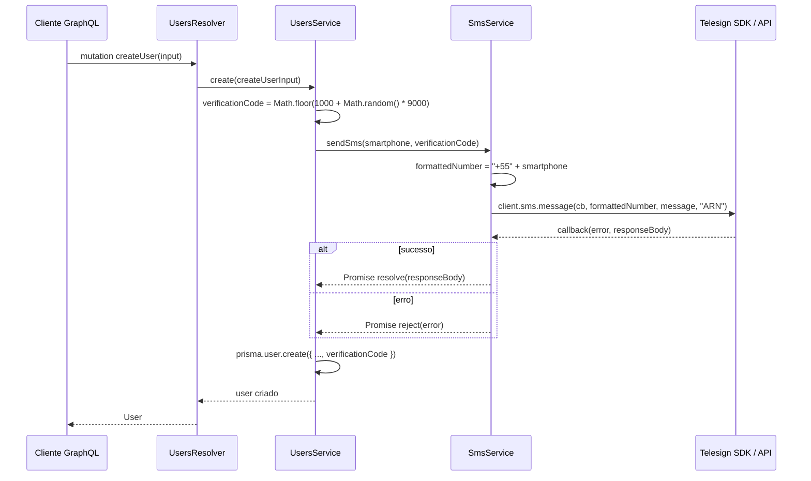

# Módulo `sms`

## 1. Propósito

Módulo de infraestrutura responsável por encapsular a integração com o provedor de SMS [Telesign](https://www.telesign.com/) (SDK `telesignsdk`). Declarado em [`./sms.module.ts`](./sms.module.ts), registra e exporta o provider [`SmsService`](./sms.service.ts), que expõe o método `sendSms` para envio de mensagens de texto contendo códigos de verificação.

É consumido exclusivamente pelo módulo de usuários (ver seção 7) no fluxo de cadastro, não participando diretamente da camada GraphQL.

## 2. Regras de Negócio

- **Prefixo fixo de país.** Em [`./sms.service.ts`](./sms.service.ts), o número recebido em `sendSms(smartphoneNumber, verificationCode)` é concatenado com o prefixo `+55` antes de ser enviado ao Telesign (`const formattedNumber = "+55" + smartphoneNumber;`). Não há normalização adicional (remoção de caracteres, validação de comprimento, suporte a outros DDIs).
- **Tipo de mensagem.** Todas as mensagens são enviadas como `messageType = 'ARN'` (Alert, Reminder, Notification — categoria do Telesign para mensagens transacionais de notificação).
- **Texto da mensagem.** O corpo é fixo: `"Seu código de verificação é: ${verificationCode}"`. Não há internacionalização nem variação por template.
- **Credenciais obrigatórias em bootstrap.** O construtor do `SmsService` exige `TELESIGN_CUSTOMER_ID` e `TELESIGN_API_KEY` no ambiente. Quando qualquer uma estiver ausente, lança `Error('Telesign environment variables are missing')` durante a instanciação do provider, impedindo o bootstrap do Nest.

## 3. Entidades e Modelo de Dados

Não se aplica. O módulo não define entidades persistidas nem interage com Prisma/banco de dados. O `verificationCode` gerado e persistido é responsabilidade de [`../users/users.service.ts`](../users/users.service.ts).

## 4. API GraphQL

Não se aplica. O `SmsModule` **não** consta no array `include` do `GraphQLModule.forRoot` em [`../../app.module.ts`](../../app.module.ts); portanto não registra resolvers, queries nem mutations no schema. O acesso ao `SmsService` é estritamente interno, via injeção de dependência.

## 5. DTOs e Inputs

Não se aplica. O método público `sendSms` aceita parâmetros primitivos: `smartphoneNumber: string` e `verificationCode: number` (ver [`./sms.service.ts`](./sms.service.ts)).

## 6. Fluxos Principais

### 6.1 Envio de código de verificação no cadastro de usuário

O único fluxo atualmente implementado ocorre durante `UsersService.create` ([`../users/users.service.ts`](../users/users.service.ts), linhas 26-27): um código de 4 dígitos é gerado com `Math.floor(1000 + Math.random() * 9000)`, enviado por SMS via `SmsService.sendSms` e persistido no campo `verificationCode` do `User` via Prisma. O usuário posteriormente valida o código em `UsersService.activeStatusWithVerificationCode` ([`../users/users.service.ts`](../users/users.service.ts), linha 272), fluxo que **não** envolve mais o `SmsService`.

Observações sobre o fluxo:

- Em [`../users/users.service.ts`](../users/users.service.ts), a chamada `this.sms.sendSms(...)` **não é aguardada** com `await`. Uma falha no envio gera uma rejeição de Promise não tratada, mas **não** interrompe a criação do usuário no banco; o registro é persistido normalmente com o `verificationCode`.
- O retorno do Telesign é apenas logado (`console.log('SMS enviado com sucesso:', responseBody);`) e não é propagado pela API GraphQL.

## 7. Dependências

**Pacotes externos:**

- [`telesignsdk`](https://www.npmjs.com/package/telesignsdk) — importado via `require('telesignsdk')` em [`./sms.service.ts`](./sms.service.ts). O tipo do cliente é declarado como `any`, sem tipagem estrita.

**Consumidores internos:**

- [`../../app.module.ts`](../../app.module.ts) — importa `SmsModule` no array `imports` (linha 75).
- [`../users/users.module.ts`](../users/users.module.ts) — importa `SmsModule` (linha 5/10) para disponibilizar o `SmsService`.
- [`../users/users.service.ts`](../users/users.service.ts) — injeta `SmsService` no construtor e invoca `sendSms` em `UsersService.create`.
- [`../users/users.service.spec.ts`](../users/users.service.spec.ts) e [`../users/users.resolver.spec.ts`](../users/users.resolver.spec.ts) — fornecem um mock do `SmsService` via `useValue` em testes do módulo `users`.

**Variáveis de ambiente:**

- `TELESIGN_CUSTOMER_ID` — Customer ID da conta Telesign. Consumida em [`./sms.service.ts`](./sms.service.ts) no construtor.
- `TELESIGN_API_KEY` — API Key da conta Telesign. Consumida em [`./sms.service.ts`](./sms.service.ts) no construtor.

Ambas estão documentadas em [`../../../docs/infrastructure.md`](../../../docs/infrastructure.md).

## 8. Autorização e Papéis

Não se aplica. O `SmsService` não é exposto via GraphQL nem HTTP e não implementa guards, decorators de papel ou verificações de autorização. O controle de acesso é delegado ao consumidor (`UsersService`), que só o invoca dentro de `create`.

## 9. Erros e Exceções

- **Credenciais ausentes no bootstrap.** Se `TELESIGN_CUSTOMER_ID` ou `TELESIGN_API_KEY` não estiverem definidos, o construtor lança `Error('Telesign environment variables are missing')`, o que aborta a inicialização do módulo pelo NestJS.
- **Falha no envio via Telesign.** O callback do SDK retorna `(error, responseBody)`. Quando `error` é truthy, o `SmsService` loga `"Erro ao enviar SMS Telesign:"` via `console.error` e chama `reject(error)` da Promise interna. A rejeição é propagada ao consumidor (`UsersService.create`), mas como a chamada não usa `await`, atualmente torna-se uma unhandled rejection (ver seção 10).
- **Sem exceções customizadas.** O módulo não define classes de erro próprias nem mapeia códigos HTTP/GraphQL; todos os erros são os originais do SDK ou o `Error` genérico de credenciais.

## 10. Pontos de Atenção / Manutenção

- **`sendSms` não é aguardado em `UsersService.create`.** Em [`../users/users.service.ts`](../users/users.service.ts), linha 27 (`this.sms.sendSms(createUserInput.smartphone, verificationCode)`), a Promise retornada não é encadeada com `await` nem `.catch()`. Em caso de falha no Telesign, o usuário é criado no banco mesmo sem receber o SMS, e o processo pode registrar uma `UnhandledPromiseRejection`.
- **Prefixo `+55` hardcoded.** Não há suporte a usuários fora do Brasil. Para internacionalização, a normalização do número precisará ser revista.
- **Tipo `any` no cliente Telesign.** O `telesignsdk` não possui tipagens TypeScript oficiais utilizadas aqui (`require('telesignsdk')` com `private client: any`). Erros de assinatura de `client.sms.message(...)` só aparecem em runtime.
- **Uso de API callback-based convertida manualmente em Promise.** `client.sms.message` é invocado com callback `(error, responseBody)` dentro de `new Promise(...)`. Não há cancelamento/timeout — se o SDK nunca chamar o callback, a Promise fica pendente indefinidamente.
- **Mensagem fixa e sem i18n.** O texto `"Seu código de verificação é: ${verificationCode}"` está inline no service, sem template/config externo.
- **Logs com `console.log`/`console.error`.** Ambos os ramos escrevem diretamente no stdout/stderr, sem integração com o `Logger` do NestJS, dificultando filtragem em produção.
- **Divergência com `main.tf`.** Segundo [`../../../docs/infrastructure.md`](../../../docs/infrastructure.md), o Terraform referencia `SMS_KEY` no container do Cloud Run, nome que **não é lido por este código** (que usa `TELESIGN_API_KEY` e `TELESIGN_CUSTOMER_ID`). A confirmar: o alinhamento de nomes entre infraestrutura e aplicação antes do próximo deploy.
- **Sem unit tests dedicados.** Ver seção 11.

## 11. Testes

Não há arquivos de teste dedicados ao módulo (`src/modules/sms/` contém apenas [`./sms.module.ts`](./sms.module.ts) e [`./sms.service.ts`](./sms.service.ts)). O `SmsService` aparece apenas como dependência mockada em testes do módulo consumidor:

- [`../users/users.service.spec.ts`](../users/users.service.spec.ts) — provê `SmsService` via `useValue` com `sendSms` mockado.
- [`../users/users.resolver.spec.ts`](../users/users.resolver.spec.ts) — mesmo padrão.

A confirmar: necessidade de cobertura unitária própria (validação de prefixo, tratamento de callbacks de erro, ausência de credenciais) antes de ampliar o uso do módulo.
