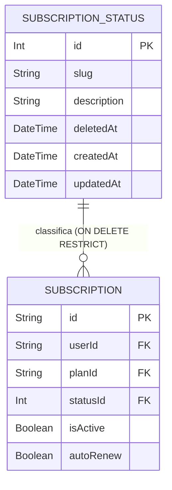
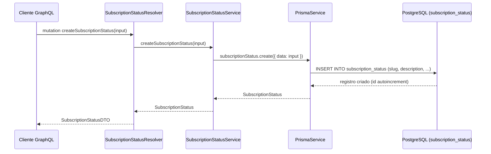
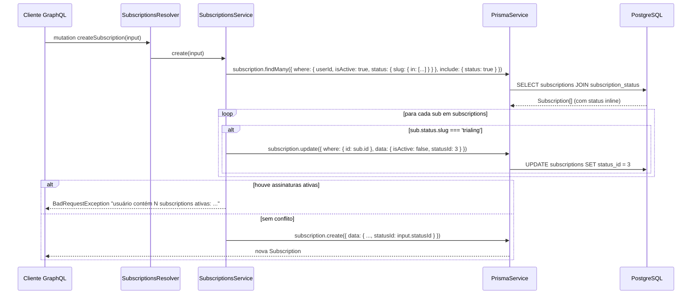

# Módulo: SubscriptionStatus

## 1. Propósito

O módulo `subscription-status` é responsável pelo **catálogo de macroestados** (status) que uma assinatura (`Subscription`) pode assumir ao longo do seu ciclo de vida. Declarado em [`./subscription-status.module.ts`](./subscription-status.module.ts), registra `SubscriptionStatusResolver` e `SubscriptionStatusService` como providers.

A entidade `SubscriptionStatus` representa cada linha do catálogo (tabela `subscription_status`): um `id` inteiro autoincrement, um `slug` humano-legível (ex.: `active`, `trialing`, `canceled`), uma `description` textual e suporte a soft-delete via `deletedAt`. Os registros funcionam como "constantes vivas" — cada `Subscription` aponta para um deles via FK `statusId` (`Int`) declarada no model Prisma em [`../../../prisma/schema.prisma`](../../../prisma/schema.prisma).

`SubscriptionStatusModule` está listado tanto no array `imports` quanto no array `include` do `GraphQLModule.forRoot` em [`../../app.module.ts`](../../app.module.ts) (linhas 64 e 82), portanto todas as queries e mutations declaradas em [`./subscription-status.resolver.ts`](./subscription-status.resolver.ts) são efetivamente expostas no schema GraphQL (`src/schema.gql`).

> **A confirmar**: se a manutenção do catálogo (criar/atualizar/remover status) deve permanecer exposta via GraphQL público (estado atual) ou migrar para um canal administrativo protegido — e se o catálogo deve ser populado por seed em vez de via API.

## 2. Regras de Negócio

Regras observáveis a partir do código atual:

- **Slugs canônicos definidos pelo `SubscriptionStatusEnum`.** [`./enum/subscription-status.enum.ts`](./enum/subscription-status.enum.ts) declara os seis slugs aceitos pelo domínio:

  | Chave TypeScript | Valor (`slug` persistido) | Uso observado |
  |---|---|---|
  | `ACTIVE` | `active` | Assinatura em vigor. Filtrada em `checkingValiableCreateNewSubscription` (`SubscriptionsService`) para impedir nova criação. |
  | `PASTDUE` | `pastDue` | Pagamento em atraso. Também bloqueia nova criação. |
  | `CANCELED` | `canceled` | Assinatura cancelada. |
  | `INCOMPLETE` | `incomplete` | Inicialização pendente. Bloqueia nova criação. |
  | `INCOMPLETE_EXPIRED` | `incompleteExpired` | Inicialização expirou. |
  | `TRIALING` | `trialing` | Período de teste. Bloqueia nova criação; na listagem, assinaturas em `trialing` sofrem side-effect de encerramento (ver seção 6). |

- **Enum é usado apenas na query `findSubscriptionStatusByName`.** [`./subscription-status.resolver.ts`](./subscription-status.resolver.ts) recebe `slug: SubscriptionStatusEnum` na query de busca por slug. Nas mutations `createSubscriptionStatus` e `updateSubscriptionStatus`, o campo `slug` é um `String` livre — **não há validação de `@IsEnum`** (ver seção 10), logo o banco pode conter slugs fora do enum.
- **`slug` não é `@unique` no schema Prisma.** [`../../../prisma/schema.prisma`](../../../prisma/schema.prisma) (linhas 123–134) declara `slug String` sem `@unique`. `findSubscriptionStatusByName` usa `findFirstOrThrow`, portanto em caso de duplicatas retorna apenas o primeiro registro.
- **Relação com `Subscription` usa `ON DELETE RESTRICT`.** A FK `subscriptions.statusId` → `subscription_status.id` foi criada com `ON DELETE RESTRICT ON UPDATE CASCADE` — ver [`../../../prisma/migrations/20250915184725_create_payment_plan_subscription_subscriptionstatus/migration.sql`](../../../prisma/migrations/20250915184725_create_payment_plan_subscription_subscriptionstatus/migration.sql) (linha 62). Consequência: `removeSubscriptionStatus` falha (`P2003`) sempre que existirem assinaturas apontando para aquele status.
- **Uso de `statusId` numérico hard-coded em `SubscriptionsService`.** [`../subscriptions/subscriptions.service.ts`](../subscriptions/subscriptions.service.ts) (linha 107) executa `data:{ isActive:false, statusId:3 }` para fechar assinaturas em `trialing`. O valor `3` depende da ordem de inserção do seed no catálogo e **não é resolvido via `SubscriptionStatusService`** (ver seção 7 e 10).
- **Soft-delete modelado, mas não aplicado.** O model Prisma declara `deletedAt` (mapeado como `deleted_at`), porém [`./subscription-status.service.ts`](./subscription-status.service.ts) `removeSubscriptionStatus` executa `prisma.subscriptionStatus.delete` — hard-delete. Nenhuma das queries (`findAllSubscriptionStatus`, `findSubscriptionStatusByName`) filtra por `deletedAt`.

> **A confirmar**: quais slugs do enum devem obrigatoriamente existir como linhas no banco (seed mínimo) e se `incompleteExpired` deve ser incluído na lista de bloqueio de `checkingValiableCreateNewSubscription` em [`../subscriptions/subscriptions.service.ts`](../subscriptions/subscriptions.service.ts) (hoje considera apenas `active`, `incomplete`, `trialing`, `pastDue`).

## 3. Entidades e Modelo de Dados

### Model Prisma `SubscriptionStatus`

Declarado em [`../../../prisma/schema.prisma`](../../../prisma/schema.prisma) (linhas 123–134):

| Campo | Tipo Prisma | Obrigatório | Default | Observação |
|---|---|---|---|---|
| `id` | `Int` | Sim | `autoincrement()` | Chave primária. FK referenciada por `Subscription.statusId`. |
| `slug` | `String` | Sim | — | Slug canônico (ver enum na seção 2). **Sem `@unique`.** |
| `description` | `String` | Sim | — | Descrição humana do status. |
| `deletedAt` | `DateTime?` | Não | — | Mapeado como `deleted_at`. Soft-delete não aplicado pelo service (ver seção 10). |
| `createdAt` | `DateTime` | Sim | `now()` | Mapeado como `created_at`. |
| `updatedAt` | `DateTime?` | Não | `@updatedAt` | Mapeado como `updated_at`. |
| `subscription` | `Subscription[]` | — | — | Relação reversa 1:N com `Subscription` (via `statusId`). |

Tabela mapeada como `subscription_status` (`@@map("subscription_status")`).

### Diagrama ER (foco `SubscriptionStatus` ↔ `Subscription`)



Para a visão completa dos demais relacionamentos, consultar [`../../../docs/data-model.md`](../../../docs/data-model.md).

### Tipos GraphQL

Há duas classes TypeScript distintas que descrevem o mesmo recurso:

- [`./entities/subscription-status.entity.ts`](./entities/subscription-status.entity.ts) — `@ObjectType()` registrado como `SubscriptionStatus`. Expõe `id` (`Int`), `slug`, `description`, `deleted_at` (alias de `deletedAt`), `created_at` (alias de `createdAt`), `update_at` (alias de `updatedAt`). É o tipo de retorno das mutations `updateSubscriptionStatus` e `removeSubscriptionStatus` e da query `findSubscriptionStatusByName`.
- [`./dto/subscription-status.dto.ts`](./dto/subscription-status.dto.ts) — `@ObjectType()` registrado como `SubscriptionStatusDTO` (o nome deriva da classe). Mesmas colunas, mesmas convenções snake_case via `name`. É o tipo de retorno da mutation `createSubscriptionStatus` e da query `findAllSubscriptionStatus`.

A coexistência de `SubscriptionStatus` e `SubscriptionStatusDTO` com conteúdo idêntico gera duplicação desnecessária no `src/schema.gql` (ver seção 10).

## 4. API GraphQL

`SubscriptionStatusModule` consta no `include` de [`../../app.module.ts`](../../app.module.ts), portanto todas as operações abaixo são publicadas em `src/schema.gql` (ver linhas 214–287 e 312–314).

### Queries

| Nome | Argumentos | Retorno | Guards/Autorização | Descrição |
|---|---|---|---|---|
| `findAllSubscriptionStatus` | — | `[SubscriptionStatusDTO!]!` | Nenhum | Lista todos os status do catálogo. Delegado a `SubscriptionStatusService.findAllSubscriptionStatus` → `prisma.subscriptionStatus.findMany()` **sem filtro de `deletedAt`**. |
| `findSubscriptionStatusByName` | `slug: SubscriptionStatusEnum!` | `SubscriptionStatus!` | Nenhum | Retorna o primeiro status cujo `slug` corresponde ao enum. Usa `prisma.subscriptionStatus.findFirstOrThrow`; lança `P2025` se não existir. |

### Mutations

| Nome | Argumentos | Retorno | Guards/Autorização | Descrição |
|---|---|---|---|---|
| `createSubscriptionStatus` | `createSubscriptionStatusInput: CreateSubscriptionStatusInput!` | `SubscriptionStatusDTO!` | Nenhum | Cria um novo status. `slug` é `String` livre (sem validação de enum). |
| `updateSubscriptionStatus` | `id: Float!`, `updateSubscriptionStatusInput: UpdateSubscriptionStatusInput!` | `SubscriptionStatus!` | Nenhum | Atualiza `slug` e/ou `description`. `id` é declarado como `@Args('id')` sem tipo — GraphQL infere `Float`, apesar do model usar `Int` (ver seção 10). |
| `removeSubscriptionStatus` | `id: Int!` | `SubscriptionStatus!` | Nenhum | Remove o status. **Hard-delete** via `prisma.subscriptionStatus.delete`. Falha com `P2003` se houver `Subscription` apontando para ele. |

**Nenhum resolver aplica `@UseGuards(...)`, `@Roles(...)` ou decorator equivalente.** Ver seção 8.

> **A confirmar**: se `findSubscriptionStatusByName` deveria retornar `SubscriptionStatusDTO` (consistente com `findAllSubscriptionStatus`) em vez de `SubscriptionStatus`.

## 5. DTOs e Inputs

Localizados em [`./dto/`](./dto), [`./entities/`](./entities) e [`./enum/`](./enum).

### `CreateSubscriptionStatusInput` — [`./dto/create-subscription-status.input.ts`](./dto/create-subscription-status.input.ts)

| Campo | Tipo GraphQL | Obrigatório | Validação (`class-validator`) |
|---|---|---|---|
| `slug` | `String` | Sim | `@IsString()` — **sem `@IsEnum(SubscriptionStatusEnum)`** |
| `description` | `String` | Sim | `@IsString()` |

### `CreateSubscriptionStatusSlugInput` — [`./dto/create-subscription-status.input.ts`](./dto/create-subscription-status.input.ts)

| Campo | Tipo GraphQL | Obrigatório | Validação |
|---|---|---|---|
| `slug` | `SubscriptionStatusEnum!` | Sim | `@IsString()` (a validação efetiva de enum é feita pelo GraphQL) |

**Declarado mas não utilizado** em nenhum resolver ou input do projeto (ver seção 10). A classe é exportada mas não referenciada por `src/schema.gql` nem por outros módulos.

### `UpdateSubscriptionStatusInput` — [`./dto/update-subscription-status.input.ts`](./dto/update-subscription-status.input.ts)

`PartialType(CreateSubscriptionStatusInput)` — todos os campos (`slug`, `description`) tornam-se opcionais. O arquivo importa `Field`, `Int` e `InputType` de `@nestjs/graphql`, mas não declara novos campos (imports não utilizados).

### `SubscriptionStatusDTO` — [`./dto/subscription-status.dto.ts`](./dto/subscription-status.dto.ts)

`@ObjectType()` — expõe `id` (`Int`), `slug`, `description`, `deleted_at?` (alias), `created_at` (alias), `update_at?` (alias). Retornado por `createSubscriptionStatus` e `findAllSubscriptionStatus`.

### `SubscriptionStatus` (entidade) — [`./entities/subscription-status.entity.ts`](./entities/subscription-status.entity.ts)

`@ObjectType()` — mesmos campos do `SubscriptionStatusDTO`. Retornado por `updateSubscriptionStatus`, `removeSubscriptionStatus` e `findSubscriptionStatusByName`. Também é importado por [`../subscriptions/entities/subscription.entity.ts`](../subscriptions/entities/subscription.entity.ts) e [`../subscriptions/dto/subscription.dto.ts`](../subscriptions/dto/subscription.dto.ts) para tipar o campo `status` da `Subscription`.

### `SubscriptionStatusEnum` — [`./enum/subscription-status.enum.ts`](./enum/subscription-status.enum.ts)

Enum com seis valores (`ACTIVE`, `PASTDUE`, `CANCELED`, `INCOMPLETE`, `INCOMPLETE_EXPIRED`, `TRIALING`), registrado no GraphQL como `SubscriptionStatusEnum` via `registerEnumType`. Usado apenas em `findSubscriptionStatusByName` e em `CreateSubscriptionStatusSlugInput` (que, por sua vez, não é utilizado — ver seção 10).

## 6. Fluxos Principais

### 6.1. Criar status (cadastro de catálogo)

Mutation `createSubscriptionStatus` publicada via [`./subscription-status.resolver.ts`](./subscription-status.resolver.ts), delegando a [`./subscription-status.service.ts`](./subscription-status.service.ts) (`createSubscriptionStatus`). O service chama `prisma.subscriptionStatus.create({ data: createSubscriptionStatusInput })` — `slug` é `String` livre, portanto aceita qualquer valor (inclusive fora do `SubscriptionStatusEnum`).



### 6.2. Atualização de estado de uma assinatura (consumo cross-module)

A tabela `subscription_status` é um catálogo; o que "muda de estado" é a `Subscription`, ao apontar sua FK `statusId` para outra linha do catálogo. O módulo `SubscriptionStatus` **não** expõe mutations que alteram o estado de uma assinatura em particular — isso é feito em [`../subscriptions/subscriptions.service.ts`](../subscriptions/subscriptions.service.ts).

Exemplo observável: `checkingValiableCreateNewSubscription` (linhas 84–115) lista assinaturas ativas do usuário, filtrando por `status.slug IN ('active', 'incomplete', 'trialing', 'pastDue')`; para cada assinatura em `trialing`, executa um `update` com `statusId: 3` — ou seja, muda o macroestado para o registro de id 3 do catálogo (**valor hard-coded**, ver seção 10).



Para o fluxo completo de criação/cobrança de assinatura, consultar [`../subscriptions/README.md`](../subscriptions/README.md) (quando disponível).

### 6.3. Buscar status pelo slug

Query `findSubscriptionStatusByName(slug: SubscriptionStatusEnum!)`. Executa `prisma.subscriptionStatus.findFirstOrThrow({ where: { slug } })`. O uso de `findFirst` (em vez de `findUnique`) é necessário porque `slug` não tem restrição `@unique` no schema. Lança `P2025` se não houver correspondência.

### 6.4. Atualizar status do catálogo

`updateSubscriptionStatus(id, updateSubscriptionStatusInput)` em [`./subscription-status.service.ts`](./subscription-status.service.ts): primeiro `findUniqueOrThrow({ where: { id } })` (valida existência), depois `update({ where: { id }, data: updateSubscriptionStatusInput })`. `try/catch` re-lança qualquer erro do Prisma.

### 6.5. Remover status do catálogo

`removeSubscriptionStatus(id)` executa `prisma.subscriptionStatus.delete({ where: { id } })`. **Hard-delete**: não respeita `deletedAt`. Como a FK `subscriptions.statusId` foi criada com `ON DELETE RESTRICT`, a remoção falha com `P2003` sempre que houver assinaturas apontando para o status.

## 7. Dependências

### Imports internos do módulo

Declarados em [`./subscription-status.module.ts`](./subscription-status.module.ts):

- `SubscriptionStatusResolver` (provider).
- `SubscriptionStatusService` (provider).
- **Não** exporta `SubscriptionStatusService`.
- **Não** importa `PrismaModule` explicitamente. Funciona porque `PrismaModule` é `@Global()` (ver [`../prisma/README.md`](../prisma/README.md)), disponibilizando `PrismaService` em toda a aplicação.

### Grep reverso (`SubscriptionStatus*` em `src/**/*.ts`)

Ocorrências relevantes fora do próprio módulo:

- [`../../app.module.ts`](../../app.module.ts) (linhas 18, 64, 82) — importa `SubscriptionStatusModule` e o inclui tanto em `imports` quanto em `include` do `GraphQLModule.forRoot`.
- [`../subscriptions/entities/subscription.entity.ts`](../subscriptions/entities/subscription.entity.ts) (linhas 3, 30–34) — importa o ObjectType `SubscriptionStatus` para tipar `subscription.status` e declara `statusId: number`.
- [`../subscriptions/dto/subscription.dto.ts`](../subscriptions/dto/subscription.dto.ts) (linhas 3, 31–32) — idem para o DTO de `Subscription`.
- [`../subscriptions/subscriptions.service.ts`](../subscriptions/subscriptions.service.ts) (linhas 40, 97, 107) — acessa o catálogo via Prisma (`status: true` no `include`, filtro por `status.slug IN [...]` e `update` com `statusId: 3` hard-coded). **Não injeta `SubscriptionStatusService`.**
- [`../subscriptions/dto/create-subscription.input.ts`](../subscriptions/dto/create-subscription.input.ts) (linha 28) — expõe `statusId: number` como input obrigatório na criação de assinatura.

`SubscriptionStatusService` **não é injetado por nenhum outro módulo** (não é `export`ado pelo module, de todo modo). O consumo do domínio é feito diretamente via `prisma.subscriptionStatus.*` / `prisma.subscription.status` em outros services.

### Integrações externas

Nenhuma. O módulo não faz chamadas HTTP, não usa Redis, filas ou GCP.

### Variáveis de ambiente

Nenhuma específica. O acesso à tabela `subscription_status` ocorre via `PrismaService` (que lê `DATABASE_URL`).

> **A confirmar**: se a intenção futura é que `SubscriptionsService` passe a resolver `statusId` via `SubscriptionStatusService.findSubscriptionStatusByName('trialing')` (evitando o `statusId: 3` hard-coded) e se `SubscriptionStatusService` deveria ser exportado pelo module para viabilizar essa injeção.

## 8. Autorização e Papéis

Não se aplica dentro deste módulo — [`./subscription-status.resolver.ts`](./subscription-status.resolver.ts) **não declara** `@UseGuards(...)`, `@Roles(...)`, `@Public(...)` ou qualquer decorator de autenticação/autorização.

Consequência prática: no estado atual do `app.module.ts`, todas as queries e mutations ficam **públicas** (qualquer cliente com acesso ao endpoint GraphQL pode executá-las):

| Operação | Guard aplicado | Exposição |
|---|---|---|
| `findAllSubscriptionStatus` | Nenhum | Pública |
| `findSubscriptionStatusByName` | Nenhum | Pública |
| `createSubscriptionStatus` | Nenhum | Pública |
| `updateSubscriptionStatus` | Nenhum | Pública |
| `removeSubscriptionStatus` | Nenhum | Pública |

Como o catálogo é composto por constantes de domínio (macroestados de assinatura), as mutations `create`/`update`/`remove` deveriam, tipicamente, exigir papel administrativo — um cliente final não tem caso de uso para criar novos status de assinatura.

> **A confirmar**: política esperada de autorização. Mutations deveriam exigir papel `admin`/`staff`; queries podem permanecer públicas apenas se o catálogo for considerado informação pública. Ver [`../../../docs/business-rules.md`](../../../docs/business-rules.md).

## 9. Erros e Exceções

Comportamento atual observável em [`./subscription-status.service.ts`](./subscription-status.service.ts):

- `createSubscriptionStatus` executa `prisma.subscriptionStatus.create` **sem `try/catch`**. Qualquer erro (ex.: violação de constraint, falha de conexão) propaga diretamente.
- `findAllSubscriptionStatus` não trata erros; qualquer exceção do Prisma propaga.
- `findSubscriptionStatusByName` usa `findFirstOrThrow`, que lança `PrismaClientKnownRequestError` com código `P2025` ("No SubscriptionStatus found") quando não há correspondência. Sem tradução para erro GraphQL/HTTP amigável.
- `updateSubscriptionStatus` tem `try/catch` que apenas **re-lança** o erro original. Se o `id` não existe, `findUniqueOrThrow` lança `P2025`. Não há tradução.
- `removeSubscriptionStatus` executa `delete` sem `try/catch`. Como a FK para `Subscription` é `ON DELETE RESTRICT`, a remoção falha com `P2003` ("Foreign key constraint failed") sempre que o status estiver em uso.

Não há uso de `Logger`, filtros customizados, `GraphQLError` personalizado, `BadRequestException` ou interceptors dentro do módulo.

> **A confirmar**: padrão esperado de tratamento de erros no projeto (exceções tipadas vs. re-throw do Prisma bruto) e se `P2025`/`P2003` devem ser convertidos em mensagens amigáveis (ex.: `NotFoundException("Status de assinatura não encontrado")`).

## 10. Pontos de Atenção / Manutenção

- **`slug` de entrada não valida enum.** [`./dto/create-subscription-status.input.ts`](./dto/create-subscription-status.input.ts) declara `slug: string` com `@IsString()` apenas. O banco pode receber qualquer string, quebrando o contrato implícito de que `slug` pertence a `SubscriptionStatusEnum`. `CreateSubscriptionStatusSlugInput` (com validação de enum) existe no mesmo arquivo, mas **não é usado** no resolver.
- **Duplicação `SubscriptionStatus` vs `SubscriptionStatusDTO`.** [`./entities/subscription-status.entity.ts`](./entities/subscription-status.entity.ts) e [`./dto/subscription-status.dto.ts`](./dto/subscription-status.dto.ts) são idênticos. Ainda assim, o resolver retorna `SubscriptionStatusDTO` em `createSubscriptionStatus`/`findAllSubscriptionStatus` e `SubscriptionStatus` em `updateSubscriptionStatus`/`removeSubscriptionStatus`/`findSubscriptionStatusByName` — inconsistência visível no `src/schema.gql` (linhas 214–221 vs. 253–260).
- **`statusId: 3` hard-coded em `SubscriptionsService`.** [`../subscriptions/subscriptions.service.ts`](../subscriptions/subscriptions.service.ts) (linha 107) assume que o id `3` corresponde ao macroestado de "trial finalizado". Isso depende da ordem de inserção do seed; em um ambiente onde o catálogo é populado via API (mutations públicas), os ids podem divergir. Deveria usar `SubscriptionStatusService.findSubscriptionStatusByName('canceled' /* ou slug apropriado */)`.
- **`slug` sem `@unique` no schema.** [`../../../prisma/schema.prisma`](../../../prisma/schema.prisma) permite duplicatas. `findSubscriptionStatusByName` usa `findFirstOrThrow` exatamente por esse motivo. Adicionar `@unique` resolveria e permitiria `findUniqueOrThrow`.
- **Soft-delete modelado mas não aplicado.** `removeSubscriptionStatus` é hard-delete; `findAllSubscriptionStatus` e `findSubscriptionStatusByName` não filtram `deletedAt: null`. Além disso, `ON DELETE RESTRICT` torna o hard-delete quase sempre inviável quando o status está em uso.
- **`updateSubscriptionStatus.id` sem tipo `Int`.** [`./subscription-status.resolver.ts`](./subscription-status.resolver.ts) declara `@Args('id') id: number` sem `{ type: () => Int }`, resultando em `Float!` no schema (linha 313 de `src/schema.gql`). `removeSubscriptionStatus` faz isso corretamente (`Int!`). Inconsistência.
- **`SubscriptionStatusModule` não exporta `SubscriptionStatusService`.** Mesmo que outros módulos quisessem injetar o service (ex.: para resolver `statusId` por slug), não conseguiriam sem ajustar o `module.ts`.
- **`CreateSubscriptionStatusSlugInput` definido mas não utilizado.** Classe declarada em [`./dto/create-subscription-status.input.ts`](./dto/create-subscription-status.input.ts) com validação de enum, porém nenhum resolver ou input do projeto a referencia.
- **Imports não utilizados.** [`./dto/create-subscription-status.input.ts`](./dto/create-subscription-status.input.ts) importa `IsInt` sem usá-lo. [`./dto/update-subscription-status.input.ts`](./dto/update-subscription-status.input.ts) importa `Field` e `Int` sem usá-los. [`./subscription-status.resolver.ts`](./subscription-status.resolver.ts) importa `Int` mas só o usa em `removeSubscriptionStatus`.
- **`PrismaModule` não declarado nos imports do módulo.** Funciona apenas pelo `@Global()` em `PrismaModule`. Dificulta testes unitários isolados (ver seção 11).
- **Ausência total de guards.** Mutations de catálogo administrativo ficam públicas (ver seção 8).

## 11. Testes

Dois specs gerados pelo schematics padrão do Nest:

- [`./subscription-status.service.spec.ts`](./subscription-status.service.spec.ts) — instancia `SubscriptionStatusService` via `Test.createTestingModule` com `providers: [SubscriptionStatusService]` e verifica apenas `expect(service).toBeDefined()`. **Atenção**: não declara `PrismaService` como provider; o teste só passa porque `SubscriptionStatusService` **não chama** Prisma dentro do construtor. Se a classe passasse a injetar dependências adicionais, o spec começaria a falhar.
- [`./subscription-status.resolver.spec.ts`](./subscription-status.resolver.spec.ts) — instancia `SubscriptionStatusResolver` com `SubscriptionStatusResolver` e `SubscriptionStatusService` como providers e verifica apenas `expect(resolver).toBeDefined()`. Também não provê `PrismaService`.

Nenhum dos specs cobre:

- Criação com `slug` fora do `SubscriptionStatusEnum` (aceito silenciosamente pelo service).
- `findSubscriptionStatusByName` quando há duplicata de `slug` no banco (retorna o primeiro).
- `findSubscriptionStatusByName` quando não há correspondência (esperado: `P2025`).
- `updateSubscriptionStatus` quando o `id` não existe.
- `removeSubscriptionStatus` em presença de `Subscription` referenciando o status (esperado: `P2003` por `ON DELETE RESTRICT`).
- Comportamento de `findAllSubscriptionStatus` com registros `deletedAt != null`.

Execução:

```
npm run test -- src/modules/subscription-status
```

> **A confirmar**: política de cobertura mínima esperada e se testes de integração (com banco real ou mock do Prisma) devem ser adicionados antes ou depois de corrigir o hard-delete/soft-delete e a validação de `slug`.
