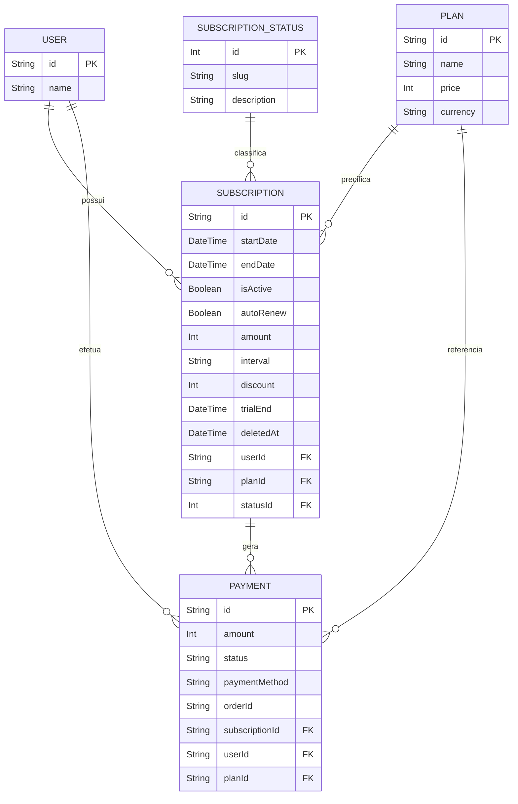
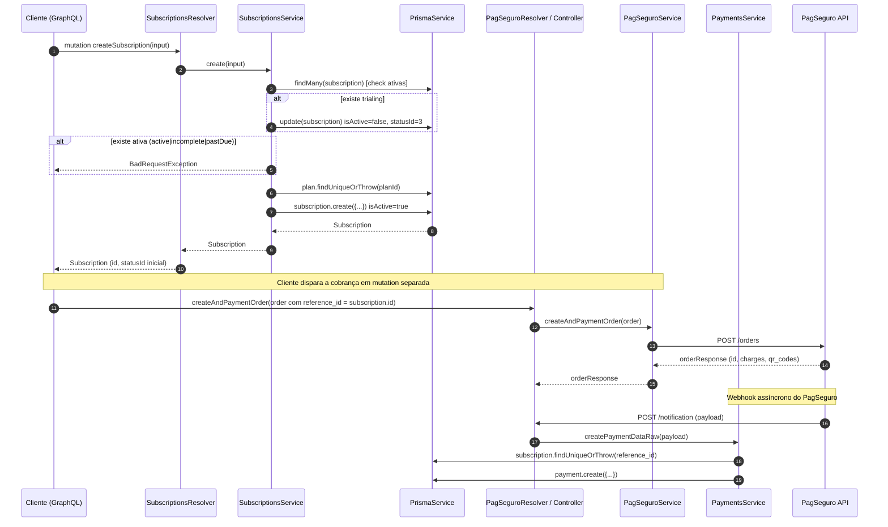

# Módulo: Subscriptions

## 1. Propósito

O módulo `subscriptions` é responsável pelo **ciclo de vida das assinaturas** que ligam um `User` a um `Plan`, definindo período de vigência, valor cobrado, macroestado (via `SubscriptionStatus`) e renovação. Declarado em [`./subscriptions.module.ts`](./subscriptions.module.ts), registra `SubscriptionsResolver`, `SubscriptionsService` e o utilitário `CalculateDateBrazilNow` como providers.

A entidade `Subscription` representa o vínculo monetizável do usuário com um plano: guarda `startDate`/`endDate`, `amount` (em centavos), `interval` (`MONTH`/`YEAR`), flags `isActive` e `autoRenew`, desconto opcional (`discount`), `trialEnd` e suporte a soft-delete via `deletedAt`. É referenciada por `Payment` (via `subscriptionId`) no model Prisma definido em [`../../../prisma/schema.prisma`](../../../prisma/schema.prisma).

`SubscriptionsModule` está listado tanto no array `imports` quanto no array `include` do `GraphQLModule.forRoot` em [`../../app.module.ts`](../../app.module.ts) (linhas 63 e 81), portanto as operações declaradas em [`./subscriptions.resolver.ts`](./subscriptions.resolver.ts) são efetivamente expostas no schema GraphQL (`src/schema.gql`).

> **A confirmar**: hoje apenas a mutation `createSubscription` está ativa no resolver — `findAll`, `findOne`, `updateSubscription` e `removeSubscription` estão comentados (ver seção 10). Definir se/quando essas operações devem ser reabilitadas e sob quais guards.

## 2. Regras de Negócio

Regras observáveis a partir do código atual:

- **Um usuário só pode ter uma assinatura "operacional" por vez.** Antes de criar nova assinatura, `SubscriptionsService.checkingValiableCreateNewSubscription` em [`./subscriptions.service.ts`](./subscriptions.service.ts) (linhas 84–115) consulta `prisma.subscription.findMany` com `isActive: true` e `status.slug IN ('active','incomplete','trialing','pastDue')`. Se qualquer registro for encontrado, lança `BadRequestException`.
- **Efeito colateral no "check": encerra `trialing` automaticamente.** Durante o mesmo `checkingValiableCreateNewSubscription`, se uma das assinaturas ativas estiver em `trialing`, o service executa `prisma.subscription.update({ data: { isActive: false, statusId: 3 } })` para encerrá-la. **O valor `3` é hard-coded** e depende do seed do catálogo `subscription_status` (ver seção 10).
- **Intervalo obrigatório e apenas `MONTH`/`YEAR`.** Em [`./subscriptions.service.ts`](./subscriptions.service.ts) (linha 19) o método `create` exige `createSubscriptionInput.interval`; o método privado `calculateIntervalSubscription` mapeia:
  - `MONTH` → 30 dias
  - `YEAR` → 365 dias
  - qualquer outro valor → `BadRequestException('Invalid interval: ...')`
  O enum GraphQL [`./enum/interval.enum.ts`](./enum/interval.enum.ts) já restringe o input para esses dois valores.
- **`startDate` calculada no servidor (fuso Brasil).** Mesmo quando o input declara `startDate` opcional, `create` **ignora** o valor recebido e usa `this.calculateBrazilDate.brazilDate()` (linha 24) — o utilitário vem de [`../../utils/calculate_date_brazil_now.ts`](../../utils/calculate_date_brazil_now.ts).
- **`endDate` derivada do intervalo.** `endDate = startDate + timeInterval` (30 ou 365 dias). O campo `endDate` do schema Prisma é `DateTime?`, porém o service sempre popula um valor.
- **`trialEnd` fixo em 7 dias.** `trialEnd = startDate + 7 dias` (linhas 27–28), independentemente de existir ou não trial real para o plano e independentemente do `statusId` enviado.
- **`amount` opcional, derivado de `plan.price` quando omitido.** Em [`./subscriptions.service.ts`](./subscriptions.service.ts) (linha 32):
  ```ts
  const amount = createSubscriptionInput.amount ?? (Math.trunc(timeInterval / 30) * plan.price);
  ```
  Consequência: para `MONTH` (30 dias) → `1 * plan.price`; para `YEAR` (365 dias) → `Math.trunc(365/30) = 12` × `plan.price`. O dia residual do ano não é cobrado.
- **Plano obrigatoriamente existente.** `prisma.plan.findUniqueOrThrow({ where: { id: planId } })` — se o `planId` não existir, o Prisma lança `P2025` (not found).
- **Assinatura criada já com `isActive: true`.** O service sobrescreve o valor do input e força `isActive: true` na criação (linha 41). O campo `isActive` do DTO é, portanto, ignorado na entrada.
- **`statusId` vem do input (sem default).** Diferente de `isActive`, o `statusId` **não é inferido** pelo service — é responsabilidade do cliente enviar o id correto (tipicamente o id do status `incomplete` até o pagamento ser confirmado).
- **Valor monetário em centavos.** `amount` é tipado como `Int` tanto no Prisma quanto na entidade, alinhado com `Plan.price` (ver [`../plans/README.md`](../plans/README.md)).

> **A confirmar**: (a) se `startDate` do input deveria ser respeitado quando enviado; (b) se `trialEnd` deve ser aplicado apenas quando `statusId` corresponder a `trialing`; (c) se `amount` passado pelo cliente deveria ser validado contra `plan.price * meses` para impedir fraude/override.

## 3. Entidades e Modelo de Dados

### Model Prisma `Subscription`

Declarado em [`../../../prisma/schema.prisma`](../../../prisma/schema.prisma) (linhas 96–121):

| Campo | Tipo Prisma | Obrigatório | Default | Observação |
|---|---|---|---|---|
| `id` | `String` | Sim | `uuid()` | Chave primária. |
| `startDate` | `DateTime` | Sim | — | Definido no servidor via `CalculateDateBrazilNow`. |
| `endDate` | `DateTime?` | Não | — | Sempre preenchido pelo service (startDate + interval). |
| `isActive` | `Boolean` | Sim | `true` | Flag de disponibilidade operacional. Sobrescrita para `true` na criação. |
| `autoRenew` | `Boolean` | Sim | `false` | Flag de renovação automática. Atualmente apenas persistido — não há job de renovação. |
| `amount` | `Int` | Sim | — | Valor em centavos. |
| `interval` | `String` | Sim | — | `MONTH` ou `YEAR` (validado no service). |
| `discount` | `Int?` | Não | — | Desconto (em centavos). Aplicação em cobrança não implementada. |
| `userId` | `String` | Sim | — | FK → `users.id`, `ON DELETE RESTRICT`. |
| `planId` | `String` | Sim | — | FK → `plans.id`, `ON DELETE RESTRICT`. |
| `statusId` | `Int` | Sim | — | FK → `subscription_status.id`, `ON DELETE RESTRICT`. |
| `trialEnd` | `DateTime?` | Não | — | Sempre preenchido pelo service (startDate + 7 dias). |
| `deletedAt` | `DateTime?` | Não | — | Soft-delete **não aplicado** (não há mutation de remoção ativa — ver seção 10). |
| `createdAt` | `DateTime` | Sim | `now()` | — |
| `updatedAt` | `DateTime` | Sim | `@updatedAt` | — |
| `user` | `User` | — | — | Relação N:1 (obrigatória). |
| `plan` | `Plan` | — | — | Relação N:1 (obrigatória). |
| `status` | `SubscriptionStatus` | — | — | Relação N:1 (obrigatória). |
| `payment` | `Payment[]` | — | — | Relação reversa 1:N com pagamentos. |

Tabela mapeada como `subscriptions` (`@@map("subscriptions")`). FKs criadas em [`../../../prisma/migrations/20250915184725_create_payment_plan_subscription_subscriptionstatus/migration.sql`](../../../prisma/migrations/20250915184725_create_payment_plan_subscription_subscriptionstatus/migration.sql) (linhas 56–62).

### Diagrama ER (Subscription ↔ User ↔ Plan ↔ SubscriptionStatus ↔ Payment)



## 4. API GraphQL

Apenas a mutation de criação está habilitada — as demais estão comentadas no resolver. Declaradas em [`./subscriptions.resolver.ts`](./subscriptions.resolver.ts).

### Mutations

| Mutation | Input | Retorno | Descrição |
|---|---|---|---|
| `createSubscription(createSubscriptionInput: CreateSubscriptionInput!)` | [`CreateSubscriptionInput`](./dto/create-subscription.input.ts) | `Subscription!` | Cria uma nova assinatura para o usuário. Delega para `SubscriptionsService.create` (ver seção 6). |

### Queries e mutations comentadas (inativas)

| Operação | Situação |
|---|---|
| `subscriptions` (Query) | Comentada em [`./subscriptions.resolver.ts`](./subscriptions.resolver.ts) (linhas 18–21). |
| `subscription(id: Int!)` (Query) | Comentada (linhas 23–26). |
| `updateSubscription(updateSubscriptionInput: UpdateSubscriptionInput!)` (Mutation) | Comentada (linhas 28–31). |
| `removeSubscription(id: Int!)` (Mutation) | Comentada (linhas 33–36). |

> **A confirmar**: se `UpdateSubscriptionInput.id` deve ser `String` (assinaturas usam UUID). Hoje o DTO declara `id: Int` — ver seção 10.

## 5. DTOs e Inputs

### `CreateSubscriptionInput`

Declarado em [`./dto/create-subscription.input.ts`](./dto/create-subscription.input.ts):

| Campo | Tipo GraphQL | Obrigatório | Validador | Observação |
|---|---|---|---|---|
| `startDate` | `Date` | Não | `@IsDate` | **Ignorado pelo service** — `startDate` é recalculado no servidor. |
| `endDate` | `Date` | Não | `@IsDate` | **Ignorado pelo service** — recalculado a partir de `startDate + interval`. |
| `userId` | `String` | Sim | `@IsString` | FK para `User`. Não há guard — qualquer cliente pode passar qualquer `userId` (ver seção 8). |
| `planId` | `String` | Sim | `@IsString` | FK para `Plan`. Validado via `findUniqueOrThrow`. |
| `statusId` | `Int` | Sim | `@IsInt` | FK para `SubscriptionStatus`. Sem default no service. |
| `isActive` | `Boolean` | Não | `@IsBoolean` | **Ignorado** — service força `true` na criação. |
| `autoRenew` | `Boolean` | Sim | `@IsBoolean` | Persistido diretamente. |
| `discount` | `Int` | Não | `@IsInt` | Persistido em centavos. Não há aplicação em cobrança. |
| `interval` | `IntervalEnum` | Sim | `@IsEnum(IntervalEnum)` | `MONTH` ou `YEAR`. Enum em [`./enum/interval.enum.ts`](./enum/interval.enum.ts). |
| `amount` | `Int` | Não | `@IsInt` | Se omitido, service calcula `meses * plan.price`. |
| `trialEnd` | `Date` | Não | `@IsDate` | **Ignorado pelo service** — recalculado como `startDate + 7 dias`. |

### `UpdateSubscriptionInput`

Declarado em [`./dto/update-subscription.input.ts`](./dto/update-subscription.input.ts). Estende `PartialType(CreateSubscriptionInput)` e adiciona `id: Int` (ver seção 10 — `id` de `Subscription` é `String` no Prisma). Atualmente não utilizado por nenhuma mutation ativa.

### `SubscriptionDTO` (variante de leitura)

Declarado em [`./dto/subscription.dto.ts`](./dto/subscription.dto.ts). Alternativa de apresentação de `Subscription` que troca `User` por `UserWithAge` e `Plan` por `PlanDTO`, e renomeia campos para snake_case (`start_date`, `end_date`, `trial_end`, `deleted_at`, `created_at`, `update_at`). **Não é referenciado pelo resolver** — apenas `Subscription` (em [`./entities/subscription.entity.ts`](./entities/subscription.entity.ts)) é exposto hoje.

### Enums

- [`./enum/interval.enum.ts`](./enum/interval.enum.ts) — `IntervalEnum` com `MONTH` e `YEAR`. Registrado no schema GraphQL.
- [`./enum/plan-slug.enum.ts`](./enum/plan-slug.enum.ts) — `PlanSlugEnum` com `FREE`, `PRO`, `ULTIMATE`. **Duplica** o enum de [`../plans/enum/plan-slug.enum.ts`](../plans/enum/plan-slug.enum.ts) (ver seção 10).

## 6. Fluxos Principais

### Fluxo — `createSubscription`

1. Cliente envia `createSubscriptionInput` com `userId`, `planId`, `statusId`, `interval`, `autoRenew` (mínimos).
2. `SubscriptionsResolver.createSubscription` ([`./subscriptions.resolver.ts`](./subscriptions.resolver.ts), linha 13) delega para `SubscriptionsService.create`.
3. `create` ([`./subscriptions.service.ts`](./subscriptions.service.ts), linhas 15–51):
   1. Chama `checkingValiableCreateNewSubscription(userId)` — bloqueia se já existe assinatura ativa com status em `active|incomplete|trialing|pastDue`, encerrando eventuais `trialing` com `statusId: 3`.
   2. Valida `interval` presente (lança `BadRequestException` se ausente).
   3. Resolve `timeInterval` via `calculateIntervalSubscription` (30 ou 365).
   4. Calcula `startDate` via `CalculateDateBrazilNow`, `endDate = startDate + timeInterval`, `trialEnd = startDate + 7`.
   5. Busca `plan` via `prisma.plan.findUniqueOrThrow` (acesso direto, **não** via `PlansService`).
   6. Calcula `amount = input.amount ?? (Math.trunc(timeInterval/30) * plan.price)`.
   7. Persiste via `prisma.subscription.create` forçando `isActive: true`.
4. Resolver retorna o `Subscription` recém-criado.

### Diagrama de sequência — criação de assinatura e cobrança PagSeguro

O fluxo abaixo representa a integração **pretendida** entre `createSubscription`, `PagSeguroService.createAndPaymentOrder` e `PaymentsService.createPaymentDataRaw`. Observação importante: hoje a chamada `await this.payment.createPaymentDataRaw(response.data)` dentro de `PagSeguroService.createAndPaymentOrder` está **comentada** em [`../pag-seguro/pag-seguro.service.ts`](../pag-seguro/pag-seguro.service.ts) (linha 133) — portanto o `Payment` só é criado quando o **webhook** do PagSeguro chama o controller e aciona explicitamente `createPaymentDataRaw` (ver seção 10).



### Fluxo — encerramento automático de `trialing`

Executado como side-effect dentro de `checkingValiableCreateNewSubscription` ([`./subscriptions.service.ts`](./subscriptions.service.ts), linhas 104–113):

1. Para cada assinatura ativa do usuário com `status.slug === 'trialing'`, executa `update` definindo `isActive: false` e `statusId: 3`.
2. Acumula mensagem `"<id> - <slug>, "` para todas as assinaturas encontradas.
3. Lança `BadRequestException` relatando as assinaturas remanescentes (inclusive a que acabou de ser encerrada).

> **A confirmar**: a exceção é lançada **após** o `update` que encerra `trialing`, portanto o usuário vê a mensagem "contém N subscriptions ativas" mesmo tendo a `trialing` sido encerrada no mesmo call — o cliente precisa repetir a mutation.

## 7. Dependências

### Injetadas em `SubscriptionsService`

- `PrismaService` (de [`../prisma/prisma.service.ts`](../prisma/prisma.service.ts)) — acesso direto a `prisma.subscription` e **também** a `prisma.plan.findUniqueOrThrow` (linhas 29–31).
- `CalculateDateBrazilNow` (de [`../../utils/calculate_date_brazil_now.ts`](../../utils/calculate_date_brazil_now.ts)) — fonte da data inicial (fuso Brasil).

### Não injetadas (acopladas por dado, não por código)

- **`PlansService`** — não é injetado. `SubscriptionsService` **fura o encapsulamento** do módulo `plans` ao usar `prisma.plan.findUniqueOrThrow` diretamente (ver seção 10).
- **`SubscriptionStatusService`** — não é injetado. O `statusId: 3` usado para encerrar `trialing` é **numérico hard-coded** (ver seção 10).
- **`PaymentsService` / `PagSeguroService`** — não são injetados aqui. A integração com pagamento é orquestrada pelo **cliente**, que chama `createSubscription` e, em seguida, `createAndPaymentOrder` do módulo `pag-seguro`, passando `subscription.id` como `reference_id`. O vínculo reverso (criar `Payment`) é feito por `PaymentsService.createPaymentDataRaw` em [`../payments/payments.service.ts`](../payments/payments.service.ts).

### Consumidores externos de `SubscriptionsService`

Grep `SubscriptionsModule|SubscriptionsService` em `src/**/*.ts` retorna apenas auto-referências (`subscriptions.module.ts`, `subscriptions.resolver.ts`, specs) e o registro em [`../../app.module.ts`](../../app.module.ts). **Nenhum outro módulo injeta `SubscriptionsService`** no estado atual. `PaymentsService`, por exemplo, lê `prisma.subscription` diretamente.

### Registro no app

`SubscriptionsModule` está em `imports` (linha 81) e em `include` do `GraphQLModule` (linha 63) de [`../../app.module.ts`](../../app.module.ts).

## 8. Autorização e Papéis

- **Nenhum guard aplicado.** `SubscriptionsResolver` não importa/usa `@UseGuards`, `JwtAuthGuard`, `RolesGuard` ou qualquer decorator de autenticação/autorização. `createSubscription` é portanto acessível por qualquer cliente que alcance o endpoint GraphQL.
- **`userId` vem do input.** Como não há `@CurrentUser()` nem extração do JWT, qualquer cliente pode indicar **qualquer** `userId` como dono da assinatura.
- **`statusId` vem do input.** Igualmente sem validação — um cliente pode criar assinatura já em `active` sem pagamento.

> **A confirmar**: deve ser adicionado `JwtAuthGuard` e `userId` deve ser derivado de `context.req.user`, ignorando o valor do input. O `statusId` inicial provavelmente deveria ser forçado a `incomplete` no service até o webhook de pagamento confirmar.

## 9. Erros e Exceções

Originados em `SubscriptionsService`:

- `BadRequestException('The "interval" field is required!')` — quando `interval` é falsy ([`./subscriptions.service.ts`](./subscriptions.service.ts), linha 20).
- `BadRequestException('Invalid interval: ${interval}')` — quando `interval` não é `MONTH` nem `YEAR` (linhas 73–74).
- `BadRequestException('Erro: usuário contém N subscriptions ativas: ...')` — quando `checkingValiableCreateNewSubscription` encontra qualquer assinatura ativa com slug em `active|incomplete|trialing|pastDue` (linhas 111–113).
- Propagadas do Prisma:
  - `P2025` em `prisma.plan.findUniqueOrThrow` — `planId` inexistente.
  - `P2003` em `prisma.subscription.create` — violação de FK (`userId`/`planId`/`statusId` inexistentes). FKs têm `ON DELETE RESTRICT`.
- Validação de input via `class-validator` (`@IsString`, `@IsInt`, `@IsBoolean`, `@IsDate`, `@IsEnum`) depende de um `ValidationPipe` global — **não foi localizado** pipe global em [`../../main.ts`](../../main.ts); confirmar antes de assumir que os validadores são efetivamente executados.

> **A confirmar**: mensagens de erro estão misturando português e inglês (ver `'The "interval" field is required!'` vs `'Erro: usuário contém ...'`). Padronizar.

## 10. Pontos de Atenção / Manutenção

Achados no módulo:

1. **`statusId: 3` hard-coded.** [`./subscriptions.service.ts`](./subscriptions.service.ts) (linha 107) usa `statusId: 3` para encerrar `trialing`. O valor depende da ordem de inserção do seed em `subscription_status`. Solução: resolver via `SubscriptionStatusService.findSubscriptionStatusByName('canceled' | 'incompleteExpired')` e usar o `id` retornado.
2. **`SubscriptionsService` acessa `prisma.plan` diretamente.** Em vez de injetar `PlansService` (ver [`../plans/plans.service.ts`](../plans/plans.service.ts)), o service executa `prisma.plan.findUniqueOrThrow` em [`./subscriptions.service.ts`](./subscriptions.service.ts) (linhas 29–31). Isso quebra o encapsulamento do módulo `plans` e impede aplicar filtros centralizados (ex.: `deletedAt IS NULL` ou `isActive = true`). **Bug potencial**: permite criar assinatura contra um plano marcado como `isActive: false` ou soft-deletado.
3. **`startDate`, `endDate` e `trialEnd` do input são ignorados.** O resolver/service não respeita os valores enviados pelo cliente (declarados como opcionais no DTO). Ou removê-los do DTO, ou passar a considerá-los.
4. **`isActive` do input é ignorado.** Service força `isActive: true` — o campo do DTO é decorativo.
5. **Cálculo de `amount` para `YEAR` trunca.** `Math.trunc(365/30) * plan.price` = `12 * plan.price`, logo um plano anual cobra apenas 12 meses (perde 5 dias). Usar `amount = plan.price * 12` explicitamente para `YEAR` ou definir preço anual no `Plan`.
6. **Efeito colateral + exceção em `checkingValiableCreateNewSubscription`.** O método encerra `trialing` e depois sempre lança exceção (mesmo após limpeza), obrigando o cliente a repetir a mutation. Separar "detectar conflito" de "encerrar trial".
7. **Método privado morto: `checkAmountSubscription`.** [`./subscriptions.service.ts`](./subscriptions.service.ts) (linhas 77–82) duplica exatamente `calculateIntervalSubscription` e não é chamado. Remover.
8. **Ausência de guards.** Ver seção 8 — módulo está exposto no `include` do GraphQL sem autenticação.
9. **`UpdateSubscriptionInput.id` é `Int`.** [`./dto/update-subscription.input.ts`](./dto/update-subscription.input.ts) declara `@Field(() => Int) id: number`, mas `Subscription.id` é `String` (UUID). Sem impacto atual porque a mutation está comentada, mas precisa ser corrigido antes de reabilitar.
10. **`SubscriptionDTO` é código morto.** [`./dto/subscription.dto.ts`](./dto/subscription.dto.ts) não é referenciado pelo resolver ativo. Decidir se será usado em queries de leitura ou removido.
11. **Enum `PlanSlugEnum` duplicado.** [`./enum/plan-slug.enum.ts`](./enum/plan-slug.enum.ts) duplica [`../plans/enum/plan-slug.enum.ts`](../plans/enum/plan-slug.enum.ts). Consolidar em um único arquivo.
12. **Rotina de renovação ausente.** Apesar do campo `autoRenew`, não há `@Cron` nem job no módulo que renove assinaturas expirando. O `ScheduleModule.forRoot()` está registrado em [`../../app.module.ts`](../../app.module.ts), mas nenhum provider do módulo consome.
13. **Nenhuma operação de leitura/atualização/remoção ativa.** Resolver expõe apenas `createSubscription`. `findOne`/`findAll`/`update`/`remove` estão comentados. Logo não é possível, via GraphQL, cancelar ou consultar a própria assinatura.
14. **Integração com pagamento é implícita.** `SubscriptionsService` não cria `Payment` diretamente. O vínculo acontece via `reference_id` passado para PagSeguro; `PaymentsService.createPaymentDataRaw` ([`../payments/payments.service.ts`](../payments/payments.service.ts), linhas 16–44) usa esse `reference_id` como `subscriptionId`. A chamada que conectaria o fluxo síncrono está comentada em [`../pag-seguro/pag-seguro.service.ts`](../pag-seguro/pag-seguro.service.ts) (linha 133) — documentar explicitamente que o `Payment` só nasce via webhook.
15. **Sem atualização de `statusId` após pagamento.** Quando `PaymentsService.createPaymentDataRaw` registra um `Payment`, não há passo correspondente que altere `Subscription.statusId` para `active`. A assinatura permanece no status inicial enviado pelo cliente indefinidamente.
16. **Erro de digitação/gramática em mensagens** — `"Erro: usuário contém ..."` mistura PT/EN com outras partes; `"checkingValiableCreateNewSubscription"` deveria ser `checkIfUserCanCreateNewSubscription` (typo `Valiable` → `Viable`).
17. **Soft-delete modelado, mas não aplicado.** Coluna `deletedAt` existe e nunca é lida/escrita. Nenhum filtro `deletedAt: null` nas consultas (inclusive em `checkingValiableCreateNewSubscription`).

## 11. Testes

- [`./subscriptions.resolver.spec.ts`](./subscriptions.resolver.spec.ts) — apenas smoke test `it('should be defined')`. Usa `Test.createTestingModule` com `[SubscriptionsResolver, SubscriptionsService]` sem mockar `PrismaService` nem `CalculateDateBrazilNow`. **Sem testes de negócio.**
- [`./subscriptions.service.spec.ts`](./subscriptions.service.spec.ts) — também apenas smoke test. Igualmente sem mocks das dependências reais (e por isso susceptível a falhar se as injeções forem exigidas em tempo de compilação).
- **Cobertura ausente** para: bloqueio de usuário com assinatura ativa, encerramento de `trialing`, cálculo de `amount` por `MONTH`/`YEAR`, cálculo de `endDate`/`trialEnd`, tratamento de `planId` inexistente, rejeição de `interval` inválido.

> **Sugestão de roteiro mínimo de testes unitários** (mock de `PrismaService` e `CalculateDateBrazilNow`):
> - `create()` calcula `endDate = startDate + 30` para `MONTH` e `+ 365` para `YEAR`.
> - `create()` deriva `amount = plan.price` para `MONTH` e `12 * plan.price` para `YEAR` quando input não informa.
> - `create()` respeita `amount` enviado no input.
> - `create()` lança `BadRequestException` quando `interval` é ausente/inválido.
> - `checkingValiableCreateNewSubscription()` encerra `trialing` e sempre lança `BadRequestException` com a listagem.
> - `create()` propaga `P2025` quando `planId` não existe.
