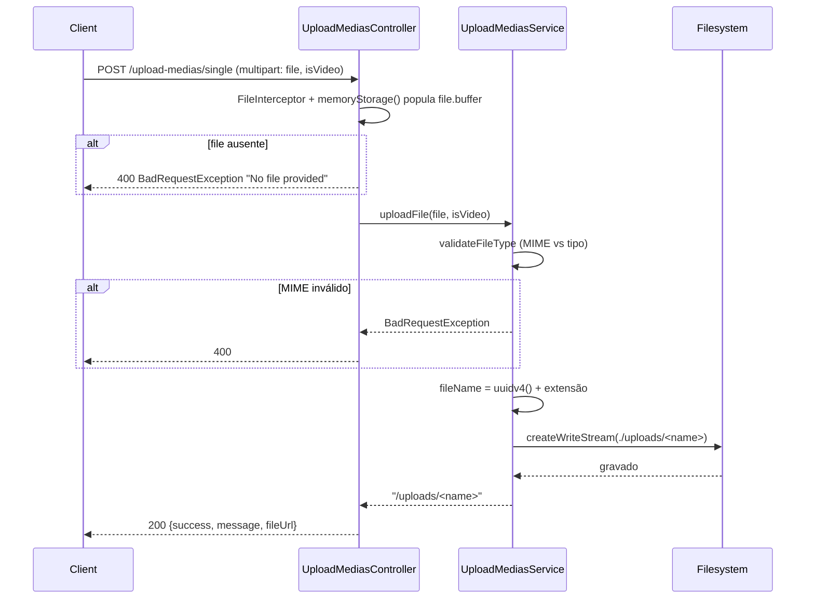

# Módulo: Upload Medias

## 1. Propósito

Módulo responsável por receber arquivos (imagens e vídeos) enviados pelos clientes e persisti-los no disco local do servidor (pasta `./uploads`). Expõe endpoints REST para upload único e upload múltiplo. O resolver GraphQL está presente mas **vazio** — as operações reais acontecem via REST, enquanto a integração `graphql-upload` permanece desabilitada por incompatibilidade conhecida.

Os arquivos gravados são servidos estaticamente na rota `/uploads/` por `app.useStaticAssets(..., {prefix: '/uploads/'})` em [`../../main.ts:11`](../../main.ts). Cabe a outros módulos (ex.: `posts`, `users`) persistir as URLs retornadas nos respectivos registros.

## 2. Regras de Negócio

1. **Tipo de arquivo.** Se `isVideo === 'true'` o MIME type deve estar em `['video/mp4','video/avi','video/mov','video/mkv']`; caso contrário deve estar em `['image/jpeg','image/png','image/gif','image/webp']`. Violação gera `BadRequestException("Unsupported video type.")` ou `"Unsupported image typed."` (ver [`./upload-medias.service.ts:35-46`](./upload-medias.service.ts)).
2. **Conversão `isVideo`.** Chega como string e é comparada textualmente: `isVideoParam === 'true' ? true : false` (ver [`./upload-medias.service.ts:19`](./upload-medias.service.ts)). Qualquer valor diferente de `"true"` é tratado como imagem.
3. **Nome do arquivo.** Substituído por `uuidv4()` preservando apenas a extensão original (ver [`./upload-medias.service.ts:22-24`](./upload-medias.service.ts)).
4. **URL retornada.** O service devolve caminho relativo `/uploads/<uuid>.<ext>` (ver [`./upload-medias.service.ts:30`](./upload-medias.service.ts)). Combinado com `app.useStaticAssets` em `main.ts`, esse caminho é servido diretamente pelo Nest.
5. **Criação do diretório.** No construtor, `mkdirSync('./uploads', {recursive: true})` garante a existência; falha lança `InternalServerErrorException("Failed to create upload directory")` (ver [`./upload-medias.service.ts:49-57`](./upload-medias.service.ts)).
6. **Upload múltiplo** (`POST /upload-medias/multiple`) faz chamadas em paralelo ao service para cada arquivo, compartilhando o mesmo valor de `isVideo` (ver [`./upload-medias.controller.ts:67-71`](./upload-medias.controller.ts)).

## 3. Entidades e Modelo de Dados

Não se aplica — este módulo **não** persiste em banco. Não há modelo Prisma `UploadMedia`. Os arquivos são gravados no filesystem; a URL retornada é persistida por outros módulos (ex.: `Post.imageUrl`, `Post.videoUrl`) que o cliente chamará em seguida.

O entity GraphQL [`./entities/upload-media.entity.ts`](./entities/upload-media.entity.ts) declara apenas `{ postId: String, isVideo: String? }` — estrutura auxiliar, não tabela. Atualmente sem uso efetivo (nenhuma operação GraphQL a retorna).

## 4. API GraphQL

### Queries

Não se aplica.

### Mutations

Não se aplica. O [`./upload-medias.resolver.ts`](./upload-medias.resolver.ts) existe e está registrado no `include` do `GraphQLModule.forRoot({...})` em [`../../app.module.ts`](../../app.module.ts), mas **não declara nenhuma query ou mutation**. Há comentário explicando que o suporte a upload GraphQL foi desabilitado por problemas de compatibilidade com `graphql-upload`.

### Subscriptions

Não se aplica.

### REST

Controller: [`./upload-medias.controller.ts`](./upload-medias.controller.ts). Base path `/upload-medias`.

| Método | Rota | Interceptor | Body | Retorno | Descrição |
| --- | --- | --- | --- | --- | --- |
| POST | `/upload-medias/single` | `FileInterceptor('file', {storage: memoryStorage()})` | multipart com `file` + campo `isVideo` | `UploadResponseDto` | Upload de um único arquivo |
| POST | `/upload-medias/multiple` | `FileInterceptor('files')` | multipart com `files` + campo `isVideo` | `UploadResponseDto` | Upload múltiplo |

> ⚠️ **A confirmar:** em `/multiple`, o interceptor usado é `FileInterceptor('files')` (singular), mas o handler declara `@UploadedFile() files: Express.Multer.File[]`. Para múltiplos arquivos o padrão Nest é `FilesInterceptor('files', max)` com `@UploadedFiles()`. Provável bug — investigar.

Resposta (HTTP 200):
```json
{ "success": true, "message": "File uploaded successfully", "fileUrl": "/uploads/<uuid>.<ext>" }
```

## 5. DTOs e Inputs

### CreateUploadMediaInput

Arquivo: [`./dto/create-upload-media.input.ts`](./dto/create-upload-media.input.ts). Input GraphQL sem uso efetivo.

| Campo | Tipo | Validadores | Obrigatório | Observação |
| --- | --- | --- | --- | --- |
| postId | String | — | sim | |
| isVideo | String | `@Type(() => String)` | não | |

### UpdateUploadMediaInput

Arquivo: [`./dto/update-upload-media.input.ts`](./dto/update-upload-media.input.ts). `PartialType(CreateUploadMediaInput)` — sem uso efetivo.

### UploadResponseDto

Arquivo: [`./dto/upload-response.dto.ts`](./dto/upload-response.dto.ts). Retorno do controller REST.

| Campo | Tipo | Obrigatório | Observação |
| --- | --- | --- | --- |
| success | Boolean | sim | |
| message | String | sim | |
| fileUrl | String | não | presente em upload único |
| fileUrls | [String] | não | presente em upload múltiplo |

### upload-media.entity.dto.ts

Arquivo presente em `dto/`. Declarado com `@ObjectType` espelhando o entity; sem consumidor identificado.

> ⚠️ **A confirmar:** provável código morto. Validar antes de remover.

## 6. Fluxos Principais

### Fluxo: Upload de arquivo único via REST



### Fluxo: Upload múltiplo

Igual ao anterior, mas o controller mapeia `files[]` com `Promise.all`, chamando `uploadFile` em paralelo para cada arquivo. Retorna `fileUrls` (array) em vez de `fileUrl`.

## 7. Dependências

### Módulos internos importados

Declarados em [`./upload-medias.module.ts`](./upload-medias.module.ts):
- `MulterModule.register(multerConfig())` — configura `diskStorage` em `./uploads`, `fileFilter` por MIME e `limits.fileSize = 50MB`.

Observação: embora o `MulterModule` esteja configurado globalmente, o `UploadMediasController` usa `memoryStorage()` dentro do próprio `@UseInterceptors`, sobrepondo o storage global. O `fileFilter` e o `limits.fileSize` da config também não se aplicam aos handlers do controller.

### Módulos que consomem este

Grep reverso: `UploadMediasModule` é importado em `app.module.ts` (inclusive no `include` do GraphQL). **Nenhum outro módulo** importa `UploadMediasService`. O fluxo de produção é REST-first: o cliente faz upload, recebe `fileUrl`, depois envia esse URL para `posts`/`users`/etc.

### Integrações externas

- **Filesystem local** — pasta `./uploads` no servidor.
- **Multer** (via `@nestjs/platform-express`) — parsing de multipart.
- **uuid v4** — geração de nome.

Não há integração com AWS S3, apesar de o módulo `src/aws/` oferecer cliente S3.

> ⚠️ **A confirmar:** [`../../../docs/business-rules.md`](../../../docs/business-rules.md) afirma que uploads vão para S3 via `aws-sdk/client-s3`. O código atual salva em disco local. Divergência de documentação a ajustar ou implementação pendente.

### Variáveis de ambiente

Nenhuma. O path `./uploads` é hardcoded em [`./upload-medias.service.ts:10`](./upload-medias.service.ts) e em [`./config/multer.config.ts:7`](./config/multer.config.ts).

## 8. Autorização e Papéis

Nenhuma. O controller **não aplica** `JwtAuthGuard` nem `RolesGuard`. Os endpoints `/upload-medias/single` e `/upload-medias/multiple` estão **abertos** a qualquer cliente com acesso à rede da aplicação.

> ⚠️ **Débito de segurança:** endpoints de upload sem autenticação permitem que qualquer parte envie arquivos ao disco do servidor. Recomendação: adicionar `@UseGuards(JwtAuthGuard)`.

## 9. Erros e Exceções

| Erro lançado | Condição | Código HTTP | Origem |
| --- | --- | --- | --- |
| `BadRequestException("No file provided")` | Nenhum arquivo no upload único | 400 | controller |
| `BadRequestException("No files provided")` | Array vazio no upload múltiplo | 400 | controller |
| `BadRequestException("Unsupported video type.")` | `isVideo=true` e MIME não suportado | 400 | service |
| `BadRequestException("Unsupported image typed.")` | `isVideo≠true` e MIME não suportado | 400 | service |
| `BadRequestException(<error.message>)` | Erro genérico propagado do service | 400 | controller (try/catch) |
| `InternalServerErrorException("Failed to create upload directory")` | `mkdirSync` falha | 500 | service (constructor) |
| `InternalServerErrorException("Failed to save file")` | Erro no `writeStream` | 500 | service |

## 10. Pontos de Atenção / Manutenção

- **Sem autenticação.** Os dois endpoints REST são públicos. Grande risco.
- **Armazenamento em disco local.** Não persiste em S3 apesar de a infra prever; arquivos somem em reinício de container se `./uploads` não for volume persistente. Inconsistente com `docs/business-rules.md`.
- **`memoryStorage()` no controller** ignora a configuração global de `multer.config.ts` (storage em disco, fileFilter, limits). Resultado: uploads grandes consomem heap do Node e não respeitam o limite de 50 MB.
- **`FileInterceptor('files')` no multiple** é incorreto — provavelmente deveria ser `FilesInterceptor('files', N)` com `@UploadedFiles()`. Testar antes de confiar no endpoint.
- **`console.log` em produção** nos caminhos `/single` e dentro do service (`'cheguei aqui'`). Ruído de log.
- **Resolver vazio** permanece incluído no schema GraphQL — gera o tipo `UploadMedia` no schema sem operações. Considerar remover do `include` até o upload GraphQL ser implementado.
- **Typo de mensagem:** `"Unsupported image typed."` (deveria ser `"type."`).
- **Entity GraphQL sem uso.** `UploadMedia`, `CreateUploadMediaInput`, `UpdateUploadMediaInput`, `upload-media.entity.dto.ts` são código morto enquanto o resolver estiver vazio.
- **Hardcoded paths.** Mover `./uploads` e limites para `ConfigService`.

## 11. Testes

| Arquivo | Cenários cobertos | Observações |
| --- | --- | --- |
| [`./upload-medias.controller.spec.ts`](./upload-medias.controller.spec.ts) | `should be defined` | Placeholder — mocka `UploadMediasService`. |
| [`./upload-medias.service.spec.ts`](./upload-medias.service.spec.ts) | `should be defined` | Placeholder do CLI Nest. |
| [`./upload-medias.resolver.spec.ts`](./upload-medias.resolver.spec.ts) | `should be defined` | Placeholder. Resolver está vazio. |

Cenários claramente não cobertos: validação de MIME, escrita em disco, upload múltiplo, falhas de filesystem, comportamento quando `isVideoParam` não é literal `"true"`/`"false"`.
