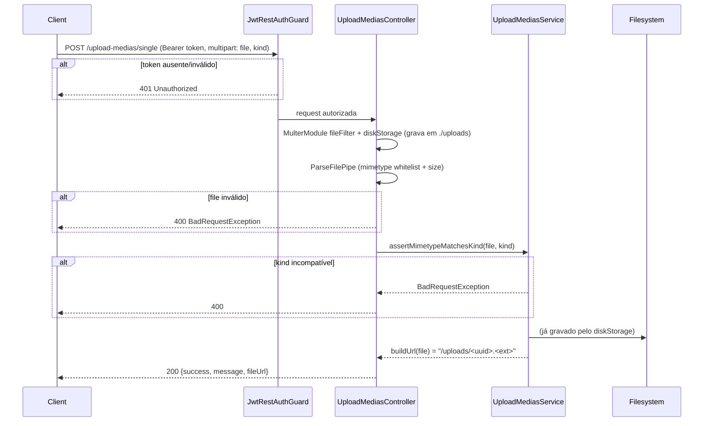

# Módulo: Upload Medias

## 1. Propósito

Módulo responsável por receber arquivos (imagens e vídeos) enviados pelos clientes autenticados e persisti-los no disco local do servidor (pasta `./uploads`). Expõe endpoints REST para upload único e upload múltiplo. O resolver GraphQL está presente mas **vazio** — as operações reais acontecem via REST, enquanto a integração `graphql-upload` permanece desabilitada por incompatibilidade conhecida.

Os arquivos gravados são servidos estaticamente na rota `/uploads/` por `app.useStaticAssets(..., {prefix: '/uploads/'})` em [`../../main.ts:11`](../../main.ts). Cabe a outros módulos (ex.: `posts`, `users`) persistir as URLs retornadas nos respectivos registros.

## 2. Regras de Negócio

1. **Autenticação obrigatória.** Ambos os endpoints exigem Bearer token JWT (ver [`./upload-medias.controller.ts`](./upload-medias.controller.ts) com `@UseGuards(JwtRestAuthGuard)`).
2. **Tipo de arquivo.** O body traz `kind: 'image' | 'video'` validado por `@IsIn(['image','video'])`. Se `kind === 'image'` o MIME type deve estar em `IMAGE_MIMETYPES`; se `kind === 'video'`, em `VIDEO_MIMETYPES` (ver [`./config/media-mimetypes.ts`](./config/media-mimetypes.ts)). Violação gera `BadRequestException('Unsupported image type.')` ou `Unsupported video type.` (ver [`./upload-medias.service.ts`](./upload-medias.service.ts)).
3. **Whitelist de MIME.** Todos os arquivos recebidos precisam estar em `ALL_MEDIA_MIMETYPES` (união de imagem + vídeo). Validação ocorre em duas camadas: `fileFilter` do `MulterModule` + `ParseFilePipe` do controller.
4. **Tamanho máximo.** `MAX_FILE_SIZE_BYTES = 50 * 1024 * 1024` (50 MB). Aplicado via `limits.fileSize` do Multer e reverificado pelo `ParseFilePipe`.
5. **Nome do arquivo.** Substituído por `uuidv4()` preservando apenas a extensão original (ver [`./config/multer.config.ts`](./config/multer.config.ts)).
6. **URL retornada.** `UploadMediasService.buildUrl` devolve caminho relativo `/uploads/<uuid>.<ext>`. Combinado com `app.useStaticAssets` em `main.ts`, esse caminho é servido diretamente pelo Nest.
7. **Upload múltiplo.** `POST /upload-medias/multiple` usa `FilesInterceptor('files', 10)` — máximo de 10 arquivos por requisição, todos compartilhando o mesmo `kind`.

## 3. Entidades e Modelo de Dados

Não se aplica — este módulo **não** persiste em banco. Não há modelo Prisma `UploadMedia`. Os arquivos são gravados no filesystem; a URL retornada é persistida por outros módulos (ex.: futuro `Post.imageUrl`, `User.avatarUrl`) que o cliente chamará em seguida.

O entity GraphQL [`./entities/upload-media.entity.ts`](./entities/upload-media.entity.ts) declara apenas `{ postId: String, isVideo: String? }` — estrutura auxiliar, não tabela. Atualmente sem uso efetivo (nenhuma operação GraphQL a retorna).

## 4. API GraphQL

### Queries

Não se aplica.

### Mutations

Não se aplica. O [`./upload-medias.resolver.ts`](./upload-medias.resolver.ts) existe e está registrado no `include` do `GraphQLModule.forRoot({...})` em [`../../app.module.ts`](../../app.module.ts), mas **não declara nenhuma query ou mutation**. Há comentário explicando que o suporte a upload GraphQL foi desabilitado por problemas de compatibilidade com `graphql-upload`.

### Subscriptions

Não se aplica.

### REST

Controller: [`./upload-medias.controller.ts`](./upload-medias.controller.ts). Base path `/upload-medias`. Ambos os endpoints exigem `Authorization: Bearer <jwt>`.

| Método | Rota | Interceptor | Body | Retorno | Descrição |
| --- | --- | --- | --- | --- | --- |
| POST | `/upload-medias/single` | `FileInterceptor('file')` + `ParseFilePipe` | multipart com `file` + campo `kind` (`image` ou `video`) | `UploadResponseDto` | Upload de um único arquivo |
| POST | `/upload-medias/multiple` | `FilesInterceptor('files', 10)` | multipart com `files[]` + campo `kind` | `UploadResponseDto` | Upload de até 10 arquivos |

Resposta (HTTP 200, single):
```json
{ "success": true, "message": "File uploaded successfully", "fileUrl": "/uploads/<uuid>.<ext>" }
```

Resposta (HTTP 200, multiple):
```json
{ "success": true, "message": "Files uploaded successfully", "fileUrls": ["/uploads/<uuid>.<ext>", "..."] }
```

## 5. DTOs e Inputs

### UploadKindDto

Declarado inline em [`./upload-medias.controller.ts`](./upload-medias.controller.ts).

| Campo | Tipo | Validadores | Obrigatório |
| --- | --- | --- | --- |
| kind | `'image' \| 'video'` | `@IsIn(['image', 'video'])` | sim |

### UploadResponseDto

Arquivo: [`./dto/upload-response.dto.ts`](./dto/upload-response.dto.ts).

| Campo | Tipo | Obrigatório | Observação |
| --- | --- | --- | --- |
| success | Boolean | sim | |
| message | String | sim | |
| fileUrl | String | não | presente em upload único |
| fileUrls | [String] | não | presente em upload múltiplo |

### CreateUploadMediaInput / UpdateUploadMediaInput / upload-media.entity.dto.ts

Arquivos em `./dto/`. Inputs GraphQL sem consumidor identificado, mantidos como placeholders até o resolver ganhar operações.

> ⚠️ **A confirmar:** provável código morto. Validar antes de remover.

## 6. Fluxos Principais

### Fluxo: Upload de arquivo único via REST



### Fluxo: Upload múltiplo

Igual ao anterior, mas com `FilesInterceptor('files', 10)`. O controller itera sobre `files[]`, chama `assertMimetypeMatchesKind` para cada um (rejeita o lote inteiro se qualquer arquivo discordar do `kind`), e retorna `fileUrls` (array) em vez de `fileUrl`.

## 7. Dependências

### Módulos internos importados

Declarados em [`./upload-medias.module.ts`](./upload-medias.module.ts):
- `MulterModule.register(multerConfig())` — `diskStorage` em `./uploads`, `fileFilter` por MIME e `limits.fileSize = 50MB`.
- `AuthModule` — necessário para o `JwtRestAuthGuard` e o `JwtStrategy` registrados.

### Módulos que consomem este

Grep reverso: `UploadMediasModule` é importado em `app.module.ts` (inclusive no `include` do GraphQL). **Nenhum outro módulo** importa `UploadMediasService`. O fluxo de produção é REST-first: o cliente faz upload, recebe `fileUrl`, depois envia esse URL para `posts`/`users`/etc.

### Integrações externas

- **Filesystem local** — pasta `./uploads` no servidor.
- **Multer** (via `@nestjs/platform-express`) — parsing de multipart.
- **uuid v4** — geração de nome (ESM-only em v13; importado apenas em `multer.config.ts` para não contaminar a cadeia ESM dos testes unitários).

Não há integração com AWS S3, apesar de o módulo `src/aws/` oferecer cliente S3.

> ⚠️ **A confirmar:** [`../../../docs/business-rules.md`](../../../docs/business-rules.md) afirma que uploads vão para S3 via `aws-sdk/client-s3`. O código atual salva em disco local. Divergência de documentação a ajustar ou implementação pendente (Plano 2 de correção prevê migração).

### Variáveis de ambiente

Nenhuma. O path `./uploads` é hardcoded em [`./config/multer.config.ts`](./config/multer.config.ts).

## 8. Autorização e Papéis

Ambos os endpoints exigem JWT via `JwtRestAuthGuard` (ver [`../auth/guards/jwt-rest-auth.guard.ts`](../auth/guards/jwt-rest-auth.guard.ts)). Sem `Authorization: Bearer <token>` válido a rota devolve 401.

Não há controle por papel/`RolesGuard` — qualquer usuário autenticado pode chamar os endpoints.

## 9. Erros e Exceções

| Erro lançado | Condição | Código HTTP | Origem |
| --- | --- | --- | --- |
| `UnauthorizedException` | Sem JWT ou JWT inválido | 401 | guard |
| `BadRequestException('No file provided')` | Nenhum arquivo no upload único | 400 | controller |
| `BadRequestException('No files provided')` | Array vazio no upload múltiplo | 400 | controller |
| `BadRequestException('Invalid file (size or mimetype).')` | `ParseFilePipe` rejeita | 400 | controller |
| `BadRequestException('Unsupported image type.')` | `kind='image'` e MIME não é imagem | 400 | service |
| `BadRequestException('Unsupported video type.')` | `kind='video'` e MIME não é vídeo | 400 | service |

## 10. Pontos de Atenção / Manutenção

- **Armazenamento em disco local.** Não persiste em S3; arquivos somem em reinício de container se `./uploads` não for volume persistente. Inconsistente com `docs/business-rules.md` — Plano 2 de correção prevê migração para S3.
- **Sem registro em banco.** URLs retornadas não são rastreadas — orphan files são possíveis se o cliente fizer upload e não chamar a mutation subsequente. Plano 2 introduz modelo `Media` com ownership + cleanup.
- **Resolver vazio** permanece incluído no schema GraphQL — gera o tipo `UploadMedia` no schema sem operações. Considerar remover do `include` até o upload GraphQL ser implementado.
- **Entity GraphQL sem uso.** `UploadMedia`, `CreateUploadMediaInput`, `UpdateUploadMediaInput`, `upload-media.entity.dto.ts` são código morto enquanto o resolver estiver vazio.
- **Hardcoded paths.** Mover `./uploads` e limites para `ConfigService`.
- **Sem rate limiting.** Não há throttling nos endpoints — um cliente autenticado pode saturar disco. Considerar `@nestjs/throttler`.

## 11. Testes

| Arquivo | Cenários cobertos | Observações |
| --- | --- | --- |
| [`./upload-medias.controller.spec.ts`](./upload-medias.controller.spec.ts) | `uploadSingleFile` (sem arquivo → 400, image+kind=image → 200, image+kind=video → 400); `uploadMultipleFiles` (vazio → 400, múltiplas imagens → N URLs, mix inválido → 400) | 6/6 testes passando. |
| [`./upload-medias.service.spec.ts`](./upload-medias.service.spec.ts) | `buildUrl` (imagem, vídeo); `assertMimetypeMatchesKind` (4 combinações). | 5/5 testes passando. |
| [`./upload-medias.resolver.spec.ts`](./upload-medias.resolver.spec.ts) | `should be defined` | Placeholder. Resolver está vazio. |
| [`../auth/guards/jwt-rest-auth.guard.spec.ts`](../auth/guards/jwt-rest-auth.guard.spec.ts) | Rotas públicas (bypass), rotas protegidas (delega ao AuthGuard). | Cobre o guard aplicado aqui. |
| [`../auth/decorators/current-user-rest.decorator.spec.ts`](../auth/decorators/current-user-rest.decorator.spec.ts) | Extrai `req.user` do HTTP context. | Decorador companheiro. |

Cenários ainda não cobertos por testes unitários: escrita efetiva em disco (precisa E2E), comportamento do `ParseFilePipe` com arquivo fora da whitelist (cobertura indireta via `fileFilter` do Multer).
