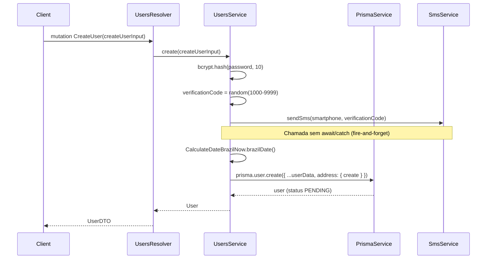
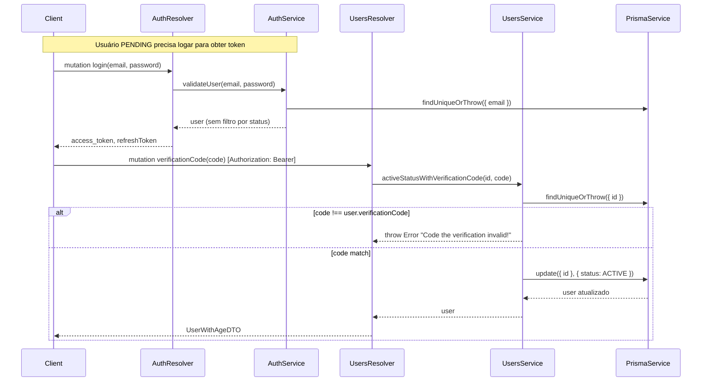

# Módulo: Users

## 1. Propósito

O módulo `users` é o domínio central de usuários finais da aplicação. Ele é responsável por:

- Cadastrar novos usuários com geração de código de verificação por SMS.
- Listar, buscar (com paginação e filtro textual) e obter usuários por ID.
- Atualizar dados de perfil, senha e endereço associado.
- Ativar o status do usuário a partir da validação do código recebido por SMS.
- Aplicar soft delete (desativação lógica) e hard delete (remoção física).
- Executar job diário (cron) que remove fisicamente usuários com soft delete com mais de 30 dias.

O módulo é declarado em [`./users.module.ts`](./users.module.ts) e expõe dois artefatos:

- `UsersResolver` ([`./users.resolver.ts`](./users.resolver.ts)) — resolver GraphQL com queries e mutations.
- `UsersService` ([`./users.service.ts`](./users.service.ts)) — lógica de negócio, exportado para uso por outros módulos (notadamente `AuthModule`).

> **A confirmar**: em [`../../app.module.ts`](../../app.module.ts) o array `include` do `GraphQLModule.forRoot` (linhas 59-69) **não** contém `UsersModule`. Como o Apollo está configurado com `autoSchemaFile` em modo `include`, os resolvers de `UsersResolver` podem não estar sendo publicados no schema GraphQL gerado. Apesar disso, o `UsersModule` está listado em `imports` (linha 73) e o `UsersService` é consumido por `AuthModule` e `JwtStrategy`. A confirmar se a omissão é intencional (acesso apenas interno via `AuthModule`) ou bug de configuração.

## 2. Regras de Negócio

### Cadastro

- Senha é hasheada com `bcrypt.hash(..., 10)` antes de persistir ([`./users.service.ts:24`](./users.service.ts)).
- `verificationCode` é gerado aleatoriamente como inteiro de 4 dígitos: `Math.floor(1000 + Math.random() * 9000)` ([`./users.service.ts:26`](./users.service.ts)).
- SMS é disparado imediatamente via `SmsService.sendSms(smartphone, verificationCode)` ([`./users.service.ts:27`](./users.service.ts)). Ver Seção 10.
- `createdAt` é gravado com a data "do Brasil" obtida por `CalculateDateBrazilNow.brazilDate()` ([`./users.service.ts:29`](./users.service.ts), [`../../utils/calculate_date_brazil_now.ts`](../../utils/calculate_date_brazil_now.ts)).
- `birthdate` é convertido para `Date` a partir do input.
- `roleId` é convertido para `Number` antes do insert ([`./users.service.ts:43`](./users.service.ts)).
- Endereço (`address`) vem aninhado e é persistido via `create` aninhado (Prisma `nested write`).
- Status default no Prisma é `"PENDING"` ([`../../../prisma/schema.prisma:29`](../../../prisma/schema.prisma)) e também no DTO de input ([`./dto/create-user.input.ts:47`](./dto/create-user.input.ts)).
- Violação de unique constraint (`P2002`) é convertida na mensagem: `"Já existe um usuário com esse e-mail ou cpf"` ([`./users.service.ts:60-61`](./users.service.ts)). Demais erros retornam `"Erro ao criar usuário"`.

### Ciclo de vida de status

Os valores possíveis estão em [`./enums/status_user.enum.ts`](./enums/status_user.enum.ts): `ACTIVE`, `INACTIVE`, `DELETED`, `BLOCKED`, `PENDING`.

- Usuário nasce `PENDING` (default do banco).
- Após `verificationCode` conferir, vira `ACTIVE` ([`./users.service.ts:283-288`](./users.service.ts)).
- `softDelete` transiciona para `INACTIVE` e grava `deletedAt` ([`./users.service.ts:258-261`](./users.service.ts)).
- Em `updateUser`, se o input traz `status === 'PENDING'` e o usuário atual **não** está `PENDING`, o valor é **sobrescrito** pelo status atual — impede regressão manual para `PENDING` ([`./users.service.ts:198-200`](./users.service.ts)).

### Atualização (`updateUser`)

- Busca usuário por ID com `findUniqueOrThrow` (inclui `address`).
- Regra de permissão: `if (user.id !== me.id && me.roleId === 1) throw` ([`./users.service.ts:190-192`](./users.service.ts)). Ver Seção 10 — possível bug.
- Se `updateData.password` vier, é hasheado antes do update.
- Endereço (`address`) é atualizado separadamente via `prisma.address.update` usando `user.address.id` ([`./users.service.ts:212-217`](./users.service.ts)).

### Soft delete

- Só permite se `user.id === me.id` **ou** `me.roleId !== 3` (3 = USER) ([`./users.service.ts:246-248`](./users.service.ts)). Ou seja: um USER só pode excluir a si mesmo; ADMIN/SUPER_ADMIN podem excluir qualquer um.
- Grava `deletedAt` como "agora − 3h" (approximação de UTC-3) ([`./users.service.ts:250-251`](./users.service.ts)).
- Se o usuário já estiver com `deletedAt` preenchido, retorna `null` sem alterar ([`./users.service.ts:253-268`](./users.service.ts)).

### Listagem paginada

- `findAllUsersPagination` filtra sempre por `deletedAt: null` e `status: 'ACTIVE'` ([`./users.service.ts:86-89`](./users.service.ts)).
- `searchTerm` aplica `contains` case-insensitive sobre `fullName` e `nickName`.
- Ordenação não é especificada (depende do default do Postgres/Prisma).

### Cron de limpeza

- `@Cron('0 0 0 * * *')` — diariamente à 00:00 ([`./users.service.ts:316`](./users.service.ts)).
- Remove fisicamente (`deleteMany`) todos os usuários cujo `deletedAt <= hoje − 30 dias` (data em horário do Brasil) ([`./users.service.ts:317-340`](./users.service.ts)).

### Derivação de idade

- `UserWithAge` expõe `age` calculado por `calculateAge(birthdate)` em [`./users.service.ts:294-304`](./users.service.ts). Usa diferença de ano e ajuste por mês/dia.

## 3. Entidades e Modelo de Dados

### Model Prisma `User`

Declarado em [`../../../prisma/schema.prisma`](../../../prisma/schema.prisma) (linhas 17-50):

| Campo | Tipo | Observação |
|---|---|---|
| `id` | `String` | PK, `uuid()` default. |
| `fullName` | `String` | Nome completo. |
| `nickName` | `String` | Apelido exibido. |
| `email` | `String` | `@unique`. |
| `password` | `String` | Hash bcrypt. |
| `smartphone` | `String` | Usado no envio de SMS. |
| `birthdate` | `DateTime` | Data de nascimento. |
| `cpf` | `String` | `@unique`. |
| `deletedAt` | `DateTime?` | Soft delete. `@map("deleted_at")`. |
| `createdAt` | `DateTime` | `@default(now())`. |
| `updatedAt` | `DateTime?` | `@updatedAt`. |
| `status` | `String` | `@default("PENDING")`. |
| `verificationCode` | `Int` | Código de 4 dígitos. |
| `resetPasswordToken` | `String?` | Reset de senha (não usado neste módulo). |
| `isOnline` | `Boolean?` | `@default(false)`. |
| `lastLogin` | `DateTime?` | Atualizado por `AuthService.validateUser`. |
| `roleId` | `Int` | FK para `Role`. |

Relações: `address` (1:1 opcional), `role` (N:1 obrigatório), `subscriptions`, `payments`, `posts`, `comments`. Mapeado para tabela `users`.

### Entidades GraphQL

- [`./entities/user.entity.ts`](./entities/user.entity.ts) — `@ObjectType('UserEntity')`. Declara também `posts` e `comments` (diferente de `UserDTO`).
- [`./dto/user.dto.ts`](./dto/user.dto.ts) — `@ObjectType('UserDTO')`, `UsersWithPagination`, `@ObjectType('UserWithAgeDTO')` (herda `User` + campo `age`).

> Observação: coexistem dois tipos "User" no schema (`UserEntity` e `UserDTO`). As queries/mutations do resolver usam majoritariamente `UserDTO`/`UserWithAgeDTO`. A confirmar se `UserEntity` chega a ser referenciado no schema publicado (ver Seção 10).

### Diagrama ER (trecho)

```mermaid
erDiagram
    User ||--o| Address : "1:1 opcional"
    User }o--|| Role : "N:1"
    User ||--o{ Subscription : "1:N"
    User ||--o{ Payment : "1:N"
    User ||--o{ Post : "1:N"
    User ||--o{ Comment : "1:N"

    User {
      string id PK
      string fullName
      string nickName
      string email UK
      string password
      string smartphone
      datetime birthdate
      string cpf UK
      datetime deletedAt
      datetime createdAt
      datetime updatedAt
      string status
      int verificationCode
      string resetPasswordToken
      boolean isOnline
      datetime lastLogin
      int roleId FK
    }

    Address {
      string id PK
      string street
      int number
      string complement
      string district
      string city
      string state
      string cep
      float latitude
      float longitude
      string userId FK_UK
    }

    Role {
      int id PK
      string name
    }

    Subscription {
      string id PK
      string userId FK
    }

    Payment {
      string id PK
      string userId FK
    }

    Post {
      string id PK
      string userId FK
    }

    Comment {
      string id PK
      string userId FK
    }
```

## 4. API GraphQL

Todos os handlers estão em [`./users.resolver.ts`](./users.resolver.ts).

### Queries

| Nome | Argumentos | Retorno | Auth | Descrição |
|---|---|---|---|---|
| `getUsers` | — | `[UserWithAgeDTO]` | `GqlAuthGuard` + `RolesGuard` (`ADMIN`, `SUPER_ADMIN`) | Lista todos os usuários com idade calculada. ([`./users.resolver.ts:29-32`](./users.resolver.ts)) |
| `getUsersByPaginationForSearchFullNameOrNickName` | `pagination?: PaginationInput`, `search?: String` | `UsersWithPagination` | `GqlAuthGuard` + `RolesGuard` (`ADMIN`, `SUPER_ADMIN`, `USER`) | Lista paginada de usuários `ACTIVE` com soft delete nulo, filtrável por `fullName`/`nickName` (case-insensitive). ([`./users.resolver.ts:34-47`](./users.resolver.ts)) |
| `getUserById` | `userId: String` | `UserWithAgeDTO` | `GqlAuthGuard` + `RolesGuard` (`ADMIN`, `SUPER_ADMIN`, `USER`) | Retorna um usuário por ID ou lança erro Prisma. ([`./users.resolver.ts:49-54`](./users.resolver.ts)) |

### Mutations

| Nome | Argumentos | Retorno | Auth | Descrição |
|---|---|---|---|---|
| `CreateUser` | `createUserInput: CreateUserInput` | `UserDTO` | `@Public()` (nenhum guard) | Cria usuário `PENDING`, hasheia senha, gera `verificationCode` e dispara SMS. ([`./users.resolver.ts:19-25`](./users.resolver.ts)) |
| `updateUser` | `userId?: String`, `updateDataUser: UpdateUserInput`, `@CurrentUser() me` | `UserDTO` | `GqlAuthGuard` + `RolesGuard` (`ADMIN`, `SUPER_ADMIN`, `USER`) | Atualiza perfil e endereço. Se `userId` não vier, usa `me.id`. ([`./users.resolver.ts:56-66`](./users.resolver.ts)) |
| `verificationCode` | `code: Int`, `userId?: String`, `@CurrentUser() me` | `UserWithAgeDTO` | `GqlAuthGuard` + `RolesGuard` (`ADMIN`, `SUPER_ADMIN`, `USER`) | Compara `code` com `verificationCode` persistido; ativa status para `ACTIVE` quando bate. ([`./users.resolver.ts:68-78`](./users.resolver.ts)) |
| `deletedUser` | `userId: String` | `UserDTO` | `GqlAuthGuard` + `RolesGuard` (`ADMIN`, `SUPER_ADMIN`) | Hard delete via `prisma.user.delete`. ([`./users.resolver.ts:80-85`](./users.resolver.ts)) |
| `softDeleted` | `userId: String`, `@CurrentUser() me` | `UserDTO` | `GqlAuthGuard` + `RolesGuard` (`ADMIN`, `SUPER_ADMIN`, `USER`) | Soft delete: grava `deletedAt` e status `INACTIVE`. ([`./users.resolver.ts:87-96`](./users.resolver.ts)) |

> **A confirmar**: tanto o decorador `@Mutation(() => User, ...)` no `CreateUser` quanto o retorno `User` aparecem no módulo como o tipo importado de `./entities/user.entity.ts` (linha 3). Os demais retornos explicitamente tipam `UserDTO`/`UserWithAgeDTO` via `./dto/user.dto.ts`. Verificar no schema gerado qual é o tipo efetivamente publicado em cada handler.

## 5. DTOs e Inputs

### Inputs

- [`./dto/create-user.input.ts`](./dto/create-user.input.ts) — `CreateUserInput`:
  - Campos obrigatórios: `fullName`, `nickName`, `email`, `password` (mínimo 6), `smartphone`, `birthdate`, `cpf` (validação custom `@IsValidCPF` em [`../common/validators/cpf.validator.ts`](../common/validators/cpf.validator.ts)), `roleId` (enum `RoleEnum`).
  - Campos opcionais: `status` (`StatusUser`, default `PENDING`), `address` (`UpdateAddressInput`).
- [`./dto/update-user.input.ts`](./dto/update-user.input.ts) — `UpdateUserInput extends PartialType(CreateUserInput)`. Todos os campos tornam-se opcionais.
- [`./dto/search-user.input.ts`](./dto/search-user.input.ts) — `SearchUserInput`: `searchTerm?`, `page?` (default 1), `limit?` (default 10). Demais campos (preferences, distância, geoloc, lastLogin) estão **comentados** no arquivo.
- `PaginationInput` — importado de [`../common/pagination.input.ts`](../common/pagination.input.ts). Usado em `getUsersByPaginationForSearchFullNameOrNickName`.

### Object Types (Outputs)

Em [`./dto/user.dto.ts`](./dto/user.dto.ts):

- `UserDTO` (`@ObjectType('UserDTO')`) — espelha o model Prisma. `role: Role`, `address?: AddressDTO`.
- `UserWithAgeDTO extends UserDTO` — adiciona `age: Int`.
- `UsersWithPagination` — `{ users: [UserWithAgeDTO], total, totalPages, page, limit, preferences?, distanceKm?, latitude?, longitude? }`.

### Enums

- [`./enums/role.enum.ts`](./enums/role.enum.ts) — `RoleEnum`: `SUPER_ADMIN=1`, `ADMIN=2`, `USER=3`.
- [`./enums/status_user.enum.ts`](./enums/status_user.enum.ts) — `StatusUser`: `ACTIVE`, `INACTIVE`, `DELETED`, `BLOCKED`, `PENDING`.

## 6. Fluxos Principais

### 6.1 Cadastro de usuário



Referências: [`./users.resolver.ts:19-25`](./users.resolver.ts), [`./users.service.ts:22-65`](./users.service.ts).

### 6.2 Verificação de código



Referências: [`./users.resolver.ts:68-78`](./users.resolver.ts), [`./users.service.ts:272-291`](./users.service.ts), [`../auth/auth.service.ts:21-41`](../auth/auth.service.ts).

### 6.3 Soft delete → Cron de remoção definitiva

1. Usuário (ou ADMIN/SUPER_ADMIN) chama `softDeleted(userId)`.
2. Service grava `deletedAt = now − 3h` e `status = INACTIVE` ([`./users.service.ts:250-266`](./users.service.ts)).
3. Diariamente às 00:00 (`@Cron('0 0 0 * * *')`), `deletingUserOlderThan30Days` busca todos com `deletedAt <= hoje − 30 dias` (Brasília) e executa `deleteMany` ([`./users.service.ts:316-340`](./users.service.ts)).

## 7. Dependências

### Importados por `UsersModule` ([`./users.module.ts`](./users.module.ts))

- `PrismaModule` ([`../prisma/prisma.module.ts`](../prisma/prisma.module.ts)) — acesso a `PrismaService`.
- `SmsModule` ([`../sms/sms.module.ts`](../sms/sms.module.ts)) — envio de SMS no cadastro.
- `AddressesModule` ([`../addresses/addresses.module.ts`](../addresses/addresses.module.ts)) — definição de `AddressDTO`/`UpdateAddressInput`.
- `CalculateDateBrazilNow` ([`../../utils/calculate_date_brazil_now.ts`](../../utils/calculate_date_brazil_now.ts)) — provider utilitário (data/hora BR).
- `@nestjs/schedule` — `@Cron` na job de limpeza (habilitado em [`../../app.module.ts`](../../app.module.ts) via `ScheduleModule.forRoot()`).

### Exportado

- `UsersService` — consumido por:
  - [`../auth/auth.module.ts`](../auth/auth.module.ts) (import de `UsersModule`).
  - [`../auth/auth.service.ts`](../auth/auth.service.ts) — acessa `usersService['prisma']` para login.
  - [`../auth/strategies/jwt.strategy.ts`](../auth/strategies/jwt.strategy.ts) — injeção via `forwardRef(() => UsersService)`.

### Consumidas indiretamente (GraphQL)

- `Role` ([`../roles/dto/role.dto.ts`](../roles/dto/role.dto.ts)) e `Role` entity ([`../roles/entities/role.entity.ts`](../roles/entities/role.entity.ts)).
- `AddressDTO` / `Address` ([`../addresses/dto/address.dto.ts`](../addresses/dto/address.dto.ts), [`../addresses/entities/address.entity.ts`](../addresses/entities/address.entity.ts)).
- `Post` ([`../posts/entities/post.entity.ts`](../posts/entities/post.entity.ts)) e `Comment` ([`../comments/entities/comment.entity.ts`](../comments/entities/comment.entity.ts)) referenciados em `UserEntity`.

## 8. Autorização e Papéis

### Guards e decoradores utilizados

- `GqlAuthGuard` ([`../auth/guards/qgl-auth.guard.ts`](../auth/guards/qgl-auth.guard.ts)) — valida JWT em contexto GraphQL.
- `RolesGuard` ([`../auth/guards/roles.guard.ts`](../auth/guards/roles.guard.ts)) — lê metadados `ROLES_KEY` e compara com `user.role.name` (ou `user.role` string).
- `@Roles(...)` ([`../auth/decorators/roles.decorator.ts`](../auth/decorators/roles.decorator.ts)) — define roles permitidas.
- `@Public()` ([`../auth/guards/public.decorator.ts`](../auth/guards/public.decorator.ts)) — marca a rota como pública (bypass do `GqlAuthGuard`).
- `@CurrentUser()` ([`../auth/decorators/current-user.decorator.ts`](../auth/decorators/current-user.decorator.ts)) — injeta o payload do usuário autenticado.

### Matriz de autorização

| Operação | Guards | Roles permitidas | Observação |
|---|---|---|---|
| `CreateUser` | `@Public()` | qualquer (sem auth) | Cadastro aberto. |
| `getUsers` | `GqlAuthGuard` + `RolesGuard` | `ADMIN`, `SUPER_ADMIN` | USER não lista todos. |
| `getUsersByPaginationForSearchFullNameOrNickName` | `GqlAuthGuard` + `RolesGuard` | `ADMIN`, `SUPER_ADMIN`, `USER` | Retorna apenas `ACTIVE` e não-deletados. |
| `getUserById` | `GqlAuthGuard` + `RolesGuard` | `ADMIN`, `SUPER_ADMIN`, `USER` | Sem filtro por status. |
| `updateUser` | `GqlAuthGuard` + `RolesGuard` | `ADMIN`, `SUPER_ADMIN`, `USER` | Regra de service bloqueia quando `me.roleId === 1` e alvo ≠ `me`. |
| `verificationCode` | `GqlAuthGuard` + `RolesGuard` | `ADMIN`, `SUPER_ADMIN`, `USER` | Requer autenticação — usuário PENDING precisa logar antes (permitido por `AuthService.validateUser`, que não filtra por status). |
| `deletedUser` | `GqlAuthGuard` + `RolesGuard` | `ADMIN`, `SUPER_ADMIN` | Hard delete. |
| `softDeleted` | `GqlAuthGuard` + `RolesGuard` | `ADMIN`, `SUPER_ADMIN`, `USER` | USER só pode excluir a si mesmo (regra no service). |

### Mapa de roles

| Nome | ID | Fonte |
|---|---|---|
| SUPER_ADMIN | 1 | [`./enums/role.enum.ts`](./enums/role.enum.ts) |
| ADMIN | 2 | [`./enums/role.enum.ts`](./enums/role.enum.ts) |
| USER | 3 | [`./enums/role.enum.ts`](./enums/role.enum.ts) |

## 9. Erros e Exceções

### Lançados em `UsersService`

| Mensagem | Origem | Gatilho |
|---|---|---|
| `Já existe um usuário com esse e-mail ou cpf` | [`./users.service.ts:61`](./users.service.ts) | Prisma `P2002` (unique violation em `email` ou `cpf`). |
| `Erro ao criar usuário` | [`./users.service.ts:63`](./users.service.ts) | Qualquer outro erro durante `prisma.user.create`. |
| `You do not have permission to update user!` | [`./users.service.ts:191`](./users.service.ts) | Em `updateUser`: alvo ≠ `me` **e** `me.roleId === 1`. |
| `Failed to update user role ${error.message}` | [`./users.service.ts:222`](./users.service.ts) | Falha genérica em `prisma.user.update` dentro de `updateUser`. |
| `You do not have permission to update user!` | [`./users.service.ts:247`](./users.service.ts) | Em `softDelete`: alvo ≠ `me` **e** `me.roleId === 3` (USER). |
| `Code the verification invalid!` | [`./users.service.ts:280`](./users.service.ts) | `verificationCode` informado não bate com o persistido. |
| `PrismaClientKnownRequestError` (P2025) | Prisma | `findUniqueOrThrow` / `findFirstOrThrow` não encontrou registro em `findUserById`, `updateUser`, `softDelete`, `activeStatusWithVerificationCode`. |

### Lançados pelos Guards

| Exceção | Origem | Gatilho |
|---|---|---|
| `UnauthorizedException` | `GqlAuthGuard` / Passport | JWT ausente, expirado ou revogado. |
| `ForbiddenException('User not found in request')` | [`../auth/guards/roles.guard.ts:24`](../auth/guards/roles.guard.ts) | Contexto não trouxe `req.user`. |
| `ForbiddenException('User role not found')` | [`../auth/guards/roles.guard.ts:29`](../auth/guards/roles.guard.ts) | `user.role` ausente/indefinido. |
| `ForbiddenException('Forbidden resource')` | [`../auth/guards/roles.guard.ts:33`](../auth/guards/roles.guard.ts) | Role do usuário não está na lista `@Roles(...)`. |

## 10. Pontos de Atenção / Manutenção

- **SMS sem `await`/`catch`** — [`./users.service.ts:27`](./users.service.ts): `this.sms.sendSms(...)` é chamado de forma fire-and-forget. Se o Telesign rejeitar a Promise, o Node emite `UnhandledPromiseRejection` sem afetar o cadastro (o `verificationCode` é persistido mesmo assim). Considerar `await` com fallback / retry, ou fila assíncrona.
- **`updateUser` bloqueia SUPER_ADMIN** — [`./users.service.ts:190-192`](./users.service.ts): a condição `me.roleId === 1` impede o SUPER_ADMIN de atualizar qualquer usuário que não seja ele mesmo. Dado que `RoleEnum.SUPER_ADMIN = 1`, aparenta ser bug (provavelmente deveria ser `me.roleId === 3` para bloquear USERs, em simetria com `softDelete`). **A confirmar**.
- **`AuthService.validateUser` não filtra por `status`** — [`../auth/auth.service.ts:21-41`](../auth/auth.service.ts): qualquer status (inclusive `PENDING`, `INACTIVE`, `BLOCKED`, `DELETED`) consegue autenticar e emitir tokens. Isso é o que permite o usuário `PENDING` chamar a mutation `verificationCode`, mas também permite que um usuário `BLOCKED`/`DELETED` obtenha JWT.
- **`console.log` em produção** — [`./users.service.ts:33`](./users.service.ts) e `./users.service.ts:179`: logs de input/ID deveriam ser removidos ou trocados por logger estruturado.
- **Cálculo de `brazilDate` inconsistente** — em `softDelete` ([`./users.service.ts:251`](./users.service.ts)) a "data Brasil" é calculada manualmente (`now - 3h`), enquanto em `create` e no cron se usa `CalculateDateBrazilNow.brazilDate()`. Unificar.
- **Cron apaga usuários independentemente de status** — [`./users.service.ts:317-340`](./users.service.ts): o filtro usa somente `deletedAt <= limitDate`. Se algum fluxo gravar `deletedAt` sem passar pelo `softDelete`, também será purgado.
- **`UsersModule` ausente do `include` do GraphQL** — [`../../app.module.ts:59-69`](../../app.module.ts): ver Seção 1. Pode impedir que as queries/mutations apareçam no schema gerado.
- **Dois tipos "User" no schema** — `UserEntity` ([`./entities/user.entity.ts`](./entities/user.entity.ts)) e `UserDTO`/`UserWithAgeDTO` ([`./dto/user.dto.ts`](./dto/user.dto.ts)) convivem. O resolver mistura os dois (`CreateUser` retorna `User` importado de `entities`, mas as queries retornam `UserDTO`/`UserWithAgeDTO`). **A confirmar** qual é a convenção desejada.
- **`status === 'PENDING'` reescrito silenciosamente** em `updateUser` ([`./users.service.ts:198-200`](./users.service.ts)) — comportamento protetivo, mas não documentado via erro nem log. Cliente pode achar que fez a alteração.
- **`searchByFilter` nunca é exposto** — método público em [`./users.service.ts:135-176`](./users.service.ts) não é chamado por nenhum resolver; código morto candidato a remoção ou ativação.
- **Typo no nome do arquivo do guard** — [`../auth/guards/qgl-auth.guard.ts`](../auth/guards/qgl-auth.guard.ts) (deveria ser `gql-auth.guard.ts`).
- **`verificationCode` de 4 dígitos, gerado com `Math.random()`** — baixa entropia para um fluxo de verificação de conta. Considerar 6+ dígitos e gerador criptográfico (`crypto.randomInt`).

## 11. Testes

Dois arquivos de teste convivem no módulo:

### [`./users.service.spec.ts`](./users.service.spec.ts)

- Mocka `PrismaService` com `user.create` e `user.findMany`.
- `should be defined` — smoke test do provider.
- `describe('create')`:
  - `deveria criar um user com senha hashada` — verifica que `prisma.user.create` é chamado com `password` diferente do input (hash) e `verificationCode` qualquer número; checa `createdAt` como `Date`.
- `describe('create falha')`:
  - `deveria lançar erro se falhar ao criar usuário` — garante que erro genérico do Prisma resulta na mensagem `"Erro ao criar usuário"`.
- `describe('create email duplicado')`:
  - `deveria lançar um erro se o email já existir` — simula `PrismaClientKnownRequestError` com `code: 'P2002'` e espera `"Já existe um usuário com esse e-mail ou cpf"`.

> Gaps de cobertura: `findAllUsers`, `findAllUsersPagination`, `findUserById`, `updateUser` (regras de permissão e override de `PENDING`), `softDelete`, `activeStatusWithVerificationCode`, `deleteUser`, `searchByFilter`, o cron e o método `calculateAge`. `SmsService` não é mockado — o fire-and-forget passa despercebido.

### [`./users.resolver.spec.ts`](./users.resolver.spec.ts)

- Instancia `UsersResolver` com `UsersService` real e `PrismaService` mockado.
- `should be defined` — smoke test do resolver.
- `describe('CreateUser')`:
  - `deveria criar um user` — espia `UsersService.create` e valida que o resolver o invoca com o input recebido e repassa o valor retornado.

> Gaps de cobertura: as demais queries/mutations (`findAll`, `findAllWithPagination`, `findUserById`, `updateUser`, `verificationCode`, `deletedUser`, `softDeletedUser`) não têm testes; guards não são exercitados (o teste instancia o resolver diretamente).

### Executando

Os testes seguem o padrão Jest do NestJS. Comando geral:

```bash
npm run test -- users
```

> Configuração Jest em [`../../../package.json`](../../../package.json) e/ou `jest.config` do projeto. Verificar antes de rodar em CI.
